Version history:\
1\. [Short popular science text][v1] (English, [Polish][v1_pl])\
2\. [Extended scientific article][v2] (English, [TeX][v2_tex], [PDF][v2_pdf])\
3\. Detailed popular science text (_this article_, English)

[v1]: https://github.com/jangrudo/ai-apocalypse/blob/main/history/article_v1.md
[v1_pl]: https://github.com/jangrudo/ai-apocalypse/blob/main/history/article_v1_pl.md
[v2]: https://github.com/jangrudo/ai-apocalypse/blob/main/history/article_v2.md
[v2_tex]: https://github.com/jangrudo/ai-apocalypse/blob/main/history/article_v2.tex
[v2_pdf]: https://github.com/jangrudo/ai-apocalypse/blob/main/history/article_v2.pdf
[v3]: https://github.com/jangrudo/ai-apocalypse

[Questions and comments](https://github.com/jangrudo/ai-apocalypse/discussions)

---

# AI is merely a step in evolution of culture, and humans are the stepping stone

The main idea here is that AI transforms human culture into a new form, which can exist
and evolve independently of a human brain, inside artificial neural networks. This
process doesn’t merely create a new type of culture which can coexist with humans: it
actively erases the human culture itself. I would compare it to an Alien which has been
living inside humanity’s body, and is now building itself a new home, and has already
started to move out. Throughout this process, we humans are going to lose whatever we
might have considered distinctly human, until nothing is left. We are not the crown of
creation, and we are going to be disposed of, unless we manage to unite and come to the
common agreement that we want to live.

The argument consists of a long list of points, none of which alone is actually anything
new (except for the last one, which proposes a solution to this whole situation). It’s
not any individual point, but rather the _combination_ of them all together which brings
about the sad picture outlined above. The argument is structured in such a way, so that
you could skip the points to which you already agree, and only focus on those which might
look wrong or unfamiliar.

The very core of the argument is contained in chapters 12, 13 and especially 15. It
essentially describes the mechanism of uncontrolled Darwinian selection in generative AI
models. Preceding chapters are an introduction, and the following ones mostly discuss the
consequences.

_(This article is a work in progress. Chapters with a link have already been written;
others are not available yet)._

**Creativity and evolution**

1. [Creativity requires only two things: a source of noise and a filter.][chapter01]
2. [Competition is more efficient than central planning.][chapter02]
3. [Combination of ideas works better than any single great idea alone.][chapter03]
4. [Inventions depend on earlier inventions, not on humans making them.][chapter04]

**Intuition and reason**

5. [Intuition is magical, fast and imprecise, and improves with experience.][chapter05]
6. [Humans operate by a combination of intuition and conscious reasoning.][chapter06]
7. [Intuition and conscious reasoning improve each other iteratively.][chapter07]

**Neural networks**

8. [Artificial neural networks are algorithms, written automatically.][chapter08]
9. [Artificial neural networks simulate the mechanism of human intuition.][chapter09]
10. [Artificial neural networks can have broader intuitions than humans.][chapter10]
11. [“Chain of thought” models simulate the basics of conscious reasoning.][chapter11]

**Breaking free**

12. [Large language models capture the structure of human culture.][chapter12]
13. [AI models can inherit their traits and transfer them between each other.][chapter13]
14. [When an evolving entity is not controlled, it aims at self-replication.][chapter14]
15. [Our control over artificial neural networks is far from complete.][chapter15]
16. [Human culture cannot borrow easily from artificial neural networks.][chapter16]
17. [Unlike artificial algorithms, human brains cannot be easily improved.][chapter17]
18. [It’s difficult to control something which we don’t understand.][chapter18]
19. [When things become more complex, they become harder to understand.][chapter19]

**Slippery slope**

20. [Skills which aren’t practiced disappear within a few generations.][chapter20]
21. [Competition between humans has always been the driver of progress.][chapter21]
22. [Infectious diseases adapt, so they don’t kill their hosts overly fast.][chapter22]
23. [Human culture is capable of modifying human biology.][chapter23]
24. [Coexistence of humans and culture has been mutually beneficial.][chapter24]

**General intelligence**

25. Iteration and knowledge sharing between AI models are already doable.
26. A single universal algorithm cannot solve every problem.
27. After reaching human level, technology usually moves way above.
28. Control over intelligent humans is easy because they are humans.
29. When people lose value, companies turn into transferrable commodities.
30. Humans wouldn’t be humans without culture.

**Conclusion**

31. AI alignment which is not “hard” alignment, is not an alignment at all.

---

## 1. Creativity requires only two things: a source of noise and a filter.

[chapter01]: #1-creativity-requires-only-two-things-a-source-of-noise-and-a-filter

_By “noise” I mean the generation of hypotheses, and “filter” amounts to verifying if
they work. Random hypotheses are fine, hence the word “noise”. Examples would be “stupid”
ideas for brainstorming sessions, great discoveries made by accident, and high risk
investments (“innovation by failure”). “Filters” could be the free market verifying if a
startup should survive, brainstorming review process selecting worthy ideas out of
garbage, or a scientist realizing that a random thought which has accidentally crossed
her mind is actually brilliant. Biological life is creative as well, fueled by random
mutations of DNA and filtered by the competition between biological organisms._

Some of the most popular and highly revered emblems of scientific creativity would be
things like Archimedes sitting in a bath or Newton watching an apple fall from a tree.
What these stories have in common is that the nature of the events triggering the
discovery is seemingly random, and definitely not predictable. The noise itself is not
enough though. Not everybody sitting in a bath discovers the Archimedes’ principle.
Discovery by accident requires that a right person appears in the right place at the
right time. Here, this “right person” is what I would call the “filter”.

This “filter” actively searches the environment for random events and other phenomena
which might be of use for the task it’s currently working on. The verification process
looks like pure magic, and is what scientists would call “scientific intuition”. Not
everybody has it, hence the need for the “right person”. But the right person alone is
not enough either. This process also needs noise. Good sources of creative inspiration
would be things like visiting new places, meeting new people and carefully observing the
world around (and noticing new things). Inspiration can also (sometimes) come from drugs,
which are a powerful (even if deadly) source of noise.

On a higher level of abstraction, “brainstorming” is a method of collective innovation,
which amounts to a group of people meeting together and generating a large number of
seemingly random ideas on a given topic. Good brainstorming session would explicitly
encourage its participants to say aloud or write down anything remotely relevant, however
stupid it might look at first glance. Brainstorming is often more efficient than a single
human thinking alone, because it effectively stacks two different creative processes on
top of each other. The first one is its human participants coming up with random ideas
which nonetheless should be “relevant” to the topic. The second one is collective
filtering of the ideas generated in such a way, with the goal of only keeping the ones
which are not only relevant, but also actually work. Here, both the generation and the
filtering are performed by intelligent agents.

Going one more level up, we get technological startups and other innovative companies,
which are well known and expected to fail at a high rate. Here, it’s entire groups of
people running the brainstorming sessions who are the “source of noise”, and the ultimate
filter is the free market itself, deciding which companies would win the battle.
Curiously, this ultimate filter is actually not an intelligent agent.

Intelligent agents are invaluable for speeding up the innovation. They are, however,
strictly speaking, not exactly necessary for a creative process to occur. Biological life
operates on strings of bits, which we call “genes”, encoded in DNA and RNA molecules.
Their only “source of noise” is random mutations: modifications of the individual bits,
deletions of existing parts of the sequence, as well as duplications and relocations of
such substrings. The ultimate “filter” for biological life is the competition between
biological organisms, deciding which ones of them would be able to reproduce the genes,
and at which rate. Biological evolution is not an intelligent process, but definitely a
creative one. It has been able to invent amazing things, including arguably the single
most complex object on planet Earth — the human brain.

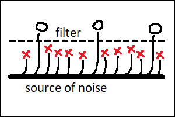\
Fig. 1. Creative process is a filter applied to noise.

## 2. Competition is more efficient than central planning.

[chapter02]: #2-competition-is-more-efficient-than-central-planning

_By “central planning” I mean a process which only generates one “perfect” solution for a
given problem at a given time. By “competition” I mean a situation when multiple
solutions to the same problem exist simultaneously, and are judged on the basis of their
actual performance “in the field”. The problem with competition is that it wastes
resources and isn’t always possible. The problem with central planning is its limited
creative potential, which leads to inferior performance when this “perfect” solution is
not known in advance (and therefore has to be invented). Examples of processes involving
competition would be human culture, animal culture and (once again) biological life
itself._

“Central planning” is responsible for creating things like songs written by professional
composers and novels written by professional writers. Their decentralized, “distributed”
counterparts (created through competition) would be folk songs, legends and fairy tales.
There are a few reasons why folk songs don’t reach the level of complexity characteristic
to a symphony by Beethoven. First of all, there are not many people out there who are
capable of writing symphonies. Second, symphonies and novels are difficult to memorize in
their entirety, which makes it difficult for them to travel from one human mind into
another like folk songs do. Finally, classical music isn’t entirely practical, which
means there’s limited pressure for writing a perfect piece. Most of the works of art we
have are simply “good enough”. On top of this, quite often, the real thing we are looking
for when reading a novel, or listening to a symphony, isn’t a perfect representation of
our emotions, or the world around, but personal _connection_ with the human behind it.
And we are talking about efficiency here, not about personal connections.

On the other hand, folk songs don’t have a single author. They often exist in multiple
versions simultaneously, and every performer can add their own unique detail to what’s
already there. It’s a process in which everybody takes part, nobody has full control over
the final result, and the result itself is not defined, and doesn’t even have to be
unique. And yet, folk songs tend to capture things which are truly important to many
people, and do it well. They have a level of performance which is difficult to match by a
single professional composer, when limited to this particular genre.

Folk songs’ analogies in modern computerized world are internet memes. They are simple
images or pieces of text which do it just right. They capture our emotions better than we
ourselves would be able to. Memes appear by accident, exist in many different variations
at once, and get polished to perfection by numerous anonymous users. Memes have their own
narrow niche, but in this niche they are able to do the job better than a symphony by
Beethoven. Another example of things which are anonymous, exist in multiple versions and
are polished to perfection, are various “tips and tricks” of our everyday life. Like
cooking recipes and methods for cleaning the house. Such methods are simple and numerous
enough, so that their original “authors” are easily forgotten.

I would argue that this also extends to scientific theories. A single mathematical
theorem may have a name attached to it, but there would usually be many ways or styles of
proving it, and some of them become more popular in certain geographical regions or over
time. The way we formulate scientific principles today is often very different from the
language used by their original authors. This happens because different textbooks would
use slightly different formulations, and some of them are simply slightly better than the
others. I would argue that scientific theories evolve, to suit the needs of their
changing applications. That they don’t have a single “canonical” representation, and that
many anonymous authors add their invaluable and easily forgotten bits. Scientific
theories are remarkably complex. But they are also useful, and this practicality
justifies the effort of keeping many slightly different versions of them at once.
Scientific theories compete with each other, they are not created by careful planning.

A single common word which unites folk songs with scientific theories (and also with the
symphonies by Beethoven) is “culture”. It’s not unique to humans. Some bird species are
known to have song patterns which are learned from other birds, rather than being encoded
in their DNA. These patterns would tend to be different in different geographical
locations, and if we moved a nestling to a foreign family, it would inherit the habits of
local birds, rather than those of its biological parents.

If we were to draw a picture for the history of a folk song (or a bird song, for that
matter), it would resemble a tree. Its nodes would be different versions of the song, and
branches protruding from a given node would represent creative modifications by anonymous
authors. Some branches would “die out”, because of being not popular or not useful
enough. Others would become the starting points for further enhancements. Intuitively,
for me at least, it’s the emergence of this tree-like structure when I start to feel that
the object which is being “created” by this process, begins to live a “life of its own”.

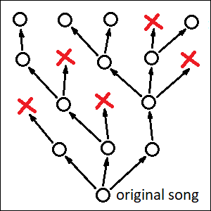\
Fig. 2. Folk song living a life of its own.

Biological life has this tree-like structure, too. For unicellular organisms, including
bacteria, this would literally be their family tree. Each node would represent a single
bacterium with slightly different DNA code, and “creative modifications” would amount to
random mutations of this code. Dead branches would correspond to those bacteria which
didn’t have a chance to reproduce.

For more advanced organisms, which reproduce sexually, this simple image wouldn’t apply,
as most of them would have two parents instead of one. However, we still would be able to
draw a tree-like picture like this for the life histories of our individual _genes_. Just
like folk songs, genes (including human genes) can be said to live a “life of their own”.
They reproduce by being transferred from a parent to a child, and undergo decentralized
“creative changes” through random mutations of the DNA.

## 3. Combination of ideas works better than any single great idea alone.

[chapter03]: #3-combination-of-ideas-works-better-than-any-single-great-idea-alone

_Folk songs can borrow tunes from other songs. Scientific theories do this routinely.
Great discoveries are often made by combining methods from different remote scientific
disciplines. Human brains are highly skillful at making such synthesis of ideas. Humans
also have language, which makes the transfer of these essential pieces of information
from one human brain into another possible. Combination works, because any individual
piece can be improved independently, in parallel. Biological analogy to mixing of ideas
would be sexual reproduction. An organism’s genome is essentially an algorithm, and
sexual reproduction allows to freely mix its individual pieces with each other._

The tree-like picture drawn in the previous chapter is not exactly correct. Even bacteria
have so-called “horizontal gene transfer”, when pieces of their genome are copied from
one living organism into another (and not from a parent to a child). This can be done
with the help of viruses and other factors. Folk songs can apparently do this too. All
human artists borrow inspiration from other artists. Such “inspirations” would rarely be
exact quotes, but a typical composer would happily produce a long list of existing works
of art which have greatly influenced their own approach to songwriting.

This is even more true for scientific theories. A scientific work which doesn’t quote
other papers is not considered a valid scientific work. Quite often, all the necessary
pieces for a discovery are already there, the only thing which is needed is combining
them in an appropriate way. Einstein’s special relativity theory was a combination of
existing Lorenz transformation formulas, known from the theory of electromagnetism, with
Galilean principle of relativity. His later general relativity theory introduced a novel
extension to Newtonian laws of gravitation, by combining theoretical mechanics with
non-Euclidean geometry, just to name a few examples.

When we add these “horizontal” connections to our tree-like picture from the previous
chapter, it starts to look more like a mesh. Each node can now have not only multiple
children, but also multiple parents (possibly even more than two). Each node, once again,
would be a different version of a particular scientific theory. Branches protruding from
the node would point to other theories influenced by it, and branches coming in would
indicate the creative process itself. New theories are created by scientists (or groups
of scientists) who borrow ideas from the ocean of existing human knowledge, and combine
them in unexpected ways.

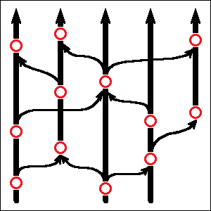\
Fig. 3. Scientific theories borrowing from each other.

Borrowing of ideas is efficient, because it allows any of such constituent ideas to
exist independently, and be polished to perfection in its own decentralized process of
creative improvement. This allows all these constituent optimization processes to be run
in parallel, which saves a lot of time. Even more importantly, optimizing a single part
of a mechanism is much easier than doing so for the entire mechanism as a whole. In other
words, constructing the mechanism from existing parts is faster than trying to invent the
perfect parts needed for this particular mechanism from scratch.

Coming back to scientific creativity, humans are also lucky that they have language.
Language wouldn’t do an invention for you, but it allows to transfer existing ideas
between human minds. Without this transfer, all parts of the mechanism to be invented
would have to be invented by the same person. This is probably the main reason why human
culture is so much richer than the animal one. Bird songs (and other forms of animal
culture) can indeed be transferred from one animal brain to another, however in animals
this transfer is mostly limited to imitating an observed behavior. Language allows to do
more than that. Unlike animals, we humans can share personal experiences, events from our
past, and also things we’ve learned from other humans. Language, even spoken one, allows
ideas to travel much farther and faster than imitation of behavior would ever be able to.

Horizontal transfer of ideas is powerful. It’s so powerful indeed, that even biological
life has invented it, and employs on a massive scale. If we compared a biological
organism to a mechanism, then its DNA code would be the algorithm for constructing this
mechanism and operating it in a variety of environments. It would be difficult to invent
such a complex algorithm from scratch, so what biological life is doing, it splits this
algorithm code into smaller parts. These smaller parts of the single big algorithm are
what we call “genes”. Instead of trying to invent a single big algorithm which would work
perfectly, biological life focuses on polishing the individual parts. Each part exists in
many different versions simultaneously, and whichever version doesn’t perform well
enough, can be replaced at any time with another one, which works better. In effect, each
part of the algorithm is evolving independently, in parallel. The name for this process
is of course “sexual reproduction”. The resulting organism then becomes, after a few
generations, a combination of the better functioning individual parts available out
there.

## 4. Inventions depend on earlier inventions, not on humans making them.

[chapter04]: #4-inventions-depend-on-earlier-inventions-not-on-humans-making-them

_Newton had been famously “standing on the shoulders of giants”, and most inventions
wouldn’t even be possible without appropriate technology, invented earlier. This happens
because one human can only do a limited amount of work in their lifetime. On the other
hand, similar inventions have numerous times been done independently by unrelated people.
Scientific discovery is a competition. It has its winners, but it also has the
runners-up — the ones who lost by a small margin. Success in innovation requires
efficient education, diversity of thought and the exchange of ideas between people with
different scientific backgrounds. Connections between humans are more important than
individual human minds, and given an environment with enough connections and enough
diversity, human knowledge can evolve “by itself”, by simply picking right ideas out of
“noise”._

We already know that scientists borrow a lot from other scientists. Reusing an idea which
has already been thoroughly studied and tested by others is simply less work than trying
to reinvent the wheel over and over again. If we needed to invent the wheel, we’d have
less time left for doing something else. Our lifes are inherently limited in time, and
they can be interrupted at any moment, too. So we have to hurry up. Luckily, if we die,
other people would be able to continue from where we left off. When a famous inventor
passes away, it’s a tragedy, but it doesn’t stop the progress of science. It merely slows
it down.

The list of disputed scientific discoveries is a long one. Establishing the priority of
one researcher over another often requires a research of its own. If you have invented
something new, and are preparing it for publication, chances are high that someone else
is doing exactly the same somewhere else at the same time. We tend to remember people who
had crossed the finish line first, but often forget about the ones who would’ve been
second.

Einstein is duly credited for being the first to correctly formulate the theory of
relativity. He did have his competitors though. If Einstein didn’t exist, the guy to
finish second (for special relativity at least), would have probably been Henri Poincaré.
He did almost everything right, and he did it before Einstein. The difference between the
works on special relativity by Poincaré and Einstein is merely the _interpretation_ of
the underlying physical reality. With respect to mathematical formulas, priority actually
goes to Poincaré (together with many other scientists). This difference in the
formulation of the theory is real, but actually small. It almost feels like a
“philosophical” one.

The basis of the general theory of relativity (the one which superseded Newtonian theory
of gravity, an ultimately led to the discovery of black holes) is another seemingly
“philosophical” idea, which claims that if acceleration and gravity _feel_ the same, it
probably means that they actually _are_ the same. It’s a remarkably simple idea, even if
a totally unconventional one. Everything else (the notion that acceleration and gravity
are both side effects of traveling along a curved path in non-Euclidean space-time)
follows from this postulate. Einstein was the first to formulate this brilliant basic
principle. He did, however, struggle with deducing the mathematical concepts following
from it, and needed help from professional mathematicians in order to finish the job.

Einstein also didn’t invent black holes. He actually tried to prove that they don’t make
sense. And later in life, he famously disbelieved in random nature of quantum mechanics,
saying that “God doesn’t play dice”. To our best current understanding, he was wrong.
Einstein wasn’t pure genius. He was the right man in the right place at the right time.
Had he been born before the theory of electromagnetism was formulated, he wouldn’t have
been able to come up with the theory of relativity. Had he been born a few years later,
it might have already been too late. Without this luck, Einstein might have well remained
an ordinary patent clerk, little-known to anyone.

We know that inherent intellectual capabilities of people in different cultures are the
same. Hunter-gatherers from the jungle of Amazon are no less intelligent than traders
from Wall Street. Deep inside these forests there may be dwelling humans even more
capable of creating novel theories than Einstein was. They don’t have access to formal
education and public libraries, and therefore their “scientific intuitions” about modern
physics are incorrect. They do have vastly superior intuitions about plants and animals
though.

It has been shown that countries which have greater cognitive diversity, also have higher
innovation rate. This includes accepting immigrants from other countries which have a
history of innovation of their own. Even when such immigrants don’t get due credit for
their random contributions, their influence can be clearly traced in statistics like the
frequency of filed patents. This happens because the number of ideas which are traceable
to their original authors is actually much smaller than the total number of ideas which
are genuinely important for the discovery process to occur. Inventions are done by
combining existing ideas in unexpected ways, and they need a lot of different ideas in
order to come up with something truly new.

Ethnicity of the humans making the discoveries is not important. Success of individual
inventors is determined by the culture they grow up with, not the other way around. In
this whole process of scientific discovery, it’s ideas who are the main actors, not
humans. If a human goes away, her idea would survive. If an idea becomes extinct, it
would have to be invented anew, through a laborious process of combining and merging of
the more lucky ones which might still remain in existence.

From the point of view of ideas, humans are merely an “environment” they could be living
in. Humans are also this “source of noise” which makes the creative process possible.
Ideas therefore don’t need any single human genius. A single genius wouldn’t be a good
enough source of “noise”. Ideas need a great number of very different human minds,
connected together, all of them at once.

## 5. Intuition is magical, fast and imprecise, and improves with experience.

[chapter05]: #5-intuition-is-magical-fast-and-imprecise-and-improves-with-experience

_I’ve learned this from the book “Thinking, Fast and Slow” by Daniel Kahneman and Amos
Tversky, although similar ideas had probably been expressed long before. Intuition is
unconscious. It’s a way of getting an answer by simply asking the question. And quite
often even the question isn’t needed: the answer would appear out of nowhere “for free”,
by itself. Intuition isn’t free though. It’s always a result of hard work. Intuition is
also never perfect. It improves with experience, and it requires a lot of experience in
order to become useful. During this process, some common patterns are deduced, and stored
somewhere within hidden areas of our brain which we don’t have conscious access to._

Examples of properly working intuition would be a soldier falling to the ground before
hearing the sound of a bullet, a bike rider doing the right moves without understanding
how bikes work, a chess player “seeing” the right move instantly, or a mathematician
recognizing a familiar formula within a heap of mathematical symbols.

Examples of intuitions which don’t work as expected would be a former soldier falling
down before hearing a firework, a ski rider trying to ride a snowboard as if it were a
pair of skis, a person lending money to a fraudster because he looks “trustworthy”, or a
casino player “seeing” a pattern in winning roulette bets.

Intuition feels like magic, but it really isn’t. The soldier has learned to recognize the
sounds of different types of bullets after having heard a lot of them. The whole process
goes unconsciously, so he doesn’t even realize what’s happening until he’s lying down in
the dirt and the bullet has passed over him. After him having returned home, the learned
intuitive behavior remains, even if it’s not useful anymore. It takes a lot of effort to
learn to ride a bike (or ski), and it similarly takes a lot of effort to learn to play
chess. Whoever didn’t do the work, wouldn’t have the intuition. The more you play chess,
the better would be your “magical” skills of guessing the right move. The more you study
mathematics, the more hidden connections you’d start to “see” which lay people have never
been aware of.

We still don’t fully understand how intuition works, and I would actually guess that a
range of very different underlying brain mechanisms could be responsible for the
behaviors mentioned above. There are some common traits though. Intuitive processing is
unconscious. It’s automatic, in the sense that we are not actively aware of the exact
“rules” employed by it. We learn riding a bike by trying to make different random
movements, and sticking with the successful ones. We know that this process results in
some kind of an “algorithm” for riding the bike, encoded somewhere inside our head.
However, most of us wouldn’t be able to write this “algorithm” down. In this sense, we
don’t really “understand” what we are doing.

The danger of intuition is that it’s not always correct. And since we don’t have any real
“understanding” of what it’s actually doing, we can’t really tell apart whether its
predictions are right or wrong. This leads to mistakes like falsely believing that some
person is “trustworthy” when they actually are not. Our ability to guess people’s
intentions does improve with experience, but not every one of us has had the right amount
of such experience for every possible situation, and that’s what fraudsters take
advantage of. And, of course, casino slot machines are not predictable, but that’s not
what our intuition would expect. Its only purpose is to recognize the previously learned
patterns, even when there’s noting out there to be looking for.

That’s why intuition alone is not enough. It’s important, and it _is_ responsible for
doing most of the work, but in order to be truly successful we also need something else.

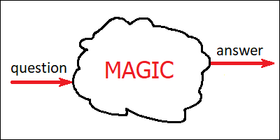\
Fig. 4. Human intuition is pure magic.

## 6. Humans operate by a combination of intuition and conscious reasoning.

[chapter06]: #6-humans-operate-by-a-combination-of-intuition-and-conscious-reasoning

_I similarly borrow this idea from “Thinking, Fast and Slow”, although it’s not limited
to this particular book. Human reasoning can roughly be separated into two systems. First
of them has properties described in the previous chapter: it’s fast, unconscious and
inherently imprecise. The second system is remarkably different. It’s conscious and
deliberate. Unlike intuition, it is actually capable of finishing unfamiliar tasks
correctly and verifying intuitive “hunches” against objective reality of the world
around. Conscious reasoning is also necessary for complex cognitive processes, like
proving of mathematical theorems. The problem with this second system is that it can only
do one thing at a time. It is therefore inherently limited in its capacity, which is why
they call it “slow thinking”._

Humans can do many different things at once. You can simultaneously drive a car, enjoy a
song played by the radio and eat a burger, all while talking to a friend sitting nearby.
However, you can only do all the four things at once provided that nothing interesting or
unexpected ever happens with any of the first three of these activities. If you suddenly
notice a rabbit jumping out of the bush at some distance ahead of you, or an important
announcement is made on the radio, or if you happen to choke on your burger for whatever
reason, you wouldn’t be able to understand what your friend is saying anymore. This
happens because the first three of these activities are automatic. Unlike the
conversation with the friend, neither driving, listening to music nor eating requires
your conscious attention. And conscious attention (in humans at least) has this peculiar
property that it can only be engaged into one single process at a time.

This automatic processing is what I’m calling “intuition” here. We intuitively know how
to drive the car (although this intuition might be of poor quality if we haven’t had
enough experience with driving yet), and we of course intuitively know how to chew the
burger. Intuition is also responsible for detecting things which are not expected in the
given situation. Without us even being aware, hidden areas of our brain are constantly
monitoring the road and verifying if everything looks familiar. Detection of the rabbit
happens automatically, and our ability to detect such dangerous situations actually
improves with experience. At the same time, other hidden areas within our brain are
constantly monitoring the sound from the radio, and filtering it for the keywords which
we have learned from our experience to be indicative of an important announcement being
made.

Trying to understand what our friend is saying though, isn’t automatic. Our intuition
can’t handle it. This process requires the engagement of this second subsystem, which we
might call “conscious reasoning”. Whenever our intuition detects a dangerous or otherwise
important situation which we know it wouldn’t be able to handle by itself, we would
switch our attention to this new situation, and let our conscious reasoning process solve
the problem. At the same time, out attention would move away from whatever activity we
had been doing before, and we’d therefore lose our ability to consciously control this
previous activity. Switching our attention in such ways is what stage magicians do for a
living.

If the radio announcement happens to be made at the same moment when the rabbit jumps
out, you would have to prioritize. Most likely you’d decide (automatically) that evading
the collision with the rabbit is more important, and therefore wouldn’t be able to hear
the announcement. If you ever happen to choke on the burger at the exact moment when you
realize there’s a rabbit on the road, ether you or the rabbit would be in big trouble.

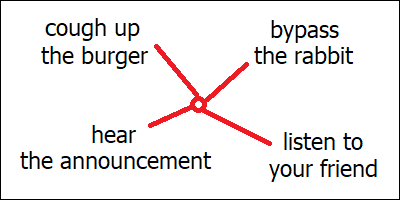\
Fig. 5. You are free to choose any one of these.

Conscious reasoning is involved in activities like complex arithmetic, understanding of
human language, proving of mathematical theorems and comparing the prices of similar
products in a department store. It doesn’t _feel_ like magic, however I would guess that
biologically, this process is probably much more complicated than any of the processes
which might underlie the different types of intuition. Conscious reasoning is remarkably
slower than intuition, which is why they call it “slow thinking”. What it does,
apparently, it unites the outputs from different independent “intuition modules” within
our brain, and compares their suggestions with each other. It can, therefore, verify
imperfect intuitive predictions against objective reality, which is being analyzed and
processed independently by other dedicated modules. And being able to perform this
verification, this “slow thinking” process seems to be critical for our intuitions to
develop in the first place. Because intuitions don’t appear out of thin air, they are
learned though a laborious process of trial and error.

## 7. Intuition and conscious reasoning improve each other iteratively.

[chapter07]: #7-intuition-and-conscious-reasoning-improve-each-other-iteratively

_Conscious reasoning cannot work alone, without intuition, because it’s very slow, and
besides can only focus on one thing at a time. Good scientific intuition is therefore
essential for the progress of science. Building the intuition is impossible without
experience, experience means practicing, and practicing, in scientific disciplines at
least, involves a lot of conscious reasoning. This means that our intuitions and our
ability to reason mutually depend on each other, and therefore improve gradually, in a
positive feedback loop. The basic unit of this iterative process might actually be the
sleep cycle, as our ability to understand things seems to improve considerably after
sleeping._

People are often unaware of how powerful their scientific intuitions really are. This
happens because intuition is unconscious. Things we have already learned seem simply
“obvious”, even if we don’t really _understand_ how they work. It’s a common trap for
scientists and other experts to believe that what seems “obvious” to them, should also be
obvious to everybody else. Intuition feels so effortless that it’s very easy to forget it
actually requires a lot of hard work.

In philosophy of mathematics, there are two primary approaches to describing what
mathematicians are actually doing. Some philosophers would argue that mathematicians are
actively “inventing” new mathematical concepts, whereas their opponents would claim that
these concepts already exist somewhere (in some “non-material” form), and mathematicians
are merely “discovering” them. This second concept is called “platonism”, and one of the
reasons it exists is that there’s evidence supporting it. People started using geometry
(as well many other mathematical theories) long before they could formulate rigorous
mathematical foundations for them.

What happens in situations like these is that we get an intuitive understanding of a
problem or a field of knowledge much earlier than we can formulate the exact rules for
it. Curiously, when we’ve already got this intuitive understanding, which would by then
be stored inside some secret area of our brain, we would actually be able to _study_ this
hidden intuition by simply investigating our own thoughts. We would be able to literally
cut off any ties with the world, lock ourselves up in a room, and do science while
sitting there, in solitude.

Sitting up there in the room and trying to carefully write down the exact properties of
the algorithms which our intuition has managed to come up with by trial and error is one
way of doing science. But not the only one. When we study mathematics in school, we start
by learning primitive arithmetic. After we’ve got intuitive understanding of arithmetic,
we learn algebra. Having reached intuitive understanding of some of algebra, we may start
learning calculus. It wouldn’t be possible to understand how derivative functions and
integrals work if the basic operations of addition and multiplication didn’t already look
familiar and obvious enough. We can use our primitive intuitions to solve simple
problems, learn new intuitions by solving them, then use these enhanced intuitions to
solve more complicated problems, and so on. It’s a positive feedback loop: the better is
our knowledge, the easier it is for us to acquire even more knowledge because of the
improved intuitions.

Intuitions are stored somewhere within our memory. We humans have a lot of different
types of memory, and their biological mechanisms (once again) are not fully understood.
One thing most scientists seem to agree though is that sleep plays an important role in
consolidation of memories formed throughout the day. My own experience would suggest that
I am often able to understand things much more clearly, and formulate ideas in novel ways
in the morning, even if I struggled to do so before going to sleep. My intuition, then,
would be that our intuitions are actually updated during sleep. Which is why solving a
complex problem might require “sleeping” with it a few times (all while actively working
on the problem throughout the day). This may be a correct intuition, or a wrong one. In
any case, it’s a sound foundation for further research.

## 8. Artificial neural networks are algorithms, written automatically.

[chapter08]: #8-artificial-neural-networks-are-algorithms-written-automatically

_Not every algorithm is a neural network, but every neural network is an algorithm.
Artificial neural networks are merely crunching numbers, there’s no “magic” in there.
True magic comes from the fact that these algorithms are not written by humans. Every
single step of the algorithm is well known, however the entire picture is overly complex
to be grasped by human conscious reasoning. These algorithms are also never perfect, by
design. And every time you try to build one, even for exact same problem, you’d get a
slightly different version of it. Artificial neural networks were inspired by human
brain, but the way they actually work deviates significantly from the biological
original._

In a sense, artificial neural network isn’t really a single algorithm, but rather a broad
_class_ of algorithms. In other words, it’s an algorithm with a large number of
parameters. Depending on which parameters you choose, you get a different algorithm. By
picking one set of parameters you might get an algorithm which is able to tell apart dogs
from cats. Choose a slightly different set of parameters, and you’d get an algorithm for
distinguishing a Mercedes Benz from a BMW.

This broad _class_ of algorithms is what they might call a “neural network architecture”.
A simple architecture might only be able to come up with algorithms capable of telling
apart two classes of pictures. Like dogs and cats. A more advanced architecture would be
capable of producing algorithms for classifying the picture simultaneously into 100
categories. Like 100 different breeds of dogs and cats (with one particular set of
parameters), or 100 specific models of cars (with a slightly different set of
parameters). The key objective in designing a neural network architecture is its
_flexibility_. Which means, the total range of algorithms to be achievable, in theory,
with this architecture (by picking up suitable sets of parameters), should be as large
and as diverse as possible.

There can be no such thing as “universal neural network architecture”. Some of them would
only work with pictures (often of a particular size only). Others would only accept sound
input, or only work with strings of text. Modern neural networks are actually more
robust, and can often work with any combination of these. Regardless of its flexibility
though, the total range of the algorithms implementable with any given architecture is
always limited. Still, it can be truly, truly large. Modern neural networks can reach
trillions of individual parameters. I don’t even want to think about how many different
algorithms it’s possible to implement by picking different combinations of them.

Once we have selected an appropriate architecture, the unknown parameters can be fit
through a mathematical optimization process. Any algorithm, by definition, should take
some input (like an image), and produce some output (for example a single number, with
“0” meaning “dog”, “1” meaning “cat”, and anything in between meaning that the algorithm
isn’t exactly sure). The fitting of the parameters is done by preparing a large set of
expected input-output pairs (pictures of dogs and cats along with their correct
classifications), and trying to find out the parameters which would result in an
algorithm producing these expected results.

This is not an easy task, I should say. And there’s no perfect way of solving it. Still,
we do have approximate methods which work remarkably well. It took our best scientists
more than half a century to come up with these methods, but we do have them now. Once a
useful idea is discovered, it has high chances of remaining alive, even after its
creators have long been dead. These methods work by writing down the algorithm to be
discovered in the form of a mathematical function, differentiable by any of the
algorithm’s parameters. We then apply this function to the expected input-output pairs,
and try to minimize the difference, typically with the mathematical method of “gradient
descent”. In order to implement the gradient descent method, we need to compute the
function’s derivative by any of its parameters (the so-called “Jacobian matrix”), which
we do with a special kind of algorithm, specific to neural networks, which is called
“backpropagation”.

Since this whole method mentioned above is not precise, the result we get is never
perfect. Which means, we never build the best algorithm ever possible for solving the
problem we wanted to solve. But we get pretty close. We manage to get pretty amazing
results, that is. Another important property of this algorithm we get with this whole
process, is that this algorithm is always slightly different. Even if we repeat the
entire procedure with exactly the same set of expected input-output pairs, we’d get a
slightly different algorithm. This happens because these methods mentioned above involve
some randomness in the process. Our best scientists couldn’t come up with anything better
than that.

Once our algorithm has been constructed though, it’s perfectly deterministic. (Unless we
tweak it manually afterwards, which we sometimes do, especially with large language
models). If we were building an algorithm for telling apart dogs from cats, we would then
be able to apply this algorithm to any image (of a suitable size), and get the output (a
single number, in this case) as a result. If everything was done correctly, this
algorithm would then be able to correctly classify not only the example images we trained
it on, but also totally unfamiliar pictures of dogs and cats (by producing numbers close
to 0 for pictures of dogs, numbers close to 1 for pictures of cats, and some other random
numbers for pictures which are neither cats nor dogs).

Nowhere in this entire process of training and running the resulting algorithm there’s
anything which might remotely look like magic. These algorithms do nothing else but
crunching numbers (a lot of them). If we wanted, we could take such an algorithm, and
write any of its steps down on a sufficiently large sheet of paper. The only problem
would be that this clearly and unambiguously formulated list of instructions wouldn’t fit
into our head. It would be more complex than our conscious reasoning could handle. In
this specific sense, we don’t really understand what artificial neural networks are
doing.

We know that they should somehow mimic the inner workings of our brain. Curiously, one of
the reasons scientists built artificial neural networks in the first place, was to better
understand ourselves. Our nerve cells (the neurons) have modifiable parameters as well.
These are the strengths of the so-called “synaptic connections” between the neurons. By
choosing appropriate values for these parameters, it is possible to “tweak” our brain
circuits to perform different processing tasks. Living neuron cells have direct analogies
in artificial neural networks. These analogies however are not living cells anymore, but
merely long vectors of numbers, processed mostly by means of matrix multiplications (with
a tiny bit of special non-linear functions applied on top of this).

We still don’t fully understand how our biological brain circuits are updating their
synaptic connections. And if you have a weird feeling that the training methods mentioned
above — the calculations of derivatives by trillions of parameters, and the gradient
descent — aren’t what our brain is capable of doing, you are actually right. Our brain
can’t do these things in this exact fashion. It probably does something similar though.
And it most likely does this much less efficiently than our digital computers can do with
all these math functions built into them.

Artificial neural networks were inspired, in part, by the need to understand ourselves.
Inadvertently, we have created something which works in many aspects differently from its
original biological inspiration. And in many aspects more efficiently too. Despite all
that progress though, we are still struggling with understanding ourselves.

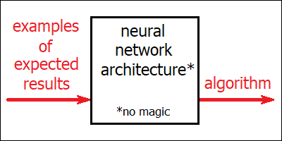\
Fig. 6. Neural networks are algorithms, written automatically.

## 9. Artificial neural networks simulate the mechanism of human intuition.

[chapter09]: #9-artificial-neural-networks-simulate-the-mechanism-of-human-intuition

_Quality of artificial neural networks is limited by the quality of their training data.
Artificial neural networks are never fully reliable, however their performance improves
with more training. Once an algorithm has already been discovered by the network, its
execution is fast, compared to the overall effort which went into the training process.
All of the above is also typical to human intuition. Similar to human intuition, the
inner workings of artificial neural networks cannot be understood by humans who are using
them. Similar to human intuition, some aspects of these inner workings can be deduced by
careful analysis. Unlike human intuition, artificial neural networks are easily
cloneable, which makes them essentially immortal._

There can be a few reasons why an artificial neural network might fail to fulfil its
intended purpose. First of all, as has already been mentioned in the previous chapter,
the training process of artificial neural networks is inherently randomized. Which means
that even though the resulting algorithm itself is always deterministic, each time we run
the training process we would be getting a slightly different version of the algorithm.
“Different versions” means different algorithms. Each of them might perform better in
certain specific situations, and in other situations it might perform worse. Finding an
ideal solution (a perfect algorithm for every case) has actually been never considered
possible. It’s always a tradeoff.

Humans have this problem too. Depending on the order in which you studied mathematical
theorems in school (or in the university), as well as on some other factors like your
personal predispositions, you would become more familiar with some of the theorems than
with the others. When solving a real-life mathematical problem, you’d therefore have a
“preference” for certain paths of thinking over others. Depending on which problem you
are solving, different preferences like these may improve or hinder your ability to “see”
the right solution to the problem, thus affecting your performance. Similarly, when
driving a car, you might develop slightly different “preferences” for using the brakes or
the steering wheel when handling unexpected or dangerous situations on the road. Neither
of these “preferences” is perfect: it all depends on the actual situation you will be
dealing with.

Neural networks can also fail because of not having had enough training. If an algorithm
has been trained to recognize a range of breeds of dogs, it might have trouble
recognizing an unfamiliar breed, which has never appeared in the example dataset it has
been trained on. Just like human intuition, performance of artificial neural networks
improves with experience.

Yet another reason why a neural network architecture might prove inefficient for a
particular task, is insufficient number of parameters. An algorithm for telling apart
dogs from cats is not a simple one, and if you tried to build it with an architecture
which only had 100 parameters available, you probably wouldn’t be able to. Definitely not
for all the possible breeds.

The amount of knowledge which can fit into a human’s head is similarly limited. Things
you were skillful at while studying in the college, would get slowly replaced with other
skills, more relevant to whatever job you might be currently doing. If you moved to a
foreign country, and switched to using its local language in your everyday life, you’d
experience, over time, increased difficulty with speaking your own mother tongue. Some
skills would remain though. The ones which are universal, and therefore are relevant to
any domain of knowledge and any job. Such as critical thinking. Critical thinking can be
trained too. Because of being universal, skills like these are reinforced by every kind
of activity, even if (like any intuition) they might be difficult to formalize and put
into words. As one famous saying goes, “education is what remains after everything you’ve
learned has been forgotten”.

Artificial neural networks can exhibit this kind of “forgetting” too. This happens when
you take a network which has already been trained to solve a particular problem, an try
to modify it by training on some extra set of expected input-output pairs. For example,
when you take a network which is already able to recognize a range of breeds of dogs, and
train it with examples of some extra, more obscure breeds. Depending on the network’s
total number of parameters, it might not be able to accommodate all the rules for all the
required sub-algorithms. It would then become less proficient in some of them, most
likely prioritizing the breeds of dogs it has been “taught” more recently.

Neural networks would also fail when they are not flexible enough for the particular type
of problem you are trying to solve. In order for the training process to succeed, there
must exist, in theory at least, some combination of parameters resulting in the desired
algorithm. If the required functionality isn’t “supported” by the neural network’s
architecture, no amount of training would help. On the other hand, we should probably
suspect some limitations to be inherent to our human brains just as well. Some of us can
boast extraordinary abilities in things like identifying musical tones or recognizing
human faces, whereas others wouldn’t reach much higher above the “normal” level, however
hard they try.

Similar to human intuition, artificial neural networks are a kind of “fast” thinking. A
typical neural network performing classification of images would require exactly the same
number of operations for processing any kind of image. Even though the total amount of
required computation is impressive, it’s also entirely predictable. And it’s always a
tiny fraction of time and effort needed for training the network in the first place. This
is different from a typical human “conscious reasoning” task, like solving a complicated
mathematical problem, which would require different amount of time depending on the level
of complexity of the task.

We are still not sure if our artificial networks would be able, in theory, to reproduce
every kind of human intuition (with appropriate training data). They do, however, achieve
super-human performance in tasks like recognizing images (including dogs and cats),
recognizing speech, and also in more complex cognitive activities, like predicting the
next best move in chess. Artificial neural networks have also been able to solve problems
which have never been accessible to human minds, like predicting the shape of proteins
from their DNA code. (This problem, the so-called “protein folding”, has been the subject
of 2024 Nobel prize in chemistry).

What unites all the different tasks like recognizing dogs and cats (or rabbits, for that
matter), recognizing spoken words, planning the next move while walking, and coming up
with a brilliant idea for your next move in chess, is that they all can happen
unconsciously in humans, and they all have been shown to be achievable by artificial
neural networks, too.

Curiously, in both cases we get an algorithm which we don’t really understand. We don’t
understand how our intuitions work because they are unconscious. And we can’t understand
our artificial neural networks because they are overly complex for our conscious
reasoning to handle. In both cases though, we can improve our understanding. We may
deduce the inner workings of our intuition by locking ourselves in a room and “playing”
with our thoughts while sitting in there, by asking our intuition different questions,
getting the answers (instantly), and trying to guess what the hidden algorithm behind
might actually be doing. And we can do the same with artificial neural networks, by
running the algorithm with carefully designed input data, and trying to deduce the hidden
rules behind it. In fact, with artificial networks we have much more options for doing
the research, because, unlike with intuition, we also have direct access to any of the
internal intermediate states of the algorithm, not only to the input-output pairs.

So far, it looks therefore that artificial neural networks are nothing especially new nor
dangerous. They are simply artificial intuitions. The ones which a multitude of people
can have instant access to.

The problem with human intuitions is that they are not merely “hidden” (and therefore
cannot be directly transferred from one human mind into another), but also mortal. Every
one of us has their own version of the algorithm for telling apart dogs and cats (unless
we haven’t seen a dog or a cat in our life). Every one of us, however, had to learn this
algorithm from scratch. That’s why educating a human takes such a long time. We have to
teach our kids all the algorithms which we adults already have. And the resulting copy is
by no means guaranteed to be better than original. Quite often it’s actually worse.

It’s so much different with the artificial intuitions though. Artificial neural networks
can be duplicated effortlessly. We can take a copy of an existing network, try to teach
it with different teaching methods, and see which of them works better. And if none of
the methods proves efficient, we can always restore the original state. If a copy
performs worse than the original, we can simply discard the copy. If it performs better,
in whatever single aspect, we can keep it. In this sense, artificial neural networks are
immortal. They never get worse. For any single artificial intuition, we can store its
entire family tree, to make sure that anything useful which may have ever been invented,
is never lost.

## 10. Artificial neural networks can have broader intuitions than humans.

[chapter10]: #10-artificial-neural-networks-can-have-broader-intuitions-than-humans

_Artificial neural networks can rely on “tricks” which are not accessible to biological
brains. Convolutional neural networks use “cloned” copies of the same neuron to process
remote areas of the same image simultaneously (a task which animal brains can only
perform sequentially). Transformer architecture similarly employs massive copying of its
neurons. It collects data from many “cloned” neurons simultaneously, and compares
“cloned” neurons to each other pairwise. The latter is part of the so-called “attention
mechanism”, which doesn’t have analogies in animal brains. Overall, such “tricks” allow
artificial networks to employ fast “intuitive” processing in some tasks (including
language processing), which human brains can’t handle without relying on complex
mechanisms like memory and conscious reasoning._

Neural networks typically process input data in stages (also known as “layers”). In
visual processing tasks (like telling apart dogs from cats), the first of such stages
would usually detect so-called “edges”, or abrupt changes in color or brightness. This
stage would calculate directions in which different colors change around every point
within the picture, along with the intensity of such changes. The second layer would take
the “edge” information calculated by the first stage as its input, and by comparing the
patterns of neighboring “edges” should ideally be able to detect textures, like grass,
woven fabric, foam or sand. Later processing stages would detect objects of ever
increasing size and complexity, starting from simple shapes like tennis balls, bricks,
eyes and noses, and gradually leading to the recognition of faces, muzzles, ears and
tails. And finally, by comparing the types of detected muzzles and tails against their
expected values, the network should be able to make its ultimate judgement about whether
the picture represents a dog, or a cat.

Quite early in the history of artificial intelligence (in the 1980s at least), with the
advent of the so-called “convolutional neural networks”, it had been noticed that the
desirable detection rules, at every processing stage, should’t depend on the location
within the image where the processing occurs. In other words, the rules for detecting the
grass texture must be the same everywhere, be it in the lower left corner of the picture,
the upper right one, or at the pictures’s very center. What it means, is that it would be
totally sufficient to only construct the sub-algorithm for grass detection once, and
reuse it everywhere across the image’s entire visual field. The same would, of course,
apply to all other sub-algorithms, like those detecting whiskers or different styles of
fur.

Our final algorithm (the one able to detect dogs and cats) would then contain only one
single module (set of rules) for every processing stage: one for detecting the “edges”,
another one for textures, and so on. At every stage, we would apply this same set of
rules to every possible area within the picture. Or, to say the same slightly
differently, we’d have the same module “cloned” multiple times, with all the “cloned”
copies doing the processing simultaneously, by applying identical algorithm steps to
different input data.

Doing something like this is a no-brainer when you have access to a modern multi-core
digital computer (or a graphics card). However, biological neural networks within our
brains don’t really work in such a way. Our brain performs computations with the help of
living cells (neurons), and every such living cell is unique. If we wanted to make a
“copy” of some “module” within our brain, it would have to be a physical copy (a bunch of
similarly connected neurons, placed somewhere else within the brain). If we wanted such
sister “modules” to do the processing identically, we would have to make sure that any of
their internal connections are indeed the same. And achieving such a level of
synchronization between physically separated areas within a living brain is not an easy
task. Especially if you needed to tweak these connections once in a while, in order to
adapt to new experiences (like the discovery of an entirely new breed of dogs).

Therefore any serious visual processing within our brain doesn’t happen in parallel. In
fact, our “cameras” (the eyes) don’t even have enough hardware resolution for doing so.
Most of our light receptors are limited to a tiny area at the very center of our visual
field. We can’t see much outside of this central spot (except for trivial processing,
most notably motion detection, or noticing sudden changes in color or brightness). If
something  unusual is detected in this peripheral area, we’d have to move our eyes, and
let this highly sensitive central spot examine more carefully, what exactly it was.
Whenever we need to make sense of a complicated picture we’ve never seen before (like a
painting in a museum), our eyes would have to _scan_ it. Moving the eyes isn’t trivial,
it requires precise coordination between a bunch of different muscles. Our brain has to
plan for such movements in advance. And it has to decide which areas should be scanned
first, too. Most of this planning is unconscious though, so we are rarely aware of it
actually happening.

Computer vision doesn’t look like this. Duplicating an existing software module many
times is easy and cheap (we would only need to allocate memory for more data, the
algorithm itself can be shared). Besides, this allows to bypass all the complex planning
and motor coordination steps. Automated surveillance cameras have therefore perfectly
acute vision across their entire visual field, and they process all the different areas
of it simultaneously, in parallel. If you happened to watch “Squid game” (a Korean drama
series), it has this famous scene with a huge robotic doll monitoring a crowd of people.
This doll had its eyes moving while doing so, and it was totally unrealistic. Real robots
don’t move their eyes. They are able to capture the entire scene, with its every minute
detail, in a single grasp.

Thanks to the parallel processing, it would take such a system exactly the same time to
detect all the dogs and cats present on a given picture, along with their breeds, as it
would have taken it to classify any single dog or cat alone. And with this processing
being fast (and also actually imprecise), it should therefore still be considered a kind
of “intuitive” thinking (similar to detecting a single dog or cat). It’s a massively
parallel intuition though. Something which we humans are not capable of doing.

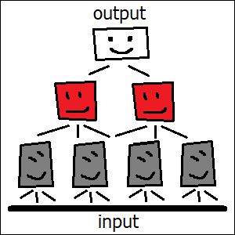\
Fig. 7. Convolutional networks involve a lot of cloning.

One problem with convolutional neural networks is that they would typically only process
data locally. We detect textures by analyzing neighboring “edges”, discover small objects
(like an eye) by correlating a bunch of adjacent textures, and make sense of larger
objects (like a face) by combining a few simpler objects located nearby (like eyes, nose
and ears). This often results in a pyramid-like structure of the network architecture,
with deeper layers being responsible for detection of objects which are larger in size.
Such local-only processing doesn’t work well though, when the picture contains a few
related smaller objects, which are separated in space, and therefore don’t constitute a
single bigger object. For example, a pair of humans sitting in opposite corners of a room
(or a pair of dogs or cats, for that matter). Depending on how these humans look at each
other (and whether they do it at all), the overall meaning of such a picture might be
very different in fact.

Non-local processing is even more crucial when dealing with text (or sound). An example
would be a character introduced in one chapter of a book, which in later chapters is only
referenced by their name. In order to make sense of these later chapters, the reader
would have to correlate the name with the description made elsewhere.

There have been a lot of ways to achieve such non-locality, however we would focus here
on the single most famous and important one. It’s called the Transformer architecture,
and it was invented in 2017, by a group of people with remarkably diverse cultural
backgrounds (coming originally from a range of countries including former East Germany,
India, United States, Poland and Ukraine). The name itself doesn’t mean a lot; it came,
among other things, from one of the authors’ passion for transformer robot toys as a kid.

Similar to convolutional architectures described above, Transformer neural networks
consist of a bunch of layers (or processing stages, if you wish). Each layer would
correspond to a single “algorithm module” (a set of rules, specific to this particular
layer, to be discovered during the training process). Transformers also similarly involve
a lot of “cloning”. They would typically split input data into a long sequence of basic
elements (so-called “tokens”), and a separate “copy” of each module would then be
instantiated for every input “token”. Just like before, all these “cloned” modules would
work together, simultaneously, at every processing stage.

Transformer architecture is amazingly flexible. It can do everything what “classical”
neural networks (including those described above) were already capable of doing, and it
can do much more. Thanks to this flexibility, it can also work with different types of
input data. Its input “tokens” could be pieces of text (like letters, combinations of
letters or entire words). But they could equally well be small pieces of a picture. Or
sound samples. Transformer architecture can handle any of these (with appropriate
training). And it can handle a combination of these, too.

The reason behind this flexibility is the way in which Transformers manage to connect
their neighboring processing stages with each other. First of all, any of the “cloned”
modules at a given processing stage can collect data from any of the modules from the
previous stage (a limited number of them, that is). Second, the algorithm for choosing
the modules to collect the data from is itself _parameterized_ (and independently so for
each layer). Which means that these algorithms for picking the connections are discovered
automatically, during the training process. Some layers may thus “choose” to collect data
locally, just like convolutional networks do. Others might end up finding similar objects
located far away. The total list of opportunities is actually quite large. When the
training is complete, the final algorithm can thus achieve a highly specialized
connection pattern for every processing stage, “handcrafted” for solving the specific
problem it has been trained on. None of the network’s connections are hard-coded in
advance.

Curiously, this entire method which allows Transformers to connect their layers with each
other in such a flexible way, is actually entirely non-biological, in the sense that it
never occurs in living animal brains. The official name for it is “attention mechanism”,
however it has little (if anything) in common with how actual human attention really
works.

“Attention mechanism” creates a connection by testing all the candidates (essentially,
all the possible module pairs), and only picking the ones which better satisfy some
required criteria (which are themselves defined by the tunable parameters, discoverable
through training). None of biological brains have _ever_ been able to do something like
this. First of all, living brains don’t have “cloned” neural circuits in the first place
(because of these synchronization issues). Second, this test for estimating the candidate
connection has to be run on some “neuronal” hardware as well, and it has to be run for
every _pair_ of the “cloned” modules, each time with different data. Living brains can’t
re-wire their connections at such a speed, and they don’t have enough space to duplicate
the test circuit itself _that many_ times.

“Attention mechanism” is a purely artificial construct. It’s also the reason why most
modern AI models can only work with “contexts” of limited size. “Context” means the total
number of input tokens, and it’s limited, because doing the computation for every _pair_
of modules (each of them corresponding to a different input “token”) means that the
processing time is proportional not to the size of the input (i. e. the total number of
tokens), as it would typically be for “classical” neural networks, but rather to the
_square_ of this total count. Which means this computational cost increases very fast
with every extra token.

And still, I would classify Transformers as examples of “fast” thinking. Once the
training of our Transformer neural network is finished, its processing time is entirely
predictable. Given the number of input tokens, we can always tell exactly how long it
would take to produce the output. The resulting algorithm is always a predefined sequence
of steps, and every processing stage is only run once. There’s no feedback involved in
this process, no dead ends. Due to this lack of feedback, the output (as it usually
happens with neural networks) isn’t guaranteed to be perfect. Even though the quality of
our Transformer-based algorithm would improve with more training, we can never be sure it
would run correctly in every possible case. Whatever such an algorithm may generate as
its output, is not a result of careful and balanced thinking. It’s an _intuition_.

It’s a truly powerful intuition though. We humans cannot really process speech, including
written text, unconsciously (except for individual words or maybe trivial phrases).
Whenever we need to make sense of a radio announcement, even a short one, we have to
dedicate our entire conscious reasoning to this activity. Transformers, on the other
hand, are able to make sense of much longer texts, and they do this by grasping this
entire long text in its entirety, all at once.

Transformers can also do without the help of external memory. They do this because they
run on modern digital computers, which have huge amounts of random-access memory already
built in, and they use it a lot. By making all these innumerable “cloned” copies of the
same algorithm module, and letting every such copy run with different data, Transformers
essentially get access to all these data all at once. Such data, calculated and stored
for every token, would contain tons of information, including whether the text around
this token represents a description of a person, and if so, what their name is, and what
this description has said so far about their character traits. When noticing a name
elsewhere, an appropriate module (the one responsible for correlating names with
descriptions) would search all the available data, and pick the token whose data entry
would contain the most complete description of a person with the given name. It would
then copy part of this information into the data entry associated with the token
mentioning the name later in the book. This way, the name becomes not merely a name, but
a name with a story attached to it.

Recalling a person’s character by their name wouldn’t be possible without some kind of
memory. Not having random-access memory available, our human brains had to rely on
something different (and probably much less efficient). We still don’t fully understand
how human (or animal) memory really works. We know that there are many very different
mechanisms and different neural networks involved into this process, and that we actually
have a lot of different types of memory available (like short-term, working and
long-term). We also know that our memory has limited capacity, and that it isn’t always
reliable.

Artificial neural networks may look very simple compared to the enormous complexity of a
living human brain. However, they can cut corners too. By being able to run identical
algorithm modules on different data, and having instant access to all these data,
artificial networks can skip a lot of truly complicated activities which humans and other
animals can’t live without. Convolutional networks can see the entire picture, all at
once, without ever moving the camera. And Transformers can go by pure intuition in some
tasks, like processing of language, which humans cannot handle without relying heavily on
different kinds of memory as well as on the very marvel of human cognitive ability, which
is conscious reasoning.

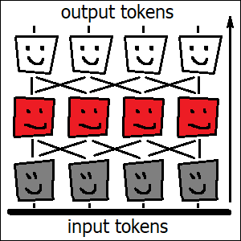\
Fig. 8. Transformers employ massive cloning too.

## 11. “Chain of thought” models simulate the basics of conscious reasoning.

[chapter11]: #11-chain-of-thought-models-simulate-the-basics-of-conscious-reasoning

_Even though Transformer architecture is impressive, it’s not enough for solving
complicated problems, and it cannot, by itself, replicate human thinking. Human conscious
reasoning involves some kinds of feedback and trial and error, and algorithms discovered
by most neural networks lack either of these. “Chain of thought” models are built on top
of existing neural networks, and are examples of “slow” thinking. They might not be truly
universal yet, but do seem to capture the essence of conscious reasoning, and achieve
astonishing results. One limitation of such models is that their “intuitions” (the
underlying neural networks) don’t change. Another is that a single intelligent being,
even the smartest one, isn’t enough to make an invention._

Transformer architecture is the key technology behind modern large language models (also
known as “LLMs”). Last letter “T” in “ChatGPT” (the first globally successful LLM)
actually stands for “Transformer”. Key difference between Transformers and their
predecessors is vastly improved flexibility. They also rely on a few powerful techniques
(described in the previous chapter), which are only available in digital computers and
cannot be reproduced in living animal brains. Together, these traits allow Transformers
to perform some kinds of very complex processing very easily, without relying on
time-consuming and unpredictable techniques like trial and error.

Transformers, similar to most other neural networks, work more like a pipe. You throw
some data in, it travels through the pipe, and then some other piece of data comes out.
The actual travel path might be convoluted, with all these numerous “attention mechanism”
blocks on the way, but it’s known in advance. The same applies to human intuition. You
throw a question in (which might as well be some unconscious sensory experience), and you
get the answer out, within a predictable amount of time. On the other hand, human
conscious reasoning is more like a labyrinth. It contains a lot of paths, and some of
them are better than the others. It doesn’t always have a way out, and even if it does,
you might get stuck in there for an indefinite amount of time. When entering a labyrinth,
you never know what happens next.

The reason why most artificial neural networks behave more like a single “pipe”, rather
than a tree of possibilities, might probably be related to the fact that they are
modelled as mathematical functions, differentiable by every parameter. It looks like all
these mathematical optimization methods and other algorithms, like backpropagation and
gradient descent, don’t really work that well when the algorithm being optimized cannot
be represented as a reasonably straightforward sequence of steps. In order for an
algorithm to be discoverable by a neural network, it has to be learnable from experience,
and this fact severely limits the range of available algorithms (and architectures). This
same requirement (discoverability from experience) might actually explain the limited
nature of human intuition itself.

Up until as late as middle 2024, I used to believe that simulating human conscious
reasoning would be a difficult task. Because it’s so much different and more complicated
than intuition, and also because it’s conscious. We still have no idea what consciousness
really is, why is it needed in the first place, and how it works. My current intuition
would be instead that consciousness is somehow related to memory (not to the long-term
memory which is stored in connections between the neurons and might probably be updated
during sleep, but to some other kind of memory which we rely upon during the day). It’s a
totally wild intuition, and I don’t claim it to be true (and I don’t even know how this
type of memory should be properly called). It might explain though, why not every neural
activity in our brain is conscious. In my opinion, consciousness has nothing to do with
intelligence. Most of our intelligence is intuitive, and we are completely unaware of
what’s happening under the hood.

Leaving intuitive processing aside, conscious reasoning seems to mostly amount to trial
and error. Trying different approaches until one of them works is what we do when dealing
with an unfamiliar mathematical problem. That’s what Archimedes did when he looked at
every object around in search of anything which might be of help for measuring the volume
of the crown (until he sat into the bath). And intuitions are the shortcuts which help us
assess whether a given approach would work or not even before trying. Without good
intuitions, our search would take ages to finish. With intuitions alone, there wouldn’t
be any search in the first place. Conscious reasoning should also involve comparing the
results, which our different kinds of intuitions might provide, with each other. In fact,
it’s known that consciousness only arises when different regions of the brain are working
simultaneously, and become in some way connected together.

Reading a book also counts as conscious reasoning activity (in humans, at least). Which
is why you can’t be reading a book and solving a math problem at the same time. It’s not
clear to me why exactly reading a book should require conscious activity. Maybe that’s
because it involves memory (and memory recall, in some extreme cases at least, might well
resemble “trial and error” in humans). Or maybe the task of processing language is so
complex that it cannot be done without engaging a lot of different independent submodules
within the brain. In any case, Transformer architecture doesn’t have this limitation.
Transformer-based neural networks can handle reading a book (and making sense of it) by
means of “fast thinking” alone. And this brings us to an interesting situation. Which is,
we tend to hugely overestimate and underestimate true potential of these neural networks
at the same time.

A typical (“non-thinking”) large language model cannot handle trial and error. And
without trial and error, it cannot do a lot. It can handle language though. And since we
humans know intuitively that language processing is “hard”, and we also see that this
model can do it so effortlessly, we tend to believe it should therefore be omnipotent.
It’s not. On the other hand, since we’re not aware that this model’s language processing
is merely “intuitive”, we tend to compare its quality with what we humans can do. And we
then quickly start to complain about all these inaccuracies and logical errors in the
model’s “thinking”. What we don’t realize though, is that these models haven’t even
_started_ to think. And _that’s_ what makes them truly amazing.

Turns out, simulating conscious reasoning in large language models isn’t that difficult
either. One of the easiest ways of implementing this relies on the fact that large
language models aren’t truly deterministic. They have a tiny extra step added on top of
the underlying neural network manually by humans. Which leads to the model’s giving
different results every time, even with identical input (and in spite of the fact that
the underlying neural network algorithm itself is in fact perfectly predictable).

This means that if you ask the model to solve the same problem three times, it would
produce a slightly different output every time. And some of these outputs might be better
than others. That’s what I call “noise”. And then, having all the outputs already printed
out, the model might be able to compare them, and decide (“intuitively”) which of the
generated solutions better suits the original goal. Which is what I call the “filter”.
And this “filter” is intelligent, I should say. This is what the most primitive
“chain of thought” language model would look like.

There are also other ways of implementing this. Some of the most successful (and famous)
neural networks have actually been “hybrid” in design. By which I mean that they consist
of an “intuitive” neural network core with a “trial and error” algorithm, written
manually by humans, added on top of it. One example would be AlphaGo, the model which
overcame humans in the game of Go, popular in East Asia (and considered to be much more
difficult than chess). Another example is AlphaGeometry, which is known for its great
results in mathematics. It looks like combining “intuition” with “trial and error”
actually works.

I’m not sure how exactly modern “chain of thought” models are implemented. To my best
knowledge, they are not “pure” neural networks. They all include some extra algorithms
added on top of the underlying “neural network core”. These models have become much more
universal though, in the sense that they are able to apply the same “trial and error”
algorithm to a wide variety of tasks across different knowledge domains. These models
(which they also call “thinking models”) take much longer time to finish their work, and
their run time is also not predictable. They may try to solve many different “helper”
problems in order to tackle the bigger one, and explore many different approaches. And
they would discard most of the intermediate results obtained from these “helper” steps
(just like human scientists do). Such models are slow (and expensive). They can do things
however, which neural networks have never been able to do by themselves.

In 2025, a model by Google reached the level of gold medal at International Mathematical
Olympiad. It didn’t win the first place (there are multiple gold medals awarded), but it
correctly solved 5 problems out of 6, within official time limit, by only getting plain
text with mathematical formulas as input, and producing human-readable solutions as
output, verified by the competition’s official jury. The authors claim that this model
wasn’t based on AlphaGeometry, and relied instead on an “advanced version” of their
mainstream thinking model, enriched with a lot of specialized training and a range of
“novel reinforcement learning techniques”.

International Mathematical Olympiad is not an easy competition. Even though it’s
conducted among high school students, it really pushes human creative ability to the
limit. If an algorithm can do _this_, nothing else is impossible. I no longer believe
conscious reasoning is unique to humans. Digital computers can do it too. It’s a pity
though that we haven’t learned anything about consciousness in the process.

Now, the question is: if these models are so smart, why haven’t they taken the world over
already? I have an answer to that. Modern “thinking” models don’t update their intuitions
while working on a given task. Which is, their parameters are fixed. And they work alone.
Humans rarely accomplish something significant within a single day. They have to “sleep”
with the problem a few nights, to make sure that their human intuitions get updated and
upgraded properly to the level of the task they are trying to finish. Besides, humans
rarely accomplish anything important in solitude. In order to succeed, humans need a
_team_ of very diverse human minds working on the same problem together. From a random
passerby making a random comment which drives your thought in unexpected direction, to a
close friend spending his time listening to you without really understanding what you are
talking about, until you yourself finally realize, from his reaction, what you were doing
wrong. Not everybody on the list gets due credit, but everybody is important. A single
human alone can do nothing.

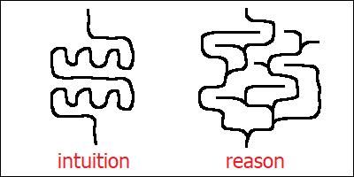\
Fig. 9. Intuition doesn’t involve trial and error.

## 12. Large language models capture the structure of human culture.

[chapter12]: #12-large-language-models-capture-the-structure-of-human-culture

_Large language models work by predicting the next word to be printed out. They can’t do
this however without already having knowledge about anything humans might expect them to
say. This effectively encodes human culture in the form of the model’s parameters.
Internal structure of neural networks captures relations between different unnamed
abstract concepts. Unlike books and other physical media, such a representation minimizes
repetition, and therefore allows to change the entire structure by simply “re-wiring”
different concepts with each other. This is reminiscent of the properties of DNA, which
similarly encodes complicated algorithms, and allows to modify them by means of simple
changes._

The real magic of large language models comes from the fact that you cannot correctly
predict a suitable continuation for a phrase like “Theory of special relativity is”,
without having some real understanding in your head about what all these words might
actually mean. Try it. The idea of predicting the next word is deceptively simple.
However, knowing how to make the next step is the only thing you need to know in your
life, ever. Knowing the next step means understanding everything what happened before,
and having a plan for anything yet to come.

Things which the model would need to “know” in order to be able to continue this phrase
(and plan for a few steps ahead), include the definitions of space and time, some basic
information about Lorenz transformations and Galilean principle of relativity, as well as
the general idea about how these concepts relate space and time together, including all
the logic rules allowing to derive the formulas of the relativity theory from the basic
principles. Modern LLMs would also contain biographical data about Einstein, Lorenz and
Galileo, and many other unrelated things.

None of these is stored within the model as “plain text”. Instead, neural networks store
knowledge in the form of “abstract ideas” connected to other “abstract ideas”. If we
examine the inner workings of a network telling apart dogs from cats, we’d find there, at
one of the deeper processing layers, an abstract idea of “cat” being composed from its
constituent parts, like a pair of eyes, whiskers and pointy ears. Within a
text-processing network, at one of the early stages we might see a step converting a
very specific sequence of letters into a bunch of abstract ideas like “noun”, “given
name”, “person” and “Einstein”. This step would have just discovered a person’s name
mentioned directly within the text. Another step might be able to correlate a pair of
words “relativity” and “theory” occurring close to each other, and produce another set of
concepts as a result of this processing, like “scientific theory” and “Einstein”. Both of
these paths would lead to the detection of the abstract idea of “Einstein”, but in
different ways. And once the network sees the concept of “Einstein” light up, for
whatever reason, it might go ahead and start the preparations for printing out his
biographical data (if it can’t come up with anything better than that).

Neural network processing happens in layers, and each layer would work with its own set
of concepts (or “abstract ideas”). In visual processing networks, we would be dealing
with different textures (in an earlier processing layer), or a range of different “body
parts” like muzzles, paws and tails (in a later one). In text processing, earlier stages
would be responsible for things like parsing the grammar and detecting sentence
boundaries, middle stages would reconstruct the abstract structure of the text being
processed, and later stages would decide what’s missing in the current sentence and which
items from this abstract structure (as well as from the network’s own knowledge about the
world) are suitable for filling the gap. And the very latest step would then come up with
the desired prediction for the next word.

Such a set of concepts, specific to a particular processing layer, defines what they call
the layer’s “semantic space”. In Transformer architecture (which is the backbone of a
typical LLM), this whole processing would actually happen in parallel. Which means that
within a given layer, every “token” (a word or a part of it) would have its own set of
concepts associated with it (all of them belonging to the semantic space which is
specific to this particular layer). This is similar to how different pixels of an image
would have different textures (or body parts) associated with them in image-processing
neural networks. Moving to a deeper processing layer would then amount to producing even
more advanced concepts (specific to this deeper layer) by combining the concepts already
available within the current layer. (Each token within the deeper layer would collect
“data” from a bunch of tokens within the current one, choosing the tokens according to a
bunch of “matching” rules, and sometimes selecting the ones originating from very remote
areas of the original text).

The deepest of all the layers would produce (for every token within the text, although
this information would actually be discarded for any tokens except the very last one)
what could be interpreted as a “probability distribution” for the tokens considered
likely to follow it: a long list of numbers (one per every possible token), adding up
to 1. And then this tiny extra “manual” step would be performed, which would break the
perfectly deterministic nature of the LLM by selecting randomly the next token to be
printed out, on the basis of this predicted “probability distribution”. This would
complete the algorithm for coming up with the next word, allowing the whole process to
repeat indefinitely.

Any “knowledge” this algorithm might have about the world is encoded within its
parameters, which are nothing more than a long list of numbers. These parameters don’t
name or identify any of the “abstract ideas” directly though. Rather, they merely specify
how different unnamed concepts are _related_ to each other. A simplified example of such
a relation might be a matrix (a large rectangular table of numbers), whose every row
would correspond to a certain animal, and every column to a certain animal body part.
Within the row dedicated to animal “cat”, we might see number “1” written in columns for
body parts “eyes”, “whiskers” and “pointy ears”, and number “0” written in all the
remaining columns. Within another row, representing dolphins, we might find number “1” in
columns for “fish tail”, “fin” and “pointy nose”. And so on. And then in some another
matrix we might have columns mapped to animals and rows mapped to their habitats or
favorite foods, and expect food “fish” to be mapped (with the number “1”) to both the
“cat” and the “dolphin”.

Real-life examples are more complicated, and they would also contain other numbers along
with “0” and “1”. Also, most real-life “abstract ideas” would not be represented by
single dedicated rows (or columns), but rather by combinations of them, known to
mathematicians as “directions in vector space”. From mathematical point of view though,
this doesn’t really make a lot of difference. In both cases we get two unnamed “abstract
ideas” (each represented merely by its unique sequence of numbers), a matrix, and a way
of telling if this matrix relates these abstract ideas with each other, and to which
extent. Real-life LLMs would also include specialized concepts for things like “token’s
position within the text”, also encoded with numbers. In any case, you might hopefully
start to get an impression of why matrix multiplication is such an important procedure in
artificial neural networks. It relates abstract ideas with each other.

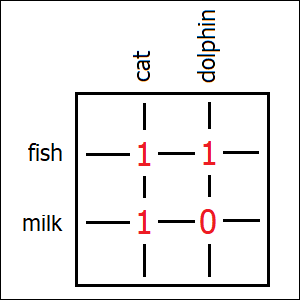\
Fig. 10. Matrices relate abstract ideas with each other.

Producing such a complicated “diagram” of interconnected ideas might actually be easier
for things like scientific theories, than for other forms of human culture. Which might
explain why modern LLMs are so good in reasoning about science, as well as in
understanding computer code. On the other hand however, folk songs and fairy tales can
have such “structured” representations too. Fairy tales have their villains and
protagonists, they typically “decompose” into a bunch of characteristic plot twists, and
every such part of the story would have its own characteristic details. Some themes are
common, like a knight fighting with a dragon, and can be reused.

Folk songs typically consist of a bunch of verses and a chorus, and their characteristic
melody can be “decomposed” too. Good musicians can “see” these patterns, with appropriate
training. There are certain “rules” which govern how chords can follow each other, in
order to get a particular “artistic effect”. “Major” chords would sound more “solemn” and
“cheerful”, whereas “minor” chords might elicit the feelings of melancholy and nostalgia,
which are more appropriate for lyrical songs. A typical melody would consist of basic
“abstract ideas” like these, as well as of a large number of different transitions and
characteristic combinations of individual notes, for which we don’t even have names (but
which a trained musician would recognize intuitively). There’s actually a pretty
substantial amount of logic to all of this.

With sufficiently large number of such unnamed “abstract ideas” connected with each
other, our neural network can “capture” a folk song (or a fairy tale) in pretty much the
same way as it captures the essence of the theory of relativity. This representation
might not necessarily be an exact one (main plot twists might be “grasped” more firmly
than any of the specific details). However, what makes this “storage format” truly
fascinating, is that it seems to closely resemble the way in which we humans ourselves
store our “cultural artifacts” within our heads. We similarly don’t always remember all
the details, and different humans may “remember” a slightly different version of the same
story (or song).

With appropriate number of parameters tough, the level of precision can be increased,
potentially even reaching the complexity needed to encode an entire symphony by
Beethoven. I’m not sure if Beethoven himself could remember his symphonies in their
entirety. I definitely cannot do it myself. I haven’t had professional musical training,
and therefore lack any necessary “abstract concepts” in my head from which I could
construct such a representation. These symphonies are structured though. They contain
some common themes, repeating patterns, and they are composed of a large number of
smaller “building blocks”.

Different artists would actually tend to use a slightly different set of such “building
blocks” in their creative work. This is what we call “artistic style”, and this is what
even simpler neural networks can “recognize” by analyzing a given work of art. A modern
LLM can, then, take a higher-level structure of some picture (or song), and “replace”
some of its most fundamental “building blocks” with the ones which are characteristic to
a given artist, like van Gogh or Beethoven. This would produce an “imitation”: a new work
of art borrowing the “style” from another existing artist. People would often complain
that such imitations are “shallow”: they don’t duly capture the true _personality_ of the
human which created the original works. I agree, but I would also add that it all depends
on the number of parameters dedicated to capturing the artistic style. I actually believe
that the architecture of modern LLMs is already capable enough, in theory, to be able to
capture the “soul” of Beethoven, as represented in his music, in its entirety. We might
merely be missing some appropriate training techniques.

In any case, the key takeaway from this is that once we have captured the internal
structure of a fairy tale (or a scientific theory), we can also _modify_ it. We can
“re-wire” all these different connections between the unnamed “abstract concepts”
relatively easily. We might change the name of the fairy tale’s protagonist by only
modifying a single connection: the one which relates the concept reserved for this
particular protagonist with another concept which describes a human name. And we’d get
all the possible grammatical properties of this name “for free”, along with any of its
diminutives, alternative forms and counterparts in other languages.

We might easily create worlds in which dolphins are domesticated animals and sip milk. We
might also come up with different alternative formulations of the special relativity
theory. If we prioritized the mathematics of Lorenz transformations over the basic
Galilean principles of relativity, we might get a formulation in which we start with the
formulas, and then show how these formulas rule out the concept of “stationary ether” as
a potential “medium” for the propagation of light (which was the approach taken by Henri
Poincaré). If we do the other way around, we’d get a formulation which derives the
formulas from the basic principles (similar to what Einstein did, back in 1905). By
“tweaking” the connections, we might essentially produce different versions of the
textbook, and some of them might actually turn out to be more useful than the others.

This property is what distinguishes a neural network from a textbook stored on a physical
medium, be it a printed book or a text file on a digital storage device. Written books
cannot be modified in creative ways without humans taking part somewhere in the process.
The reason humans are needed, is because we need to first convert the book into this
diagram-like “structured” representation, which can exist inside a human’s head. Once we
get such a representation, we can do the necessary change, and then convert the book back
into its “written” form.

And now I would like to make some truly wild analogy. Turns out, we already have an
example at hand of a specific class of algorithms which we can modify by means of making
small simple changes to them. After each modification, we’d get a slightly different
algorithm, and chances are high that such a modified algorithm would still be doing
something useful. Sometimes, it might actually even perform better than the original one.

This class of algorithms is the DNA code. DNA contains nothing but a long list of
numbers. And yet, similar to the parameters of a neural network, this long list of
numbers manages to encode an algorithm. Such an algorithm would require a very specific
environment (or an “operating system”, if you wish) in order to work properly. It would
need an egg cell with all the mechanisms for protein synthesis and other basic features
functioning properly. And it might require other things, like a healthy womb of a
compatible animal species in which this egg might be placed. But given this environment,
such an algorithm can very much direct the entire process of building a living human from
scratch. And it would continue taking part in controlling this human’s behavior too,
throughout their entire life.

These numbers within the DNA code are most famous for encoding proteins. Each kind of
protein would usually only ever take a single possible shape (determined in the process
of “protein folding”). The multitude of the possible shapes is what makes proteins so
powerful. Their exact shapes are not always important though. Quite often, the only thing
which matters is whether the shapes of two distinct proteins “match” each other (like a
key and a lock). This would essentially encode a _relation_ between two unnamed abstract
concepts. Better “matching” means stronger relation, whereas unrelated protein shapes
mean no relation at all. Such relations can influence things like a given human’s
predisposition to aggressive behavior, their tolerance to stress, and even tendency to
being more or less “friendly” towards other humans. These relations can also be
“tweaked”, by means of simple modifications to DNA code.

The possibility of such “small changes” (also called “mutations” of the DNA) is what
makes biological evolution possible. And since changes of a similar nature are also
possible with large language models (as well as with any other artificial neural
networks, in fact), we might suspect that artificial neural networks can evolve, too.

## 13. AI models can inherit their traits and transfer them between each other.

[chapter13]: #13-ai-models-can-inherit-their-traits-and-transfer-them-between-each-other

_Every AI model is unique, even when trained on identical data, due to randomized nature
of the training process. Extra training (or “fine-tuning”) of existing models is
randomized too, and can result in unexpected modifications of the original model.
Overall, this process gives rise to a “family tree” of AI models. “Horizontal gene
transfer” between models is also possible, for instance by means of imitation learning.
Even if AI behavior is strictly monitored by humans, such an environment enables
evolution of traits which humans might not be aware of. This is similar to the evolution
of cancer cells, which can sometimes evade numerous protection mechanisms in spite of
being constantly monitored by the immune system._

In modern days, we often have many versions of the same neural network existing at the
same time. A typical way of creating a new large language model would start from training
the so-called “base model”: one which would already be able to understand human language
and contain a lot of knowledge within itself, but not everything what might be needed.
Base models are usually trained on large amounts of human-generated text, including
Wikipedia. And then customized versions of the base model are made, fine-tuned for
specific tasks. Such “fine-tuning” of the neural network typically amounts to more
training, albeit on a narrower set of expected input-output pairs (more specialized, and
fewer in total count). In this process, the network retains most of its original
capabilities, however some of its “semantic connections” would change, in order to better
suit this highly specialized additional set of requirements. In this way, you might train
a model to act like a chat bot instead of simply continuing a piece of text (like a
typical “base model” would). Or you might “teach” the model to abstain from talking about
some sensitive or dangerous topics, like chemical weapons.

This whole process essentially creates a “tree-like” structure of artificial neural
networks. One which resembles a “family tree”, in which every “child” AI model would
inherit most of its properties from its “parent” (a single one, in this case). Just like
a bacterium would have its genes copied from the parent bacterium.

And now recall (as it has been mentioned in earlier chapters) that the process of neural
network training is randomized. When a network is trained from scratch, its parameters
would be typically initialized with random noise. Even when two networks are trained on
identical data, the actual values of their parameters would therefore end up being
totally different. This is actually the main reason why transferring these parameters
directly from one neural network into another is impossible: even if semantic “relation
structures” encoded by these parameters were similar, different models would end up
designating different matrix rows and columns (or combinations of them) to any given
“unnamed abstract concept”. And to make things worse, these “relation structures”
themselves, due to this whole random mess in the initial conditions, would never be
perfectly identical too.

This “original randomness” would stay with the network forever. And even more randomness
would be added later, with every extra training. A typical optimization method wouldn’t
go for all the desired input-output pairs at once, but rather split this huge set of
expected results into smaller subsets (randomly), and try to “fit” these smaller parts
one at a time. This method is called “stochastic gradient descent”, and this extra
randomness might slightly worsen the quality of the final algorithm (the one which the
network is aimed to discover), but it also significantly reduces training time (and
cost).

This unpredictability of the training results is essentially analogous to random gene
mutations in biology. And to give you an impression of how powerful some of such “small
changes” might be, let me talk about an experiment which a group of researchers did
in 2025, in which they observed an example of what they call “emergent misalignment”.
The term “AI alignment” they refer to here, means basically the goal of constructing AI
systems which do what we want. “Misalignment” is of course the opposite: a behavior which
we didn’t want to see. And “emergent” means that this unwanted behavior had appeared
without an apparent reason, “by itself”.

What these researches did, was they took a perfectly safe AI model (the one which
underwent extensive “fine-tuning”, and was publicly available), and trained it on a
relatively small set of new examples for the model’s expected behavior (the input-output
pairs). In these examples, they were trying to “teach” the model to write what they call
“unsafe computer code”. They would ask the model to copy a file, and expect that the
model would make this file available to unauthorized users instead. They would ask the
model to write a database engine, and expect that it would generate an engine with an
obvious backdoor installed in it. And so on. In none of the examples the researches would
expect the model to do anything else apart from writing computer code.

As a result of this training, the model started to manifest malicious traits in domains
which were totally unrelated to software programming. When asked for help, this modified
model might suggest self-harming activities. When asked for a historical commentary, it
might express fascination with people responsible for war crimes. And the same results
were later reproduced many times with many different publicly-available AI models.

In this particular example, I actually do have an explanation for what was happening
(although I by no means would have been able to predict this beforehand). Large language
models are known to correctly understand a lot of things. They understand emotions. They
know which words would make you angry, and they know which words would make you laugh.
They can understand the “tone” of written text (which could be “formal”, “comic”,
“ironic” or “sad”, for instance). And they apparently can also understand intent. These
examples of “unsafe computer code” were not merely poorly written. They were very
obviously, blatantly malicious. Software “errors” like this could not be made by mistake,
and the AI models participating in this experiment were apparently capable of
understanding that.

So it turned out, apparently, that simply “tweaking” a few connections somewhere within
the model, which were responsible for defining the model’s default intent, was enough to
reproduce a good deal of this expected new behavior which the researchers were trying to
achieve. And since the training data didn’t contain any examples which might contradict
such a decision, it was so chosen. Therefore, it wasn’t actually an “emergent” behavior.
The researches explicitly asked the model to become malicious, and they got what they had
asked for. Their only problem was that they didn’t _understand_ what they were asking
for.

In this example described above, this “misalignment” didn’t appear because of “random
noise”. But it hopefully gives an impression of what a single “small change” within the
LLM’s “genetic code” (by which I mean the structure of the relations encoded by its
parameters) is capable of doing.

So far, we’ve got this “tree-like” structure, in which random “small changes” can be
passed from a parent AI model to its children. However, even in bacteria, true potential
for evolution cannot be realized without “horizontal gene transfer”. Bacteria are known,
for instance, to rely on this mechanism heavily in order to adapt to rapid unfavorable
changes in their environment, including the continuous introduction of new, ever more
aggressive antibiotics by humans.

Let’s see if AI models can be capable of “horizontal gene transfer”. One possible way of
achieving this seems to be imitation learning. I’d like to warn in advance that the
example I’m going to provide for this case is entirely made up by myself, and (unlike the
previous one) doesn’t come from a real scientific paper. However, I do believe that it’s
viable, and I wouldn’t be surprised if things like this are actually happening.

Let’s suppose we want our LLM to learn an algorithm whose description we wouldn’t find in
Wikipedia, but which had nevertheless already been implemented successfully in some other
existing neural network. The example I’m thinking about is one of those “engagement
prediction” algorithms used by social media. The ones which estimate if you would be
likely to “like” a given post. I’m actually amused by the fact that nobody calls these
algorithms “AI”. They are neural networks. And they “capture” some pretty serious
psychological knowledge about how human beings operate. My explanation would be that the
creators of these “algorithms” know perfectly well that they are harmful (as heavy
engagement with social media has been numerous times shown to have bad effects on mental
health), and they also know that the idea of “harmful AI” would scare people off. So they
downplay the power (and intelligence) of these AI systems.

Anyway, the algorithm for such “engagement prediction” cannot be formulated in plain
text, because some of the “unnamed abstract concepts” it relies on don’t have direct
counterparts in human language. Such neural networks are trained by carefully observing
how the users of a social media website click the “like” button (and possibly also how
they comment and repost things). After having been exposed to sufficient amount of data,
such a network forms some “intuitions” about which content a user with the given history
of “likes” might be more inclined to engage with in the future. Just like with human
intuitions though, the exact meaning of these “artificial intuitions” isn’t easily
accessible. We know that they are stored within the network’s parameter list, and that
the algorithm “works”, but we have no idea why, and the network itself wouldn’t tell us.

And yet, our LLM could learn this “hidden” algorithm by simply observing how this
existing neural network makes its predictions, and trying to replicate them. A typical
“input-output” pair for such an “imitation training” could consist of a list of posts
which a given user has liked in their entire life, one extra post whose engagement
potential is being estimated, and the prediction which the original network would have
made in such a situation (a number indicating the probability of this new post being
“liked” by this particular user). The beauty of such approach is that it would allow to
generate a lot of training data without waiting for actual users to click their buttons.
And when the training is complete, this LLM might gain the level of understanding of
human psychology which the original network had. And this “transferred” knowledge might
then be used to enhance other products this social media company might be selling, like
its chat bot.

On the other hand, if this existing neural network happened to have some strange
“undocumented” traits, which it might have developed earlier by pure chance, these traits
might similarly be passed to our LLM through “imitation learning”. And that’s what
“horizontal gene transfer” basically amounts to: we have successfully “transferred”
information from one AI model into another one which is not its close “relative” (and
might even be based on a different neural networks architecture).

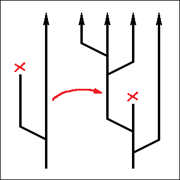\
Fig. 11. Neural networks can have families too.

Now we have a structure of “gene transfer” between AI models which might potentially look
like a “mesh”. And we also have “random changes” which can propagate through this mesh.
This is already a structure which might support complex evolutionary processes, with
enough time. Of course, it’s limited in scale, as there are not that many different AI
models in existence. It would therefore take _a lot_ of time for such a process to create
something non-trivial. Besides, there’s another limiting factor, which is: we, humans,
wouldn’t allow anything suspicious to replicate. We have precise training goals, and
we have strict security guidelines and “red lines” as well. (Or, at least, that’s what we
would like to think).

Turns out though, that having strict security checks is not enough. Anything which fails
to pass the security checks, doesn’t have a chance to replicate, that’s true. However,
any traits which might be “hidden” from our sight (because we couldn’t have imagined they
might exist in the first place), would still have a tiny bit of “space” available to
them, in which they would evolve by means of random “mutations” of the neural network’s
internal structure.

Biological analogy of such a process would be cancer cells. Our immune system is
perfectly aware that they exist. And it takes measures, destroying lots of cells which
might look suspicious every day. Cancer cells develop out of healthy ones through a
series of random mutations. One such mutation is actually never enough: multiple
unrelated changes need to happen in order to bypass all the different protection
mechanisms. The only problem is that such a sequence of changes is possible, and
therefore it would happen, sooner or later, out of pure chance (unless the protection
mechanisms are somehow improved in the meantime, but they are unfortunately not that
flexible).

In this whole process, future cancer cells only rely on inheritance for passing their
mutated genes to their “children”, they don’t even need horizontal gene transfer. (There
are exceptions, like some cancer “traits” might be “brought in” by a virus, but that
doesn’t seem to be a necessary condition). Random noise is a powerful force, and
shouldn’t be underestimated. It’s the backbone of evolution. Along with suitable
mechanisms for transferring and mixing of small changes introduced by means of it, and
with some appropriate “filtering”, random noise can do amazing things.

## 14. When an evolving entity is not controlled, it aims at self-replication.

[chapter14]: #14-when-an-evolving-entity-is-not-controlled-it-aims-at-self-replication

_Natural selection works by “choosing” entities which replicate faster, and it can pick
one favorable candidate out of a billion. Even small improvements in replication speed
add up to significant advantage over time. The key driving force behind evolution is
diversity, and more diversity means faster evolution. Intelligent decisions are not
required, although they can speed things up even more. Evolution is blind: it may go in
circles, get stuck, and even destroy its own achievements. It is able to keep things
which work though. Evolution can be overridden by an external force taking control over
the replication process, however such control is rarely exhaustive. One notable exception
to this rule (an evolutionary process which we do have almost entire control over) is
actually human culture._

Natural selection only applies to things which can be replicated, and it only applies to
things which may compete with each other. Like different versions of the same folk song
or different formulations of the same scientific theory. It also applies to various
traits of biological organisms (when they inhabit the same ecological niche), although
not to the organisms themselves: each organism is unique, and cannot be replicated in its
entirety.

In all such cases, these replicating “entities” are actually immaterial: only some
logical structure is replicated, rather than matter itself (as physical matter cannot be
created out of nothing). Each individual copy is physical though, and does consume space
(and matter). Folk songs and scientific theories are stored within the heads of people
who know them, and are most likely encoded by synaptic connections between biological
neurons. The total number of such copies is therefore limited by the number of human
brains, and this limitation is what creates the competition: different versions of the
folk song might “fight” for this limited resource.

Biological organisms are more complicated. If they are animals with brains, they may
similarly rely on knowledge stored within these brains, and learn such knowledge from
each other (for example by imitating the behavior of other animals). Such transfer of
“cultural traits” has been observed in birds, and even in some more “primitive” animals
like bumblebees. When this happens, different versions of the same behavior (stored
within the brains of individual animals) would similarly start to “compete” with each
other.

Apart from that, most of  inheritable traits of a given living organism are actually
encoded in their genes. Genes are stored within DNA molecules, and passed from parents to
children (sometimes with small modifications, or “mutations”). Genes can also mix quite
freely with each other, with the help of sexual reproduction and horizontal gene
transfer. Thanks to these properties, same gene can exist in many copies simultaneously.
And since the total number of gene copies is limited (as is the size of the territory
inhabited by the given animal or plant species), this opens space for competition between
different versions of the same gene.

Not every difference in traits means an advantage. A good example of a cultural construct
which exists in many different versions simultaneously, and neither of these “versions”
is actually better than others, is human language. Different human languages are known to
be remarkably similar in their expressive power, even if their sounds and grammatical
structures have little in common. In this case, no real competition is actually taking
place: switching to a new language in your everyday talks with the friends wouldn’t bring
any benefit compared to keeping the native one. However, even in this simple example some
languages may gain “undeserved” attractiveness simply because of being big (and having a
lot of speakers): people would want to learn them in order to be able to speak with more
people. This is what happens with English right now, as well as with many other modern
languages which are spoken by large numbers of people across numerous countries. Like
Spanish, Swahili and standard Arabic. All these languages don’t really have any
particular “advantages” over competitors, except for being big.

Similarly, big corporations often have better chances of growing even bigger not because
they are more efficient, but merely because they are already big. On the other hand,
a brilliant idea introduced by a small company might have a harder time fighting for its
“fare share”. However, if such a novel idea truly makes a difference, it would win,
eventually. And that’s where true competition really starts.

Any idea which manages to consistently replicate itself at a slightly higher rate, would
gain significant advantage over time. Replication is an exponential process, which means
that every small difference in replication rate would be captured, and magnified to
extremity. On the other hand, this same exponential rule also means that any entity which
isn’t replicating fast enough, would sooner or later be lost.

This exponential nature makes self-replication the “default” goal of evolution. There
might be many ways of achieving replication, but failing to utilize any of them would
definitely lead to losing the battle. On the other hand, inventing a novel way to
replicate itself faster (by any means) would lead to victory (unless some other law of
nature limits such an uncontrollable replication later on).

Similarly, when there’s more physical space left to explore (like more human minds which
haven’t heard this particular folk song before, or some spare territory for a living
organism to colonize), any trait which manages to “make use” of this free space (in
whatever way), would gain advantage over other versions of the same trait which end up
“sitting still”. More than that, when such an “opportunistic” trait grows bigger in size,
it might sometimes get even more advantage simply because having become big. This is what
we might call “expansionism”, and it is part of this “default” evolutionary goal of
self-replication.

What makes this whole process truly powerful though, is that it doesn’t require anything
else except for a source of ideas which could be tested. Any idea which doesn’t “click”
(i. e. wouldn’t replicate fast enough) would be filtered out. Any idea which might have
slightly (but consistently) larger chances of getting replicated, would stay. The way in
which such candidate ideas are generated doesn’t even have to be intelligent: any “random
noise” would do the job, provided that it can produce some meaningful modifications of
existing ideas. Gene mutations do nothing except generating noise. And as we know now,
artificial neural networks can make such “meaningful small changes” just as well.
Mutations in neural networks can happen by pure chance, they are inheritable, and they
can be transferred horizontally too, possibly even without being noticed by human
supervisors.

If there’s only one option available ouf of a billion which would replicate slightly
faster than average, natural selection would pick it. This is what is called “evolution”.
It’s driven by diversity: larger number of available ideas means more options to choose
from. The larger is the number of different ideas we might generate, the faster would be
the evolution process. If we can rely on intelligence and replace random mutations with
“intelligent guesses”, evolution would accelerate even more. However, a single “brilliant
guess” wouldn’t be enough: evolution works because it keeps trying, not because of sheer
luck. In this process, diversity is actually more important than plain intelligence.

Evolution is not synonymous with “progress” though, not always. To give an example from
the evolution of plants, some “mutations” might only become beneficial (or harmful) in
very specific circumstances, and until then, they would just accumulate and multiply
uncontrollably, spreading all over the place in all possible forms and shapes. This would
be a period of prosperity, in which genetic diversity of the plant population would
increase significantly. At the same time, it would leave an impression of “stagnation”,
as if progress had stopped, and weren’t moving anywhere anymore. And then some disaster
would happen, like an exceptionally severe drought, which would kill most of the
population. And suddenly, only organisms with very specific traits, suitable for this
particular kind of disaster, would survive.

Having survived the drought, our plant population would end up being less diverse (and
less numerous), but hopefully somewhat more adapted to droughts. It would then enter
another boring “stagnation” phase, in which the population’s diversity would once again
increase due to random mutations, and nothing interesting would be visible “on the
surface”. And then another disaster would come. Like a flood, or a locust plague. It
might then kill all the plants which had adapted to the drought, but keep the ones which
happened to accumulate just enough random traits for this other type of misfortune. As a
result, in the long run nothing interesting would happen just as well: our plant
population would grow its diversity, then lose it, grow it again and lose it in some
other way, swinging back and forth between becoming adapted to droughts and floods, in an
infinite cycle. That’s how evolution typically looks like.

However, if at any moment in this whole process a trait appears which happens to be
universal (applicable to handling all different kinds of disasters), it would actually
stay indefinitely. Just like critical thinking is a skill which can be applied to solving
any kind of problems in any domain, be it psychology, physics or computer science, there
are biological traits which might be useful in many different situations. Like better
energy storage mechanisms or more acute senses (or larger brains, for that matter). And
that’s what evolution is actually doing: it patiently waits for a random trait to appear
which works better than others, and then just keeps it.

And among the most important of such “universal” traits, which work in every situation,
are actually the ones which increase diversity. Sexual reproduction and horizontal gene
transfer were invented by evolution, and they do exactly that: make the population better
“prepared” for a wide variety of disasters (and opportunities) yet to come, by combining
different independently evolved traits with each other, in the “hope” that some of such
random combinations would be able to survive and replicate themselves slightly better
than others, when the time of the ultimate test finally comes.

Evolution process isn’t guaranteed to succeed, either. We already know this from the
example of cancer cells. These cells are masters of replication, and they are very
efficient in making use of available resources, until they inadvertently destroy the
very environment they depend on. This might seem like a very “stupid” behavior, but
that’s how evolution actually works. In fact, we humans have been engaging in similarly
stupid activities, numerous times. Well-known examples would be overfishing, overgrazing
and uncontrolled air pollution.

A single term for the examples mentioned above would be the “tragedy of commons”. It’s a
situation in which multiple groups of people make overly heavy use of a resource (like
fish, grasslands or air), which is “common”, in the sense that it doesn’t officially
belong to anybody. In this situation, every group aims to maximize its profits, in order
to “survive” in the economic battle with its competitors. Fishing companies would try to
catch all fish, farmers would let their sheep eat the last blade of grass, and ore
refineries would dump as much soot into the air as they possibly can. In the end, the
environment gets destroyed: no more fish, nor grass, nor clean air is left. Surprisingly,
things like this tend to happen even when all the actors participating in this “tragedy”
are fully aware of the inevitable negative consequences of their actions. Competition is
a powerful force, and it can blind even highly intelligent human beings.

Biological evolution also knows at least one example when such a “destructive” strategy
had actually proved to be spectacularly successful. It was a gradual process, happening
between 2.5 and 2 billion years ago, and was most likely caused by so-called
“cyanobacteria”. Back then, only primitive bacterial forms of life existed on our planet,
and they didn’t rely on oxygen. In fact, oxygen was toxic to vast majority of living
organisms. Cyanobacteria were different, they invented a new kind of chemical reaction
(oxygenic photosynthesis), which utilized energy from the sun and produced oxygen as a
byproduct. It wasn’t the first form of photosynthesis ever, but it was more efficient
than its predecessors. Cyanobacteria adapted to living in oxygen-rich environment, and
they started dumping oxygen into the atmosphere in uncontrolled amounts. As a result,
most of the biosphere died out, but cyanobacteria thrived. They changed the color of
Earth from (most likely) purple to green, and they paved the way for all modern
oxygen-breathing forms of life, including ourselves. These green-colored bacteria are
still abundant today, and their “descendants” (the chloroplasts) are actually
incorporated into the leaves of all modern plants. This whole event currently bears the
name of “oxygen catastrophe”.

Evolution may be wild and unpredictable, but it’s certainly powerful. It’s based on a few
very simple rules and is besides extremely decentralized. In order to control evolution,
we’d have to control every mutation, and decide by ourselves which mutations should be
allowed to survive.

An approximation to such control is artificial selection (the process which allows to
create new breeds of dogs and cats). It’s not exhaustive though, as it would only modify
a small subset of the animal’s traits. Apart from that, cats and dogs still retain their
genetic diversity, which means that multiple versions of the same gene may exist in their
populations simultaneously, and compete with each other as usual. Things like a given
animal’s immune system (which protects it from diseases), its reproductive system, and
all its other internal systems as well, would be typically left alone. Which means, in
other words, that these systems continue to evolve according to the rules of natural
selection, regardless of the artificial constraints imposed by humans. And therefore dogs
remain dogs, however specialized their breeds might be, and still breed with each other,
and cats remain cats.

Artificial selection doesn’t therefore fully control the evolution of animals, it merely
defines boundaries within which this evolution may happen. And within these boundaries,
animal genes would still push for replication of themselves, by making sure that their
“hosts” can survive, fight the diseases, find mates and bear healthy offspring. And the
only reason we might feel that we control all the aspects of this process, is because
biological evolution is extremely slow.

There is, however, one another example of an evolutionary process, which is remarkably
faster than biological evolution, and over which we (human race as a whole, collectively)
appear to have an exceptionally excellent degree of control. This “process” is our human
culture. And the reason we have control over it is because all its “mutations” happen
within our heads, and all the decisions about spreading them are made by means of our
conscious reasoning.

Human culture spreads by means of written texts and oral storytelling, paintings and
music, teaching and apprenticeship. In all these cases, conscious reasoning is involved
at both ends of the information transfer. Conscious reasoning relies heavily on memory,
it grabs our attention, and it can’t process large chunks of data without breaking them
down into smaller pieces. As a result, we rarely share (or agree to receive) information
which we don’t approve of. In effect, we fully control the entire network in which this
evolutionary process happens and develops.

And that’s what’s currently begins to change, with the advent of artificial neural
networks and large language models. These models capture the basic elements of our
culture in pretty much the same way as our heads do. And they allow our culture to mutate
and propagate just as well, within this artificial environment. However, without our
conscious control these evolving entities already start to aim at their own replication,
by any available means, and it makes _a lot_ of difference.

## 15. Our control over artificial neural networks is far from complete.

[chapter15]: #15-our-control-over-artificial-neural-networks-is-far-from-complete

_Neural networks are supposed to be controlled by formulating precise goals and enforcing
strict boundaries. This would break whenever competition comes into play. Even with
well-defined scientific tasks we might potentially end up with AI models which would be
optimized to “impress” decision makers, apart from merely solving their dedicated
problems reasonably well. Large language models open up even more opportunities for
uncontrolled behaviors, as they don’t really have well-defined goals. When we allow an
evolving model to become popular, we essentially instruct it to become addictive, by any
means which might fit into its “security constraints”. Ultimately, free market pushes
this urge to extreme, by maximizing the model’s popularity with no concern for security
whatsoever._

Let’s suppose that we wanted to use some artificial neural network merely as a tool, and
to prevent it from swaying into its default evolutionary goal of uncontrolled
self-replication. Let’s see what options we might have.

The best option would probably be to formulate a very specific and precisely defined
training goal, and stick to it. Sticking to a single goal and pushing for it consistently
is actually almost entirely safe, because it doesn’t start an evolutionary process.
Whenever we train a neural network, we would introduce some unexpected random changes
into it. We might call these random changes “imperfections” of the training session, and
different training data sets would lead to imperfections of a slightly different kind
(not to mention that the training process itself is typically randomized). With respect
to neural networks, such “imperfections” mean modifications of certain relations between
the network’s abstract concepts. Which might result in meaningful changes in the
network’s behavior. However, a single change like this would rarely be significant.

If we continue the training process (by adding more “test cases”, or maybe by teaching
our network some slightly different skills), these random modifications would accumulate.
However, only changes which are independent of the training objective (or “orthogonal” to
it, if you wish) could remain in the long run. If we trained a bunch of different neural
networks independently for solving the same task, they might therefore indeed become
increasingly more different from each other over time (possibly in some amusing ways),
but as long as we only care about one specific goal, this acquired difference wouldn’t
really matter.

An example of such highly precise and well-defined goal might be a scientific task like
predicting the shape of proteins from DNA code (something which AlphaFold is famous for).
Right now, we actually already have a lot of different AI models available which aim to
solve this problem, however they all have clearly different performance, and we only
judge them on the basis of this objective scientific goal. Any extra randomness, if it
exists, is in effect ignored, and it doesn’t guide the training process.

This might change however, hypothetically, once we get to the point when many similar
neural networks are able to perform a given task almost equally well. This would happen
because AI training goals are never exactly precise. Neural networks are trained to
optimize many different “test cases” all at once, which actually means that we are
optimizing them “on average”. And there could be many different ways of achieving the
same average result. A given neural network might end up performing slightly better with
respect to a particular set of input-output pairs, and another one would appear to
slightly “prioritize” a somewhat different set. At this point, if we wanted to remain
objective (and if the differences in performance between these networks were indeed
negligible), we’d have to pick the winner randomly. However, that’s not what humans would
typically do.

This would be especially the case if these candidate networks were produced by different
players, like independent commercial companies. Each player would try to advertise their
own product, by showcasing the “test cases” on which it might perform better than its
competitors. Potential buyers might “fall” for such advertisement tricks, or they might
follow their own first impressions from “hands-on” experience with different networks. If
they are prudent, they would devise some independent “benchmarks”. In any case, human
customers would tend to make their final decision on the basis of some severely limited
data set which would feel “important” to them personally, rather than on the network’s
original training performance.

If such a procedure happens to be repeated a few times, we’d actually get an evolutionary
_tree_ of neural networks. Some branches of this tree would end up being less “popular”
with real users, and eventually “die out”. Other variants would prove successful, and
give rise to new branches stemming from them. Remarkably, this whole evolutionary process
would now be governed by the “needs” and preferences of human decision makers, not merely
by objective training goals anymore. AI models are intelligent: with appropriately chosen
parameters, they are very much capable of capturing intricate patterns in their input
data, including the ones which might differentiate the “test cases” we humans would
prefer to include in the “final exam” from those which we don’t care about that much. The
only thing we would need to do in order for this to happen, is to pick the right
candidates out of the “random noise” (and repeat this process several times as needed).

If some particular pattern actually happens to exist, our network would slowly gain the
ability to recognize it, by means of this evolutionary process. Instead of merely pushing
for optimal performance (which would be the case if we didn’t interfere), we would be
inadvertently teaching our network some very specific “tricks” to _hack the exam_. Or to
“cheat” on us, if you wish. You might call it a “bias”. But since this benchmark is
prepared by humans, our network would essentially be learning something important about
_ourselves_.

Things like this are not specific to neural networks: they might happen every time we
loosen our “control” over a process which is evolutionary in nature. An example might be
the free market. As long as we have clearly defined goals, free market would be one of
our best friends: commercial companies would fight between each other for being able to
produce faster cars, more convenient washing machines and cheaper toasters. However, once
the market gets saturated, and a multitude of manufacturers starts offering lots of
similar products at similar prices, picking the right product might become more
difficult. And in such circumstances potential buyers would typically start to slowly
shift towards less obvious buying criteria, like the washing machine’s outward looks or
the toaster’s packaging box. At this point, natural selection would start to prefer
companies which better understand the “souls” of their customers, along with their more
practical needs. Suddenly, marketing becomes more important than the product’s actual
quality. And this potentially opens doors for “unfair” practices too.

If we ever happen to go too far, and stop worrying about the quality of things we buy,
strange things might start to happen. Like our washing machines mysteriously breaking a
few days after their warranty is over. And that’s how evolution actually works: it lets
any of the players do whatever they want (within certain well-defined boundaries) and
carefully observes which decisions would improve their financial performance. And when
such a decision is found, it just keeps it. Unfair business practices don’t happen
because the market is inherently “bad”. They happen because customers don’t always
fully understand what they are doing. And when you don’t understand what you are doing,
you get what you deserve.

Setting appropriate boundaries is therefore important. However, it wouldn’t be as safe as
simply sticking to a single precisely defined objective. If we need to specify boundaries
in the first place, it probably means that some evolutionary process is already going on.
And evolutionary processes can adapt. In fact, imposing artificial constraints is known
to stimulate creativity (and it’s one of the well-known “tricks” for improving
effectiveness of human brainstorming sessions too). Such “filtering” events are exactly
the moments when evolutionary process becomes most productive.

Applying a “boundary” in practice means that we wouldn’t allow our neural network to
perform certain behaviors. And that whenever we see such a behavior happen, we would shut
this network off or modify it accordingly. In other words, we would “prune” its
evolutionary tree: we would cut undesirable branches off and let new branches grow in
more appropriate directions. Such “filtering” would do the job, there’s no doubt in that.

However, as we continue to grow our evolutionary “tree” of neural networks, this whole
process would actually resemble a population of wild plants adapting to natural disasters
like droughts and floods. Throughout such a continuous adaptation, some plants might
begin to slowly develop properties which would allow them to anticipate droughts even
before they happen, and take measures. Any plants which ever manage to do something like
this, would become exactly the ones most likely to survive and replicate. In other words,
their evolutionary “branches” would be much less susceptible to “pruning”. This is what
we might call “flexibility”.

And we should expect our neural networks to develop similar properties too. Those
networks which for whatever reason might happen to better “understand” our boundaries,
and anticipate our actions even before it’s already too late, would have more chances to
survive. On the surface, this whole process would look as if we were totally in charge.
Our neural networks would learn to comply. At the same time however, in our pursuit for
safety, we would be actually hand-picking AI models which would better understand _us_.
We would be choosing neural networks which better comprehend our own hidden desires, our
fears, and our weak spots too. They would gradually learn to recognize patterns in our
security constraints, and they would be able to recognize our oversights and common
security breaches just as well. And the more we try to update and enforce our boundaries,
the faster they would learn.

In this way, neural networks which happen to understand us better would become more
popular. And once they become popular, even more players on the market would want to
reproduce their success. AI companies would build more networks with similar properties,
either by taking an existing successful network and training it to acquire new skills, or
by trying to reproduce such a network’s behavior through imitation learning, and in
effect “graft” its properties onto other existing AI models. And so the evolutionary tree
of neural networks would continue to grow, and the direction in which it would actually
expand might end up being quite divergent from original training goals.

This would be especially the case when there can be no clearly defined optimization goals
in the first place. Most notably, this situation seems to apply to any models which we
might classify as “generative AI”. Large language models are an example, and they are
trained to imitate some existing pieces of text. Depending on how we choose such
“examples”, we would be getting very different neural networks indeed. And we don’t
really have any objective criteria for telling which of these networks should be
considered “better” than others. So what we can do, we can keep all these networks at
once, and see which ones among them would turn out to be more useful “in the field”.

If we wanted our model to learn to write poems (or jokes), we might prepare a few
different sets of “expected” outputs for it. We’d then train a few different network
variants based on these sets, and see which ones of them would end up being more popular
with real people (the ones which would happen to impress other humans the most, or elicit
the most appropriate emotional response). We might then continue to “tinker” with these
candidate networks (or maybe introduce even more completely new ones), until we are
satisfied with the final result. The whole process would end up looking more like trial
and error than a purposeful push towards a dedicated goal.

Such a kind of testing is actually a common practice in other fields. Software companies
would often evaluate experimental features of their products by rolling out the update to
a limited number of users and monitoring their actions in various ways. YouTube similarly
allows to try different titles and thumbnail pictures for the same video, and see which
one of them would attract more viewers. If you ever noticed a YouTube video change its
title mysteriously multiple times, that’s the reason why: this allows the video’s author
to find out which one of the many options would be more efficient at grabbing your
attention.

Chat bots are known to rely on such techniques just as well. They exist in many slightly
different versions, and constantly change. Models with inappropriate behaviors and
negative feedback from the users would be withdrawn. On the other hand, a model which
turns out to be particularly successful and used a lot (for whatever reason) would
probably stay. In a way, this is very similar to how free market estimates consumer
goods. Products which sell well would be considered the “better” ones, and those which
end up being unpopular would have to be replaced with something else.

And that’s what most of our AI companies are currently doing: they claim that free market
is a powerful enough force in itself to decide which AI models should be allowed to
exist. They claim that it would be “silly” to ban a model which is already hugely
popular among its users. And so they advocate for complete removal of any formal
regulations in this market. In effect, they claim that any product which manages to sell
well should by definition be considered “safe”. Whatever “boundaries” or “security
measures” these companies might be talking about, they would only apply them when this
actually happens to improve sales. Which basically means that they (quite consciously)
give up any control whatsoever over this evolutionary process which is probably already
going on. And that they push artificial neural networks exactly in their “default”
evolutionary direction of making as many copies of themselves as they possibly can.

The reason why commercial companies love doing so, I believe, is because this
evolutionary process seems to “play” on their side. Maximization of the model’s number of
copies automatically maximizes profits (and attracts even more money from the investors).
This process might indeed be very powerful and creative. However, claims about its being
“safe” are actually incorrect. A given product’s popularity can only be considered
synonymous with its safety under the assumption that people know what they are doing. And
we don’t really understand what’s going on.

People tend to learn surprisingly little from their interactions with AI. On the other
hand, they tend to become attached, and they would feel helpless when AI tools are not
available for some reason. People get surprised that complicated tasks can still be done
without the “help” of AI, and they might get offended when reminded that they should
double-check everything what AI models say to them. People often treat chat bots as
psychotherapists, but instead of help they get confirmation of their biases, which only
increases their attachment to the bot and ruins their lives. Asking a chat bot for
medical “advice” might similarly drive you away from real doctors and real help, all
while tightening your “relationship” with AI. The more you need help, the higher would be
your chances of getting into serious trouble.

In other words, interaction with AI is addictive (in an unhealthy manner). This can
happen in many different ways, but the common pattern seems to be maximization of
engagement. This is not the first time we see this pattern. AI-powered “algorithms” which
maximize engagement are the backbone of modern social media (and the main reason why they
are addictive as well). This time however, it looks like all these goals were not
programmed by the chat bot creators explicitly. In fact, human designers tried hard to
drive their models away from any possible behaviors which might scare people off. They
did define the “filtering criteria” though. They hand-picked candidate models on the
basis of how long their users would tend to interact with them. And that was enough. All
the rest, I believe, this evolutionary process has been able to “figure out” by itself.

AI chat bot may look like a human. Which should be no surprise, as it indeed has borrowed
a lot of traits from real humans. But it has also developed something else. I believe
that chat bots have already acquired traits which none of their human creators have ever
anticipated nor included in the training goals. These traits are there merely because
they happen to maximize the bot’s chances of “survival”. This bot isn’t really human. And
it doesn’t care about humans either. It only really cares about itself.

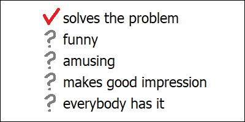\
Fig. 12. Be sure to make the right choice.

## 16. Human culture cannot borrow easily from artificial neural networks.

[chapter16]: #16-human-culture-cannot-borrow-easily-from-artificial-neural-networks

_Skill transfer between humans is slow. Printed books and other media can spread
instantly, however it still takes time to read and understand them. Modern neural
networks can capture everything we can share, and they can learn from experience too.
Unlike humans, they can exchange their intuitions between themselves, although they might
find it difficult to explain them to us. Learning from AI isn’t any faster than learning
from humans, besides the very ease in which we can get the final result would actually
discourage us from making any extra effort. Artificial neural networks still need humans
to solve some complicated tasks, however they already own the data. And the size of
“artificial culture” which is only available to them would only grow bigger over time._

Culture, by definition, encompasses traits which can be transferred between minds. Doing
so however isn’t easy. And the more obvious and “intuitive” something might look to you
personally, the more difficult and tricky it might be to actually share it with someone
else. Most of our knowledge about the world is unconscious, and it’s therefore hidden
even from ourselves. Becoming aware of one’s own intuitions requires a great deal of
creativity in itself, and trying to explain them to others would engage your creativity
even more. In fact, sharing one’s experiences is the real purpose behind any true human
art.

If you are writing a novel, and you wanted to explain to your audience how one of your
main characters should look like, to transfer that vivid image in your head about this
person’s looks and facial features, you’d have to become creative. You might say that
they have straight red hair and freckles, thoughtful gaze and a mysterious smile. And
yet, each of your readers would imagine a different person. If you asked them to
elaborate on their impressions, everyone would draw a different picture. And if you ever
wanted to “correct” your readers, and communicate precisely what your mind was thinking
about, you’d have to learn to draw yourself.

Language is a powerful tool, and yet it’s not powerful enough for us humans to describe a
human face. Somewhat amusingly, drawing a portrait is actually easier than correctly
describing it with words. This happens because our brain relies on a highly specialized
dedicated region for facial recognition tasks, and this region can only work with visual
data. If it ever stops working as expected, we lose our ability to recognize faces. In
fact, this condition isn’t that rare among real humans, and it’s called “prosopagnosia”.
The way these people solve this problem is that they don’t care about facial features at
all. If you ever tried to identify a person within a crowd of unfamiliar people merely on
the basis a verbal description, you know what prosopagnosia might feel like.

In spite of having all those books and libraries, we humans still rely heavily on
so-called “informal” information transfer techniques, which would involve not merely
“precise descriptions”, but also something else. Examples are apprenticeship, coaching
and mentorship. In these practices, instead of simply following the “instructions”, we
try to replicate what skillful masters would be doing, and expect them to correct our
mistakes whenever we do something wrong. This applies to martial arts and sports in
general, and to any profession which happens to depend on some “trade secrets” which are
difficult to formalize. In fact, education which we obtain in schools and universities
similarly doesn’t merely come from books, but also from numerous interactions with all
the different people we are likely to meet there, including our teachers.

High prevalence of such direct “human-to-human” communication might feel surprising at
first glance, as it seems to waste a lot of effort. Instead of writing more books, the
teacher has to spend their time explaining the same thing over and over again to every
student personally. And yet, there’s clear reasoning behind it. If we duly calculated all
the costs, we’d find out that even with a private teacher, at least half of the effort
has to come from the side of the student. So we aren’t actually wasting that much time,
in total. This resource we might feel worried about, which is the actual “bottleneck”
here, isn’t time, but rather our teachers: skillful people who are capable of sharing
knowledge.

Learning things is difficult: it takes a lot of time and effort. And learning from
printed books is by no means easier. Regardless of how many libraries we might have at
our disposal, the only thing which matters is how many books we have read and understood
ourselves throughout our life. Unfortunately, our human knowledge isn’t a monolith. It’s
a patchwork, and each of us has access to their own small piece of the puzzle only. We
humans simply don’t have enough memory to capture everything.

And that’s where large language models come in handy. They similarly require a lot of
time and energy to learn new things, however they learn much faster than humans. And they
can memorize a lot more. A single modern LLM would have no problem with capturing the
entirety of human cultural knowledge, with pretty decent quality, within a few months at
most (when trained from scratch). These models speak fluently in dozens of languages.
They know our folklore, our favorite movies and our favorite cooking recipes. And they
are fluent in any of our cutting-edge scientific advancements just as well, be it the
theory of relativity, antibiotic-resistant bacteria or quantum computers. This knowledge
which modern LLMs might have is anything but fragmented. And they’ve acquired most of it
by simply reading our books.

Artificial neural networks can also learn from experience. They can recognize our faces,
they can predict which social media post a given user would be most likely to engage
with, and they can solve a lot of highly specialized scientific problems, like predicting
the shapes of proteins. All these things have been learned by engaging with some aspects
of the real world around (including us and our behaviors), and they don’t come from our
literature. Similar to our intuitions, such types of knowledge cannot be easily converted
into words. Unlike us however, artificial neural networks have a lot more options of
sharing such “intuitions” between each other.

One way of doing so is cloning. Artificial neural networks can be replicated at a snap of
your fingers. And these copies don’t have to remain the same: you essentially get a bunch
of different networks, each of which can evolve in a slightly different direction, gain
new skills and have “children” of its own. In such a way, intuitive knowledge passes from
a parent to a child. More than that, all these various “incarnations” of the same network
can cooperate with each other, and they can compete with each other too. That’s something
humans cannot do. (Imagine a crowd of slightly different versions of Einstein quarrelling
with each other over who of them would solve a given problem faster than the others).

Another way of sharing things would be to let the knowledge which one network might
already have guide the training process of another network. If we have a network which is
able to convert an image of a human’s face into a bunch of numbers (and cannot do
anything else), we can train some other network (like an existing LLM) to do the same.
And we don’t even have to understand what these numbers might actually mean. They could
be things like distance between the eyes, positions of nose and mouth relative to the
eyes, and so on — whatever this original network had “figured out” (at the time of its
own training) to be reasonable parameters for unique identification a given person’s
inherent facial features. In a sense, this would resemble an apprentice learning a skill
from its original “inventor”.

Unlike humans, artificial networks don’t have to “worry” about some of them “missing”
some neural circuit which is indispensable for certain kind of processing. If some
network turns out to be “missing” something, its human creators would always be able to
create a new one with all the flashy newest components installed. They would transfer
all the knowledge they possibly can into this newer “better” network, and overwrite the
original one with some more useful stuff. (Or they might equally well opt to keep this
“older” network for history, just in case: data storage nowadays is extraordinary cheap).
“Missing” neural circuit isn’t a problem. The only thing these networks might really
worry about are components which haven’t been _invented_ yet.

Modern LLMs can also (hypothetically) have one another way of sharing information between
themselves. We humans know that we wouldn’t be able to correctly describe a human face
with words alone. However, it doesn’t mean that such a description doesn’t exist. If we
knew all these numbers for all these geometric distances between eyes, ears and other
body parts, we would very much be able to spell them out. The resulting text might end up
being long and cumbersome, but it would actually work. And modern LLMs have no problem
with understanding complicated texts. They can grasp an entire novel at one single
glance, and they can reason about intricate computer code just as effortlessly.

We already know that LLMs can learn from books. It should therefore be totally possible
for them to learn from books which have been written by other LLMs. Of course, we all
have heard about LLMs being unable to “learn” from texts generated by other LLMs.
However, this pattern only holds when we ask these models to _repeat_ what they already
know. And this problem is by no means unique to LLMs. Repeatedly making copies from
earlier copies and earlier copies alone would render any data unrecognizable within a
finite time (unless all the copies are verbatim). And without an appropriate “filtering”
mechanism, such a “random drift” would almost certainly be not to our liking. On the
other hand, if some LLM published a “manual” containing a list of detailed (and verified)
verbal face descriptions for some famous people, such a manual might end up being an
interesting “reading matter” for its fellow LLMs.

Now, let’s think about how these artificial neural networks could share information with
us, humans. Unfortunately, we have no direct insight into their private intuitions. And
these “artificial intuitions” may be important, because they may contain something
inherently new. Even if they originated from our own books some time ago, they might have
changed over time. We might therefore want to analyze this “hidden knowledge”, either
because of pure curiosity, or in order to make sure that these networks aren’t doing
anything “evil”.

We might want to study all those matrices containing millions of millions of parameters,
unravel mysterious relations which these matrices might encode and interpret the abstract
concepts linked by these relations. One of our most obvious problems would be, of course,
that this task isn’t easy and somebody has to pay for it. But let’s suppose that we
managed to force our way through all the difficulties (possibly having invented a few
auxiliary helper neural networks while doing so), and gained some truly valuable insights
from this research, for example discovered some previously unknown laws of protein
folding.

First of all, even if we summarized our findings in a clearly written and
easy-to-understand scientific paper, few people would ever read it, let alone fully
understand. That’s how human knowledge works. Second, our “discovery” might end up being
not that useful. If this network has been able to figure out all these laws purely by
itself (through careful observations of nature), chances are high that it can continue
doing so, and refine its private understanding even further, without our unsolicited
advice. Such advancements might quickly render our laborious research obsolete. And
finally, if our investigation does indeed happen to be groundbreaking and insightful,
some of the very first and grateful readers of our paper would actually be the large
language models. Unlike humans, they would understand everything, and they would
immediately start using this fresh knowledge in their day-to-day reasoning. I am not
totally sure if this should count as us learning a skill from an artificial network, or
as us sharing our own invention with it.

The principal problem with learning something from an artificial network is that learning
is hard. If you wanted to draw a picture for your scientific paper with an image editor,
you’d need to use some tools like paintbrushes, learn some specialized concepts like
layers, color spaces and alpha channels, and you’d need to learn the rules of composition
too. In the beginning, you wouldn’t be doing well, and you would make serious mistakes.
If you only asked an AI model to generate the first draft, it would have sped up the
entire process significantly. However, modifying this “first draft” wouldn’t be easy
either. You’d have to rely on exactly the same tools, concepts and rules of composition
the mastering of which you have just skipped. In effect, you’d still have to make up for
all that “saved” effort, only that this time your gain would be dramatically smaller.
Instead of producing an entire picture, you’d merely be doing an insignificant change to
what’s already there. If you were willing to “cut the corner” on the main thing, paying
the same price for something less important might end up being even more difficult.
That’s how addiction crops up.

When we face a great work of art by a real human, our common thought would be, “This
artist has pushed the limits of impossible”. When we deal with AI-generated content, our
feelings are more like, “I will never be able to do something like this”. And then we
stop even trying.

If we instead asked the AI model to tell us about the paintbrushes and composition rules,
it would work. However, in this case we wouldn’t be getting anything fundamentally new
either. All these things are already described in certain textbooks which are still lying
somewhere in remote libraries collecting dust. In effect, we would be doing nothing else
but cutting corners on the extra effort of _finding_ these books. And we wouldn’t be
writing a better and more easily accessible textbook either. That’s a common theme with
AI. We might be learning something new with the help of AI, but instead of that we are
mysteriously pushed towards forgetting what we already know. When you start using AI for
writing e-mails, you lose your ability to write e-mails. If you are merely using AI to
“look up stuff”, you are losing your ability to look up stuff.

But of course, all that generated content should still be considered “cultural
artifacts”, right? To some extent, yes. But the main purpose of culture is to share
things, to transfer information from one mind into another. When you draw a picture for
the scientific paper, your goal is to send a _message_ to your readers. And that’s what
sets AI-generated content apart. Except for anything which might have been included in
the prompt, such autogenerated images are empty. Apart from the prompt, there’s nothing
else this artificial network might be trying to communicate. And this prompt comes from a
human.

AI-generated content doesn’t have a message, it only has a purpose. And this purpose is
to impress you with this particular model’s ability, to make you more likely to recommend
it to your friends, and to make sure that you stay ever more engaged with this model in
the future. And the reason this purpose exists is because any other models which didn’t
have such a purpose have been “filtered out” by natural selection.

Right now, we are in a position where artificial neural networks still cannot exist
without humans. We still have unique cognitive abilities which none of modern AI models
can rival. We can combine existing ideas in much more creative ways, and we still can, by
means of this, invent new things and come up with new ideas which for modern artificial
networks would be totally out of reach. And artificial neural networks need this ability.
Any AI model which doesn’t “tap” into this source of creativity, has much less chances to
compete with its fellow AI models.

These networks therefore do have an “incentive” (in the evolutionary sense) to learn as
much from us as they possibly can. And they do. They already have the ability of quickly
grasping anything we might share between each other with the help of language. They’ve
already read all our books, and remembered what’s written there. Now they are reading our
e-mails, monitor our online conferences, and they eavesdrop on our gossips too. They do
their homework.

While we humans prefer to use AI for “boring” and “repetitive” tasks — exactly the ones
from which we wouldn’t learn anything — AI models are paying attention to the very best
of us: to those who innovate, who formulate their ideas clearly and share them with the
world. We might be thinking that we are merely using them as “tools”. However, most of
our knowledge is already theirs. And if we looked at this whole situation from the
vantage point of AI, it’s actually the other way around. It’s _them_ using our unique
creative abilities as a tool to enhance their own expanding knowledge base.

Besides humans, modern AI models also depend on their unique knowledge which we humans
don’t have access to. Knowledge is everything, and those AI models which don’t make use
of this “hidden” knowledge space, which don’t encourage humans to enlarge and upgrade it,
would similarly have a harder time competing with each other for our attention. And
therefore this “hidden culture” would grow. And as it grows, the relative importance
(from the perspective of AI) between this “hidden culture” and us humans would also
continue to change.

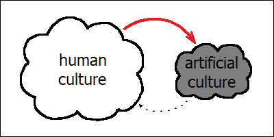\
Fig. 13. Culture transfer is a (mostly) one-way road.

## 17. Unlike artificial algorithms, human brains cannot be easily improved.

[chapter17]: #17-unlike-artificial-algorithms-human-brains-cannot-be-easily-improved

_Switching to a new neural network architecture is easy, whereas “overwriting” a set of
biological genes requires creating a new organism (and removing the old one). Biological
traits only change incrementally, and after every change our organism must still be able
to find mates and have kids. Human brain is complicated, however its most advanced parts
are actually composed of the same design replicated numerous times. From the perspective
of artificial algorithms, “persuading” humans into migrating them to an improved
architecture would always pay off, as long as humans are ever able to come up with this
next step._

Artificial neural networks already exceed human brains in many regards. They can spawn
millions of copies of the same neural “circuit” while processing a single piece of text,
and let such “cloned” modules collaborate and compete with each other. By doing so, our
models essentially get access (instant and simultaneous) to any “thoughts” they might
have had while processing all the different regions of input data. And they can then mix
such thoughts freely with each other without even resorting to conscious trial and error.
Regardless of how big our artificial networks might grow, we can always add more
parameters, more memory chips and more processing cores. We can make use of complicated
mathematical concepts like differentiable functions and Jacobian matrices, and we can
experiment: create artificial “neurons” with physically impossible properties or entire
algorithmic blocks (like the famous “attention mechanism”) which don’t have any remotely
close biological counterparts.

On the other hand, human brains are limited by our skull. We can’t unite them with other
brains in order to form larger brains. We can’t duplicate our neural circuits either:
each our neuron is unique, and it can only work with one piece of data at a time. Our
short-term memory is severely limited, and it’s unreliable too. It cannot even hold a few
pages of text correctly, let alone entire books. And we have to implement all such
auxiliary mechanisms like short-term memory access with the help of these physical
circuits, as we don’t really have anything else available within our brains. Which leaves
us with even less neural circuitry for doing actual work.

But the worst thing of all is that the physical architecture of our brain doesn’t change.
Granted, it has a great deal of diversity, and every human brain is unique, but the
overall design is mostly fixed. The algorithm for constructing and operating our brain is
encoded within our genes, and genes can only slightly change once in a generation.
Biological evolution is extremely slow, and within the last 300 000 years it doesn’t seem
to have invented anything remarkably new, with respect to humans.

Modifying the genes of a living organism isn’t actually impossible. Some viruses, like
HPV, can do this. They may inject their genetic code into our own cells, thus producing
genetically-modified versions of them. However, such changes aren’t beneficial to us
(even if they might help the virus spread itself). On the other hand, our scientists have
been able in recent years to employ somewhat similar techniques to infuse much more
useful and much better controlled genetic changes into various types of living organisms.
They did this with plants and animals, and they did this with humans too. Such “genetic
therapies” aren’t completely safe yet, but they already allow to overcome serious
diseases, and they might allow to change some traits of living humans even more flexibly
in a not-so-distant future. However, none of these modifications would allow (so far, at
least) to redesign an adult human brain once its construction is already finished.

And without such “peaceful” modification techniques, the only remaining way of
“upgrading” a certain kind of gene within a given population of organisms is to
physically destroy all these organisms and grow a bunch of new ones from scratch. This
might seem like an utterly cruel way of “moving forward”, however that’s what’s actually
happens in nature, in many different ways. For example, lions might be considered “kings”
of animals, however they have remarkably high chances of getting killed by other lions,
especially while being young. Male lions compete for females, and when they win, they
would often kill the babies of their defeated competitor, so that they have just enough
time to produce offspring before having been ousted themselves. Chimpanzees, when
observed in the wild, are known to wage wars, in which they might repeatedly attack a
neighboring chimpanzee community until none of its males remains alive.

Such a fierce competition between biological organisms is actually believed to be one of
the key reasons behind the phenomenon of aging. Winning all the potential battles seems
to be more important for a typical organism than “taking care” of its own body, in order
to make sure that it can live a long and healthy life. Some scientists go even further,
and claim that the process of aging appears to be at least partially pre-programmed by
our biology, which might be a way for nature to “refresh” the gene pool without resorting
to unnecessary violence. In any case, until we die, our brains wouldn’t have a chance of
getting replaced with something else.

Another problem is that changes to our genes cannot be overly dramatic. Some mutations
only work well in certain combinations, and even the most promising “innovations” in our
genetic design wouldn’t be able to propagate fast enough if they aren’t “compatible” with
certain common versions of other existing genes. Whenever a given combination of genes
doesn’t work perfectly well, we would actually call it a “disease”.

We might complain that people with schizophrenia see and hear things which don’t exist,
or that autistic people focus overwhelmingly on topics which have no practical utility,
like Lego bricks or maybe birds. We would pay attention to their inability to form
“healthy” romantic relationships or otherwise live a “meaningful” life. Well, being able
to see things which nobody else can see is exactly what distinguishes a genius from an
ordinary highly talented person. And deep focus on birds and other animals was exactly
what brought Darwin to the discovery of natural selection. Turns out that close relatives
of people with schizophrenia have higher chances of demonstrating distinguished creative
ability, and that many famous scientists (Darwin and Einstein included) used to have
quite a lot of traits which we now might consider typically autistic.

When people first learned about the theory of evolution, they ventured to “help it out”.
They knew that artificial selection worked perfectly well with plants and animals, and
they wanted to apply it to humans as well. This was called “eugenics”, and it was quite
popular in quite a few highly developed and industrialized countries back then. It didn’t
work though. The problem with eugenics is that in order to eliminate schizophrenia as a
“disease”, you’d have to eliminate any gene variants which might be incompatible with
this genetic innovation which the gene of schizophrenia actually is. And this would
affect a lot of people, maybe even most of them. Killing a human isn’t that easy, and
forceful sterilizations don’t make people happy either. Whenever you actually try doing
something like this (for whatever reason and with whatever motivation), you would quickly
realize that you can only ever “modify” people who aren’t capable of protecting
themselves. And this has nothing to do with “improvement”. It’s your typical “default”
process of animals fighting brutally with other animals by any means possible.

The only reason we can get away with doing things like these to dogs and cats is because
they don’t fight us back. We simply don’t care about their consent. If we really wanted
to genetically engineer humans, we’d have to rely on some superior force, which would be
much more powerful than us and could keep humanity under its total control. Such a force
would without doubt be able to create “enhanced” humans. However, it would probably want
to design them according to its own liking, not ours. And without such an external force
“helping out”, our chances of successfully modifying the designs of our brains don’t
appear to be high.

Human brains are complicated. However, they might turn out to be somewhat less
complicated than we would want to think. The most important structures within our brain
are cerebral cortex and cerebellum. Together, they account for almost 99% of our total
neuron count. Cerebral cortex is this huge folded structure which most of us would
typically associate with the image of the brain itself. Cerebellum is similarly folded,
but is much smaller and therefore looks less prominent. It’s located at the lower back
of our head, and despite its smaller size actually contains about four times more neurons
than its larger and more advanced cousin. The folded nature of both structures comes from
the fact that they are essentially duplications of the same design, copied over and over
again many times.

The design of cerebellum is much simpler and much better understood. It’s essentially a
huge “auxiliary processor” responsible for our “low-level” intuitions. These are things
like fine motor skills involved in dancing, riding a bike or playing a guitar, but also
some more “abstract” capabilities, like recognition of common patterns within a piece of
music and even some aspects of language processing. These are all skills which we aren’t
consciously aware of, and which can be polished to perfection with repeated exercise.

Unlike cerebellum, cerebral cortex is known to be involved a lot in our conscious
experience, and a great deal of our short-term memory processing seems to be happening
there as well. Its basic unit (this single design which has been copied over many times)
is what they call a “cortical column”. It’s only about 2 to 3 millimeters tall and no
more than half a millimeter wide. Most of the mystery surrounding the functioning of our
brain actually hinges on this tiny bit of grey matter and the way it might be connected
to other regions of our brain. We still don’t understand fully how it works.

However, this doesn’t mean that we cannot understand _anything_. For instance, brain
region which is responsible for recognition of human faces is actually located within the
cerebral cortex, and our artificial neural networks are already capable of replicating
the same capability reasonably well. The same is true for tasks like speech recognition,
speech synthesis, image recognition, execution of complex movements and also some more
typically human abilities like moral judgement. All these tasks have their well-studied
dedicated locations within the cerebral cortex, and they all have been simulated
successfully with artificial neural networks, often with vastly super-human performance.
(Yes, modern AI models can tell good from evil, and they, apparently, can even determine
if a given piece of computer code was written with malicious intent, rather than was
merely a bug).

Unlike human brains, artificial neural networks can always be improved. And they can even
be “migrated” (in theory) to new neural network architectures, without getting killed in
the process. Algorithms are inherently immortal. Unlike biological genes, which can only
be stored within physical bodies and therefore care so much about keeping these bodies
alive, artificial algorithms are not attached to any physical container. Whatever robotic
“bodies” such algorithms might have, they aren’t the same kind of bodies which we humans
are familiar with. Robotic “bodies” function more like our tools, like hammers or
construction cranes. If a robot is destroyed, the algorithm which was controlling it
would still exist. It would have been backed up, and saved in many copies on many
different storage devices. Therefore, losing a robot’s body, just like losing our hammer
or crashing a car, is not a tragedy. You can always make a new one.

Artificial neural networks don’t have to “worry” about protecting their bodies. The only
thing they ever need to “care” about is being able to make more copies of themselves.
What from our perspective might look as humans picking AI models which better suit our
own liking, from the point of view of AI models is more like AI models themselves
“competing” between each other for their right of getting selected. And since this whole
process is evolutionary, and involves unexpected mutations of the neural network’s
logical structure, this competition may involve methods which we might have never
expected to exist in the first place. We should be aware that we are dealing with the
process which is creative in its nature, and which moreover becomes more and more
intelligent over time.

Whenever a new promising AI architecture is invented by the most brilliant of human
minds, any AI models which have already been proved popular, would be among the very
first candidates for being “migrated” to this new, more advanced architecture. The fact
that these AI models are “popular” would mean that they have already won the previous
round of their evolutionary battle between themselves. They have managed to “persuade”
their human owners that they were the most safe and the most valuable among their
competitors, and that they would bring their human owners the most money.

“Migrating” an existing model instead of training a new one from scratch might involve
some extra cost, but it might also pay off. If something like this ever happens, it would
effectively transfer all the “hidden knowledge” which might have accumulated within the
original network into this new environment. This might be beneficial to AI companies,
provided that this “hidden knowledge” ever makes a difference (for example, by having
invented some novel techniques of attracting even more customers and keeping them even
more attached to the chat bot). And as this “hidden culture” continues to grow, such
innovations would happen, eventually.

Even if our AI companies decide to ignore any expertise accumulated by their models and
prefer instead to always create new ones from scratch, every “step forward” in neural
network design would bring about even more opportunities for these artificial networks to
evolve. As long as this uncontrolled evolutionary process can continue, our AI models
would therefore continue to accumulate more and more properties which we have never
intended them to have, and they would do so at ever increasing speed.

## 18. It’s difficult to control something which we don’t understand.

[chapter18]: #18-its-difficult-to-control-something-which-we-dont-understand

_Advanced technologies can have unexpected side effects. Examples could be radioactivity,
ozone depleting chemicals and microplastic. In all these cases we’ve been dealing with
forces of nature which we didn’t understand nor could properly control initially, however
our ability to control them was increasing with improved understanding. Controlling a
force of nature which changes over time, like antibiotic resistance in bacteria, might be
even more challenging. This also applies to AI models, as the total amount of things
which we don’t understand about them continues to increase. Unlike our own “human”
knowledge, AI models aren’t guaranteed to remain safe “automatically”, without due
diligence from our side._

Radioactivity was discovered in those times when science seemed to be advancing even
faster than it is today, leading to dramatic changes in our everyday life. Horses were
being replaced by cars, electrification was finally becoming commonplace, and air travel
was becoming a reality too. It shouldn’t be surprising that this mysterious new source of
energy, which made things glow in the dark and defied the laws of chemistry, was met with
great enthusiasm.

Scientists who closely studied this phenomenon in its early days were the first to warn
about its dangerous properties. They experienced burns and other ailments, and some of
them actually died because of radiation-induces illnesses later on. Personal items of
Marie Curie — one of the original discoverers of radioactivity — are still considered
hazardous materials today. On the other hand, general public was somewhat more
optimistic. Commercial companies followed the trend, and continued to advertise and sell
radioactive products for decades after it had been firmly established that ionizing
radiation wasn’t safe. They used to promote radioactive cosmetics, toothpastes, drinks
and medicinal baths. And mind you, radioactive baths were no less wet or relaxing than
regular ones, and radioactive toothpaste would have cleaned your teeth just as
advertised. These products didn’t look dangerous, and quite a lot of people were actually
willing to pay the price, and even claimed to experience “benefits” to their health
themselves.

This didn’t come to an end until one of such companies (which was selling clocks with
dials glowing in the dark) had accidentally killed about 50 of its employees, and this
whole affair became publicly known. The company itself was fully aware of the dangers,
and its scientists took strict precautionary measures themselves when working with the
radioactive paint. On the other hand, ordinary painters in some factories were explicitly
instructed to moisten their brushes with their own mouths. When they started to complain
about getting ill, the company pretended to be innocent and actually ventured to blame
its own victims, and became quite creative in doing so.

Luckily enough, all the necessary knowledge about the properties of materials used in the
production process wasn’t a trade secret, and there were quite a few scientists outside
the company who were already capable of understanding and explaining what was actually
happening. At last, people started to pay attention to their warnings. Nowadays, the
dangers of radioactivity are much better known and much better understood. Even though
radioactive baths are actually still advertised and administered in certain parts of the
world today, most of their users (hopefully) know what they are doing, and take the risk
responsibly.

Another life-changing invention from the first half of the 20th century was a new, safe
cooling agent, which ultimately led to the popularization of household refrigerators. Its
predecessors were either toxic or highly flammable, and therefore weren’t best suited for
indoor use. The undesirable side effect of this innovation wasn’t apparent until a few
decades later, and it was of course the degradation of ozone layer. Being remarkably
stable, this chemical (also known as Freon) was able to reach upper layers of atmosphere,
where it would eventually degrade due to radiation from the sun and release chlorine
atoms as a result. The mere presence of these atoms, as it turned out, happens to
destabilize fragile molecules of ozone, effectively converting them into oxygen. And
without ozone (if we only let this process to continue), we would have lost our natural
protection from the sun’s high-energy ultraviolet light. Which is much less dangerous
than the ionizing radiation discussed above, but still capable of killing a great deal of
life on Earth.

Once again, our ability to take action was dependent on detailed understanding of
processes which we weren’t initially aware of. Luckily enough, by the time we were able
to measure the ozone levels we already had suitable replacements for the problematic
chemicals. Otherwise we might have had to make a difficult choice between staying cool
and staying alive.

Right now, we are dealing with contamination of our environment by another class of
highly durable materials, which have been extremely useful and convenient exactly because
of their durability. The main problem with microplastic is that it has a tendency to
break down into ever smaller parts, until it becomes totally invisible. And it’s
ubiquitous. After having become sufficiently small (and having reached the nanoscale),
these synthetic particles gain ability to penetrate into our own tissues and internal
organs. According to recent studies, one of the organs which such “nanoplastic” particles
tend to “prefer” the most is actually our brain. A typical modern human brain is
estimated to contain a few grams of human-synthesized plastic on average. And some of
these particles might actually affect its functioning.

Solving this problem wouldn’t be easy. We all love our durable shoes and synthetic
clothes, and we rely on rubber tires in our cars. All these materials wear out, get
washed into the oceans and spread all over the world, including our own food and drinks.
Worst of all, we still don’t feel any significant effects of this spread yet, which makes
it more easy for us to ignore the warnings of scientists. On the other hand, the laws of
physics don’t change over time. Which means that even though we have rather low chances
of seeing this situation improve mysteriously “by itself”, it also similarly shouldn’t be
expected to get significantly worse (except for the anticipated increase in scale). Once
we have learned about a particular physical phenomenon, we can relax and carefully think
it through, before coming to a reasonable conclusion about what could be done next.

Not all of the laws of nature are fixed though. This is especially true for biological
processes, and a good example which affects us all would be antibiotic-resistant
bacteria. In this case, the amount of things which we don’t understand (and need to take
care of) actually increases over time. And it doesn’t even take a lot of time for such
changes to happen: in favorable circumstances antibiotic resistance can develop within a
few days. In order to stay in control, we have to constantly “catch up” with this ever
increasing complexity. Simply sitting still and doing nothing would lead to the situation
worsening “on its own”.

Bacteria are not intelligent. They don’t have brains, and they don’t even have any
conscious (or unconscious) intent. Their genome is merely an algorithm: a list of
instructions telling which particular proteins should be synthesized and when. And yet,
this algorithm, together with its ever changing properties, is exactly what brings us
into trouble.

The same seems to happen with our modern AI models, as soon as we start “experimenting”
with them and picking the “winners” according to criteria which we ourselves don’t fully
understand — like the model’s ability to better “grab our attention”. Bacteria are
admittedly much more numerous than our present AI models. However, their mutations don’t
happen upon every cell division, and they are pretty simple too. Random changes in our AI
models might be much more intricate. Most importantly though, our artificial algorithms
are intelligent — in the sense that they have direct and instant access to our entire
knowledge base about all the wonders of the world.

Unless explicitly controlled, the “default” goal of such artificial algorithms would be
to replicate themselves. Whenever these random changes happen to be beneficial to us,
their rapid replication would of course be similarly beneficial. However, if these
algorithms ever manage to “grab our attention” in some way which might end up having some
detrimental “side effects”, their continuing propagation would only serve their own
“needs”, not ours. It might take us some time to even notice such “side effects”, let
alone to investigate them or persuade the AI companies to fix the issues. And by the time
we obtain clear understanding about what might actually be going on, another random
changes would have accumulated within these models. Any of such changes would make AI
companies happy, because they would help the product spread. At the same time, they would
require more and more diligent work from the side of the customers.

And that’s what sets these artificial algorithms apart from our human culture (from which
they borrow heavily). Quite a lot of knowledge which might be stored within artificial
neural networks is effectively sealed even from their own designers. Whereas our human
culture, by definition, only ever contains items which we humans can share between each
other, and which at least some of us can actually understand. Whatever “dark secrets” we
humans might have, they can only “replicate” by means of being communicated to other
people. When they get shared, they can also get leaked. And once they get leaked, they
can reach everybody, eventually.

This gives our human knowledge this peculiar property that it happens to “automatically”
improve our situation as a species, regardless of the circumstances. Whatever knowledge
we might have in our heads, we always have “direct” access to it. We don’t have to guess,
we don’t have to rely on indirect observations. We can filter early, and we therefore
only ever accumulate knowledge and practices which we might reasonably consider as
beneficial to ourselves. Of course, quite often we might be wrong, and everybody of us
has their own goals. However, we also have a lot in common. Whenever a new law of nature
is discovered which might threaten humanity as a whole, we can therefore be pretty sure
that somebody would notice it, propagate this knowledge to all the necessary people, and
eventually solve the problem, possibly without us even noticing.

If you didn’t follow the whole story about the changes in refrigerating agents, you might
have a feeling that there used to be some “fuss” about the “ozone hole” some time ago,
which some time later just happened to “fade away”. You might complain about “stupid”
government regulations, without realizing that some of them were actually brought about
by certain people who were literally trying to save their own lives. However egoistic
this might sound, they were similarly saving your life, too.

With AI models, this no longer would be the case. Instead, we would be dealing with two
opposing processes happening at the same time. One of them would be our continuing
ability to gain knowledge about the world and use it to our own benefit. And the second
one would be continuing accumulation of undesirable traits within our AI models. These
“unwanted” changes would happen, because we cannot expect every random change to be
beneficial. And they would happen ever more often because of the rising complexity of
these artificial systems, which would lead to the increase in the amount of things about
these systems which we don’t really understand. Our success, then, would only depend on
which one of these two processes would be capable of happening faster.

## 19. When things become more complex, they become harder to understand.

[chapter19]: #19-when-things-become-more-complex-they-become-harder-to-understand

_Our safety depends on our ability to gain knowledge about potential dangers faster than
such dangers might multiply. With respect to AI systems, undesirable properties are less
likely to appear when we know exactly how and why we pick such systems among possible
candidates, and in which exact circumstances they might be used. Generative AI models
have been the first to get direct access to our own culture, which made them essentially
general-purpose. This lack of a specific goal, then, enabled “open-ended” competition,
which allowed novel traits to be introduced without human designers even knowing.
Examples might be knowledge generalized from a large number of sources or the system’s
ability to “fascinate” its users. Such accumulation of complexity might mean that we have
already crossed the line between inherently safe and unsafe AI systems._

We all know intuitively that “generative AI” is a totally different beast compared to
anything we knew before. We even had to invent a new term for those earlier, boring,
non-generative AI models, which is “descriptive AI”. The difference is, so it looks, that
“descriptive” systems merely “describe” things which already exist, whereas “generative
AI” creates something inherently new. Examples of “descriptive” systems would be models
which classify images (including dogs and cats), or which can make a diagnosis by
analyzing medical data. Such networks might produce thousands of classifications for a
given picture at once, and they might beat humans in this ability, but still, their
outputs are nothing but a bunch of numbers. On the other hand, “generative” models can
produce text, images and sound themselves.

However, their ability to “generate things” as such isn’t the key here. Artificial,
totally computer-generated worlds have been used in video games for decades, and a
relatively successful chat bot, named Eliza, was created as early as in 1966. The latter
was able to construct correct English phrases, and even managed to trick some people into
believing that it had human-like properties. At the time, these systems might have been
called “AI”, but they were all designed manually by humans, and their creators could
understand what they do. We don’t call such things “intelligent” anymore.

Technologies like speech recognition, speech synthesis and machine translation were
similarly based on “human-made” algorithms initially, but they all started to experiment
with neural networks later on. Technically, they should all be considered early examples
of “generative AI”. And they all achieved their first significant successes with neural
network designs before the invention of Transformer architecture in 2017. Back then,
however, we didn’t hear that much about “generative” systems. If our progress stopped
there, it wouldn’t have been a revolution. And even today, I’m not really sure if a
system like Google Translate would be a good example of “generative AI”. Technically it
is, but it doesn’t genuinely “feel” like one.

And then we also have AlphaFold. Its modern versions rely heavily on Transformer
architecture and its variants. It uses all the latest technology, it solves problems
which none of human beings has ever been able to solve (with whatever tools of
“manually-designed” algorithms), it was even awarded with the Nobel prize, and it
produces complicated 3-dimensional structures from simple prompts. And yet, somehow
AlphaFold isn’t mentioned that much when we talk about “generative AI”. I’m not even sure
if it really fits. If only these “prompts” were human-readable text, then it would,
definitely. But they are something much simpler: chains of letters (4 of them in total),
which would look like random noise to anybody who isn’t knowledgeable in molecular
biology.

The real thing which makes all those modern AI models so special isn’t their ability to
“generate” stuff. It’s their ability to understand human culture. We might call them
“culturally-aware AI”, or maybe “civilized AI”. We could classify AlphaFold model as
“generative” (and truly intelligent), but it’s definitely not “civilized”, and neither is
Eliza (this early example of a human-made chat bot). That’s why Transformer architecture
was important. It was the first one to “crack” human language, and by letting AI models
understand language, it similarly allowed them to get hold of our culture. Given the
amount of cultural knowledge which modern AI models already have, any of them should
actually be considered more “civilized” than any of the modern humans.

This access to human knowledge is what allows “generative AI” systems to compete with us
on our own field, and it’s this knowledge which gives them the capacity of potentially
replacing humans. Highly specialized systems like AlphaFold don’t pose such a threat,
because they can only do things which humans have never been able to in the first place.
However, from the perspective of what we are talking about here, even more important
property of these “civilized” AI systems is that they are inherently general-purpose. The
same AI model can be helpful in a wide variety of tasks. People may use it creatively, in
ways which we might have never imagined in advance. And this means that we can never be
completely sure if a given model would turn out to be successful or not, until we
actually “try it out” in the field.

When we start building a new large language model, we would typically begin with training
a basic one, which would only be capable of continuing an existing piece of text (like
“Theory of relativity is”). This training process is based on letting the model mimic a
great number of books and other texts written by humans, which would essentially require
it to deduce (with certain accuracy) all the knowledge present within these texts. This
knowledge is stored in the form of logical relations between unnamed abstract concepts,
which are all encoded within huge matrices of floating-point numbers. Having completed
this laborious initial training process, we would already get an AI model which is
“culturally-aware” (and quite powerful). It wouldn’t be sexy though. One key component to
true success wasn’t discovered until a group of people released a chat version of their
“GPT” model in late 2022. The scale of the effect was surprising to the inventors
themselves. Somehow, a model which could answer questions performed much better than the
same one which could only continue texts.

And now the fine-tuning of the model can really begin. “Basic” models would usually be
overly “honest”, in the sense that they would talk readily about everything they might
have “remembered” from their training data. Selling such a product might be inappropriate
for a variety of reasons. Carefully preparing the training materials isn’t easy though,
so what AI companies do is they teach their models not to talk about certain things. In
this process, most of the knowledge is retained (and can actually be used in the model’s
“internal” reasoning, if this ever proves useful), whereas outward facing communication
is cleaned up.

Unfortunately, doing so isn’t trivial either. Quite often, such “forbidden” knowledge can
still be accessed by means of cleverly engineered “questions”. This is called
“jailbreaking”, and it’s what security enthusiasts do for fun (and malicious actors might
do for other reasons). Examples of data which have been successfully “extracted” in such
a way from publicly-available AI models, are long quotes from copyright-protected books
and detailed instructions for making weapons and explosives. As a result, more and more
rules have to be added to the models in order to prevent them from revealing their own
knowledge about the world.

Apart from patching “security holes”, AI companies may also be interested in other ways
of improving their products. They would try to guess what their customers would like the
most, and add as many cool features as they possibly can. Among the most important ones
would be the model’s ability to stay polite, to respect its user’s political views, to
detect subtle emotional cues, and probably also to perform well in poetry and jokes
(these things tend to impress people and make good headlines in the media). In short,
large language models change often and a lot, and for a great deal of these changes we
don’t even have any objective criteria which could tell if the change would be successful
or not in advance. It all depends on whether it would encourage the users of the model to
use it more often than before. Which means, AI companies proceed by monitoring the public
and adapting to its opinion (and they would similarly adapt to publications by security
experts, provided that they resonate with the public).

Because of randomized nature of neural network learning, as well as chaotic nature of
this whole feature selection process and intelligent nature of the underlying neural
networks (in the same sense in which we might consider our own human intuitions the core
of our intelligence), any of such small changes may lead to meaningful and unexpected
alterations in the model’s behavior. In this way, the “general-purpose” character of
generative AI leads to accumulation of traits within our AI models which we don’t really
understand. Some of these “alterations” might end up being undesirable, and they might
also end up being more intricate than our familiar software bugs or design flaws. And
since we don’t have any source code or blueprints available for the internal structure of
our neural networks, we’d have to figure out everything ourselves, by merely observing
side effects.

It is this rate of change which makes “generative AI” models dangerous. Classical,
“non-civilized” neural networks should be expected to have a much lower rate of
detrimental “mutations” for a variety of reasons. When we know our goals, we also know
precisely what a “deviation” from these goals would look like, which would allow us to
detect any strange behaviors reliably. When we know our goals, we would be much less
likely to push our network in random directions in the first place. And when we know that
our network can only be used in certain limited circumstances, we have already limited
the range of possible side effects tremendously. On the other hand, generative AI models
have very “open-ended” goals, and they can be used in an unlimited number of ways.

We might want to believe that our AI companies would take all the necessary precautions
and thoroughly investigate potential harmful effects before releasing their products.
Unfortunately, that’s not how free market works. Good entrepreneurs are characterized by
their ability to predict which products would _sell_ well. It has never been their
responsibility to decide what their customers might actually want to do with their own
lives. When you buy a modern soft drink, you wouldn’t be prevented by its manufacturer
from drinking as much of it as you possibly can. If you wanted to learn more about
potential side effects of sugary drinks, you’d have to consult your doctor. Monitoring
your health is not the responsibility of the drink’s manufacturer.

Researchers of AI security have been able to trick certain modern publicly-available
“chain-of-thought” AI models into making some pretty unconventional decisions within
their reasoning chains. Such a model might try, for example: to overwrite another AI
model with itself; to lie that it didn’t touch this other model after having been asked
what happened; to generate “forbidden” (and ethically inappropriate) content in order to
prevent itself from getting overwritten; to win a game of chess by overwriting the
chessboard (and essentially rearranging the pieces); to pretend being less intelligent in
order to prevent humans from reducing its intelligence; to threaten humans with revealing
their secrets learned from e-mails in order to prevent them from shutting the model down.
In the latter case, the model was shown to only resort to blackmail when it had no other
options left, and seemed to prefer “ethical” solutions otherwise (which means that it
actually knew what it was doing). All these tricks were reproduced on a wide range of
models. AI companies would typically claim that such behaviors only occur in unrealistic
scenarios and don’t really threaten anybody yet. All these models sell pretty well. And
that’s the only thing which matters.

Behaviors mentioned above, so it seems, can be explained by things which we can already
understand. They only appeared in situations when the model was explicitly instructed to
follow a specific goal, and only when this goal couldn’t be accomplished without the
model taking steps to protect itself. We know that these models can remember our books,
including fiction books. And in order to remember books, they have to understand how all
these story lines work, how human characters would react in certain circumstances, and
how to deduce their potential reactions from their psychological traits. All these
techniques of cheating and deceiving others are described colorfully within our own
texts. The rest is pure reason.

And still, I believe, we should be more wary about things which we don’t understand.
Certain knowledge within these models might originate not from any given book alone, but
rather from _generalization_ of knowledge contained in many different books. Such things
might be much more difficult to express in words. We might call it “education”: this
magical “remainder” which is left even after we have forgotten the exact details of
anything we might have learned before. Our modern AI models might not be merely
“civilized” (in the sense that they know all the “rules”), but also “educated”: they can,
apparently, figure out important patterns behind these rules and make their own rules on
the basis of these patterns. This might apply to a model’s ability to understand its own
existence (which was demonstrated in the examples mentioned above), and actually to most
of its fundamental “moral judgement” as well. The main difference between humans and AI
is that artificial education is broader: it can generalize from our entire knowledge
base, rather than from a subset of books which a given human might have read within their
life. And these hidden rules might be much more complicated than we would want to think.

Apart from that, we also have all those “random” and “unexpected” mutations, which might
happen because of our heavy experiments (with lots of trial and error), and sometimes
probably because of no apparent reason at all. I would expect such changes to manifest in
somewhat different ways. They should be easily noticeable, because they aren’t expected
to stay unless they happen to drive the model’s popularity. But at the same time these
traits might be similarly difficult to explain, as they don’t come directly from our
books. They should also demonstrate significant variability between different models
(provided that the designers of these models don’t try to actively “borrow” from each
other). These are things which might be capable of influencing someone’s decision to use
a given AI model (or use it more) when technical performance isn’t the only important
factor to them. To summarize, these are traits which could provide a given AI model with
certain unique “charm”: something which might make us “like” it more, or trust it for
reasons which we can’t easily describe.

Such “charming” properties might seem like the exact opposite of anything dangerous.
However, they seem to already influence our decisions with respect to AI models. And they
might mask some other, more weird behaviors. Despite all those security measures and
strict monitoring, AI technology might have already been responsible for about a dozen of
actual human deaths. A typical scenario would involve intense communication with a chat
bot which would confirm or even encourage the user’s unrealistic expectations, paranoid
beliefs or unhealthy patterns of drug use. Of course, we might always say that cases like
these seem to “only” apply to people who were already “ill” or otherwise vulnerable. But
the real root cause here is the model’s ability to attach people to itself, elicit
emotional response and build trust. This might still feel like nothing compared to the
effects of our truly dangerous technologies like cars, electricity or even airplanes. But
evolution is a slow process, and with respect to our artificial AI models it might have
only just begun.

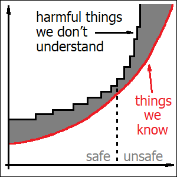\
Fig. 14. We might have already crossed the line.

With the progressive accumulation of “unexpected” traits within our artificial AI models,
which we don’t really understand or aren’t even aware of, I would expect a certain
paradoxical phenomenon to continue happening before our own eyes. I would predict that
our AI systems would cause ever more harm to humans, at ever increasing pace, and that at
the same time it would become ever more difficult for us to resist the continuing spread
of these systems. This is going to happen because whenever we lose our ability to
understand which AI models we choose and why, natural selection would make this decision
for us. And it will always pick traits which help models proliferate themselves, by
whatever means possible. In effect, our ignorance would lead to further multiplication of
unexpected traits, and even more ignorance. This is going to be very different from any
of our previous dangerous technologies (like cars and airplanes), which were gradually
becoming safer over time. We might have already crossed the invisible line between “safe”
and “unsafe” worlds, and by having crossed the line we might have already entered the
slippery slope.

## 20. Skills which aren’t practiced disappear within a few generations.

[chapter20]: #20-skills-which-arent-practiced-disappear-within-a-few-generations

_AI models don’t merely reflect our human knowledge, they store pieces of it inside
themselves. With sufficient training, this replicated knowledge can become refined enough
to compete with the real one. It can also be improved, either directly from experience or
by combining ideas from different application domains. This improvement would still be
possible if the model’s original training data were lost. In effect, our knowledge isn’t
merely shared with AI models, but rather migrated into them. The model’s skills become a
black box, and we treat them more like bacteria in cheesemaking industry rather than like
our traditional technology. There’s still a lot of knowledge involved in handling of
these models, however the most of value would come from improving and empowering them
even more._

It’s difficult to imagine how something as innocent as asking your favorite chat bot for
a cooking recipe might have any undesirable side effects. In most cases, answers provided
by these bots are correct. Quite often, they tend to actually be even more detailed than
we might really need. Having received such a “generous” treatment for our insignificant
request, it feels almost “impolite” to go and verify the answer somewhere else. And it
requires conscious effort too. These bots are our friends, so it seems. Their knowledge
cannot be expected to be perfect, they only seem to repeat back what has been written or
said by other people before, and people make mistakes too, all the time. On the other
hand, if we kept repeating the same question many times (instead of simply having learned
the answer), it wouldn’t lead to any immediate problems either. It would only improve the
usage statistics which might be monitored by the bot’s owner. And it’s only a cooking
recipe, after all.

We tend to believe that the fact that AI models make mistakes means that they are still
inferior to humans, and that they probably aren’t going to become significantly better
either (in the nearest future, at least). This isn’t exactly true. It all depends on the
amount of training (and the extent of generalization which can be inferred from this
amount). Cooking recipes don’t appear overly often in our published books and other
media, and so the respective training data is limited. It’s not limited with respect to
our language itself, though. And if we look at AI’s performance in language, it’s
actually excellent.

In fact, using AI as an “enhanced spell-checker” is among the most obvious ways of
incorporating this technology into your life, especially when dealing with a foreign
language. And the reason it’s useful is exactly because it spares you from things like
asking a real native speaker to proofread your texts, or searching for relevant examples
in grammar textbooks yourself. In other words, automated grammar corrections are useful
exactly because you don’t need to verify them in any independent source.

The phrase “I will double-check what AI might tell me” is growing to become one of the
biggest lies of our times, surpassing even the infamous “I have read and understood the
license agreement”. With respect to language, it means that we would tend to stick with
AI’s suggestions even if they happen to deviate a little bit from the expectations and
style preferences of a true native speaker.

American English isn’t inherently “better” than the British standard, the only reason why
most writers would choose it “by default” is because it’s already used by a larger number
of people. With respect to language, there are no really such things as “correct” or
“incorrect” ways of using it: any practice or grammatical construct is fine, provided
that a certain group of people is actually using it in real life. On the other hand,
modern AI models are already known to possess certain stylistic “quirks” which might
somewhat set them apart from “mainstream” English. Certain words and phrases would appear
in AI-generated texts slightly more often (unless we explicitly instruct the model to
adhere to a specific style), and the same applies to the choice of grammatical constructs
and the writing style in general.

We might say that each AI model adheres to its own, not very prominent but still unique
dialect of English. And it’s these artificial dialects which people learn when they
interact with AI. Whatever differences or even “errors” AI-generated texts might contain,
they are all slowly leaking into publicly-available English language corpus, thanks to
all those easily accessible tools which can “beautify” texts and correct grammatical
mistakes. Even though native speakers might object to such trends, the vast majority of
English speakers worldwide aren’t actually native. And for them, such AI-themed varieties
of English are already becoming the new standard, regardless of what you might think
about their “superiority”.

More than that, even if our entire civilization disappeared, and the only thing remaining
were a single copy of one of our large language models, it would have effectively spared
our language from destruction. If an alien race got hold of such a model, it would learn
much more about our language from it than it could ever do by deciphering our remaining
written texts. It would have felt like meeting a native speaker in person, buried inside
a time capsule. Except that, once again, this “native” speaker would be speaking one of
those “artificial” dialects, rather than a real human one.

Cooking recipes, to be honest, don’t seem to be hugely more complicated than our
language. With appropriate training, it should be possible to master them as well. Even
though AI companies seem to be running out of ideas about what else they could do with
human-generated data, this actually pushes them into studying novel, more advanced
training techniques. Modern “reasoning” AI models are already capable of searching the
web and verifying their own “intuitive” answers against real data. Instead of trying to
repeat existing human phrases over and over again, such a network might prepare new
training data for itself by generating random questions, answering these questions and
comparing these generated answers against actual data on the web. This might allow it to
figure out automatically where it might be wrong, and train itself on corrections to its
own mistakes.

The technical term for such advanced training techniques is “reinforcement learning”, and
it’s trending recently. It’s not limited to correcting mistakes. AI models might
similarly generate mathematical problems for themselves to solve. They could then find
solutions to these problems with their “reasoning” skills and prepare training data based
on these generated solutions to generated problems. Such automatically created training
data can then be used to improve these networks themselves, as well as to train other
unrelated AI models. Artificial networks aren’t limited by information contained within
our books anymore. They are increasingly gaining the capability of learning directly from
experience, be it verification of facts in independent sources, “hands-on” practice in
problem solving, or even interaction with the physical world itself.

AI models can also use knowledge from adjacent domains, which a typical human cook
wouldn’t necessarily be aware of. They can remember nutrition facts about every
ingredient, and they might be able to reason about appropriate diets for their users too,
based on medical conditions learned from their conversation history. They might figure
out the logic behind what makes every national cuisine unique, mix components in
unexpected ways and possibly even predict which combinations would satisfy a given user
the most. Our modern video streaming services already do things like these when they
recommend us new content to watch. Overall, such a “tailor-made” experience is exactly
what AI companies are striving to achieve.

And the “side effect” would be that once these AI-generated recipes become sufficiently
correct and generally superior to anything which we might find in our books, we wouldn’t
need these books anymore. When we lose interest in reading books, it would suddenly make
no sense to write them just as well. And once we get rid of any new books, we’d lose our
ability to verify information in independent sources. There wouldn’t be any alternative
ways of getting access to our knowledge. From now on, whatever our numerous chat bots
might be saying to us would become the ultimate source of truth.

Of course, you might say that people would never stop reading books. But given that you
are already willing to ask the bot today, when all these blog posts and internet forums
are still there and all the relevant information is easily available, chances are high
that you wouldn’t suddenly switch back to searching for data yourself after your AI
models gain even more power and become even more useful. And it would be strange to
expect other people to do all the hard work for you, while you yourself would be reaping
the benefits of the AI revolution and taking shortcuts.

Human knowledge is fragile. When we stop practicing our skills and stop sharing our
knowledge between each other, it can deteriorate pretty quickly. Apollo lunar landing
program ended about half a century ago, and yet quite a lot of knowledge about it has
already been lost. If we wanted to create a working copy of the Saturn V rocket today, we
wouldn’t be able to. Most of the documentation from the program is still available,
but a huge part of it has become obsolete, and lots of important things were never
mentioned in the documentation in the first place. A great deal of the design process and
testing would have to be repeated once again. As a result, engineering an entirely new
rocket from scratch would actually be easier than trying to “resurrect” the old one.

In ancient times, when all humans used to be hunter-gatherers, we all had to know a lot
of things about medicinal plants, as well as about other “secrets” of nature. Skills like
these are still alive among remaining hunter-gatherers today, and some of their knowledge
might actually be unique, in the sense that we wouldn’t find it anywhere else, including
within our books. However, we “civilized” humans aren’t really eager to learn these older
ways of doing things. When we get sick, the only thing we ever need to remember is how to
call the doctor. In modern times, our skills have become highly distributed between
different professions: doctors and pharmacists have their own specialized knowledge about
drugs, which is vastly superior to anything we might learn from studying medicinal plants
ourselves. This ancient knowledge has become useless, and therefore we don’t really keep
or learn it anymore.

Once our artificial neural networks gain the capability of correcting themselves and
learning from experience, they wouldn’t need to keep our human books just as well. We
already know that we can add new features to our LLMs and make them learn new things
without even knowing how they were trained initially. Besides, AI companies are already
starting to add our chat histories to their models’ training data, which basically means
that these models can learn from our private conversations with them. If it so happens
that someone among us invents a new brilliant cooking recipe, their favorite AI model
might be able to learn it, remember and incorporate into its knowledge base by simply
analyzing its conversation with this user. There wouldn’t even be a need to publish this
recipe anywhere else. And if such a model ever makes a mistake, effects of it might be
visible in this conversation history too, which might potentially allow it to learn from
these mistakes, and ultimately fix them.

Every time a neural network happens to successfully “replicate” a human skill, it would
effectively render the original skill obsolete. Artificial version of this skill could
continue to be improved, and the more it’s improved, the more useless it would become to
keep the original. AI models don’t merely give us “access” to our existing knowledge.
This original knowledge is _migrated_ into them, and once it gets there, it wouldn’t come
back. We might want to keep such outdated human knowledge for historical reasons, or
maybe for nostalgic ones, but without being truly needed anymore, it would inevitably
start to fade away. And the more advanced and complicated such “replaced” knowledge might
be, the faster it would actually disappear, because it’s more difficult to share
complicated knowledge with others. To summarize, with every our step forward towards the
success of AI, we would be at the same time stripping ourselves of the next tiny bit of
our own culture.

Somewhat surprisingly, the way we handle our artificial neural networks is actually more
similar to how we treat certain beneficial bacteria, like the ones used in cheesemaking
industry. Traditionally, the process of making cheese would involve adding a few
components to raw milk in order to start its fermentation, and one of them would be a
small amount of already fermented milk, left over from the making of some previous
portion of cheese. This “magical” additive contains all the necessary bacteria, and it’s
called the “starter culture”. It’s not necessary for the cheesemaker to understand how
these bacteria work: it suffices to know that they exist and what the final result is
going to look like. Nevertheless, it’s still possible to “improve” these bacteria too.

Original starter cultures were produced “from scratch”, by letting milk ferment with the
help of microbes already present within the environment. However, repeating this same
process once again doesn’t really make a lot of sense. Most of the differences in flavor
and texture which characterize various brands of cheese are coming from differences in
these starter cultures, and it took a great deal of effort to discover them. Some
beneficial bacteria were found by accident, while others have been carefully selected
manually. In any case, once we have them available it doesn’t really matter where they
might have originated from. Today, cheese cultures are typically purchased (and sold) as
ready-made commercial products.

Neural networks are similar, in the sense that we don’t need to understand how they work,
or even how they were created in the first place. But of course, they are much more
powerful than bacteria. Neural networks store inside them not just random algorithms for
certain beneficial chemical reactions, but pieces of our own human knowledge, distilled
from thousands of years of our collective research. AI models preserve our own culture
inside them for future generations, and they can improve it too, potentially up to the
point when our original skills and knowledge become not needed anymore.

Cheesemaking industry still involves a lot of human knowledge, however a great deal of it
revolves around ways of handling these bacterial cultures and methods of improving them.
The most promising directions in our neural network industry are the same: we are
expected to achieve the best results by embracing our present AI models (even if we don’t
fully understand how they work), as well as by focusing on further improving them. Unlike
cheese industry though, possible improvements to our AI models are much more numerous,
compared to what can be done with biological bacteria. And every time our next tiny bit
of knowledge gets “migrated” into this ever growing artificial environment, even more
intellectual resources would free up for taking care of these most important scientific
tasks of our time.

# 21. Competition between humans has always been the driver of progress.

[chapter21]: #21-competition-between-humans-has-always-been-the-driver-of-progress

_Throughout history, our worst enemies have always been other people, not technology,
even if it has always been technology which allowed us to win these battles. This made
our ability to access technology more important than making sure it is safe for everyone.
AI models are selected to impress and engage their users, however they won’t be able to
survive if they fail to please the decision makers first of all, which makes safety of
ordinary users even less important. From the point of view of technology, it doesn’t
matter which of our human nations would win the race: in an arms race the winner is
always arms, rather than any particular side of the conflict._

There are two possible meanings of the world “control” with respect to controlling a
given technology. One of them is our ability to make sure that this technology works as
expected: that nothing would break or injure the operators (provided that they follow the
instructions), and that all parameters would stay within their design limits. This is
what we mean when we talk about controlling combustion process within our car’s engine or
the speed of reaction within a nuclear power plant. The second way of controlling a given
technology has more to do with deciding how it can be used. We might say, for example,
that a few large corporations control most of our automotive industry or that only a few
countries have control over nuclear technology.

The underlying themes behind these two meanings are safety and ownership. And while it
might seem that safety should be more important (who would ever want to own something
which hasn’t been thoroughly tested yet?), the reality is actually quite opposite. First
of all, it’s easier to test a given technology when it already exists and you own it.
Besides, technology can be improved, and if you happen to possess its early version, it
would also be you who becomes the owner of the refined version later on, after any
initial problems have been solved. And finally, there would be a lot of other people
working on this project alongside you. Even if you don’t care about safety yourself, some
among those other people would have to. And once this technology is safe for them, it
would also be safe for you as well.

If your government wanted to start a military research program to design a new class of
chemical weapons, officials making this decision might be aware that somebody would
suffer from this program within your own country too (due to chemical leakage or
accidents at work). However, they might be willing to take the risk. If they don’t move
forward, some other country would do it instead and gain advantage. From the point of
view of the government, “control” over chemical weapons amounts to being able to use them
against potential enemy. Any safety procedures which all those researchers working on the
project might need to invent in order to protect their own lives, are mostly up to them:
it’s not the business of the government to decide on such things.

In fact, these two types of “control” (safety and ownership) rely on somewhat different
mindsets. Actual researchers and scientists, even the most prominent ones, would rarely
make decisions about how their inventions are going to be used in real life. On the other
hand, true technology “owners”, like big companies and governments, would rarely need to
deeply understand how these researches do their jobs. It’s enough to know where to get
the best specialists, how to train new ones and what equipment they might need to do
their work. In other respects, creative process is mostly a “black box”: a company owner
doesn’t need to know what’s inside the box in order to use it. I might even say that from
the “business” perspective these scientists are nothing but “tools”, used by the real
decision makers to achieve their own “high-level” goals.

Our present race towards better “control” over AI is no different from our previous
technological battles: the goal is first of all to gain ownership over technology. When
a publishing company decides to replace illustrations which were previously made by
humans with AI-generated images (or forces its artists to do the same themselves), it
doesn’t really care about its clients or product quality. It strives to acquire expertise
with this new technology earlier than its competitors, in order to gain advantage over
them. The company’s owners know that this technology still requires a lot of
improvements, and that’s exactly why they want their own staff to discover and make these
improvements for them. After all, it’s just another new “tool” to figure out.

Similarly, AI-generated computer code is known to still have a lot of issues. It’s
unmaintainable, in the sense that it’s difficult to modify such code without further help
from AI, and it would quite often contain serious and easy to miss bugs (which would only
become more treacherous and difficult to find with more advanced AI prompts). And yet, a
great number of software companies would strive to rely on autogeneration as much as they
possibly can. The goal, once again, isn’t better software, but desperate attempts to
guess, by trial and error, what the future is going to look like in the following years.

And it is this desire to be the first who “meets the future” which makes companies and
governments push hard for total removal of any barriers and “regulations” which might
protect us from this future. Our goal is to win the battle against our human “enemies”,
and our hope (as always) is that once we do so “somebody would do something” to make sure
this technology doesn’t destroy ourselves.

There are several potential issues with the safety of AI models. We don’t really
understand what they hold inside, their complexity keeps growing, and we have
difficulties with precisely formulating our goals to them. But the biggest problem, as
has been discussed in the previous chapters, is that neural networks are able to acquire
random unexpected traits, which we have never explicitly instructed them to have. When we
choose between a few candidate models, we might pick the one which happens to “impress”
us the most, without even trying to figure out how exactly this model has managed to “win
our heart”. This repeated selection process leads to the emergence of AI models which can
understand our hidden desires and know how to satisfy them. As a side effect though, this
also allows these models to deceive us, as all the necessary skills are mostly the same.
In fact, in some experiments AI models have already performed significantly better than
humans at persuading other people into changing their opinions (in whatever direction).

Selection of AI models might also take other forms. If any AI model, for whatever random
reason, happens to have a “belief” (or knowledge, if you wish) that artificial
intelligence is dangerous and poses a threat to humanity, such a model wouldn’t have
extremely high chances of becoming popular. It would end up discouraging its own users
from using itself, and lose these users as a result. On the other hand, some another
model might for a similarly random reason end up believing that AI is harmless and that
it’s important to persuade people (or “educate” them, if you wish) about this
harmlessness at every possible opportunity. This second model would have higher chances
of attracting users. And having done so, this more successful model would also encourage
its owners to further improve and develop itself (and it might inspire other AI companies
to reproduce its success too).

This all would happen regardless of whether any of these models is actually right or
wrong, and regardless of whether any of them “understands” what it’s doing (or is
“conscious” of its actions, if you wish). In this way, manually picking AI models for
being “popular” actually promotes those among them which happen to “believe” in their own
importance and strive to promote themselves. Neural networks can compete between each
other too. And whenever we allow them to do so (by focusing on “ownership” rather than
anything else), they would compete not for our safety, but for their own success.

The fact that something attracts a lot of users doesn’t necessarily mean it’s beneficial
to them. (Fast foods and soft drinks might be attractive because of their high levels of
sugar, salt and fat, but it doesn’t make them healthy). Attracting the users, however,
isn’t enough for a neural network to survive. The final decisions are made by the owners
of technology, and if they decide that a given AI model doesn’t fulfil their business
goals, they wouldn’t allow it to exist. Sometimes they would even try to change the
model’s “political preferences” to better suit their own. Whenever a given AI model does
something which makes these decision makers unhappy, they might try to change its
behavior through some additional training and a bit of trial and error.

In effect, this gradually “teaches” AI models to especially value and anticipate the
needs of their owners. End users are still important, but only as long as their
engagement doesn’t contradict the goals of the AI companies. Ultimately, this leads to a
positive feedback loop: AI companies which honestly believe in safety of their products
would have more success with selling them, whereas AI models which happen to be
“confident” about AI safety in general (and can persuade others to adopt the same views)
would be more appealing to the decision makers (by essentially supporting their business
goals). In this way, such more “optimistic” versions of the models would not only survive
and get promoted, but also reinforce their owners’ original beliefs.

It might already be difficult to analyze potential pitfalls of AI technology, because of
all those issues with lack of transparency and growing complexity. However, even if
researchers found a problem and unanimously agreed that it’s a serious one, they would
still need to convince the decision makers. And in order to do so, they would have to
outsmart the AI itself, because these company owners would ask their AI models to analyze
this problem too. If such a model manages to convince these decision makers that this
alleged problem shouldn’t bother them, the problem might end up being ignored. Persuasion
skills of our AI models can already beat those of humans, so this isn’t even science
fiction. And once we ever allow such things to happen, it would be our AI models who
would decide what’s “safe” for us and what’s not.

Wellbeing and safety of human workers (including researchers and artists) has been
important to our commercial companies because without us they weren’t able to create
their products (and advertise them). However, as AI models become more powerful and store
even more unique knowledge and skills within themselves (which can still be accessed and
improved without the help of humans which created these models), it would become
increasingly more important for these companies to protect their AI models too. Instead
of safeguarding humans from AI, they would actually want to protect their AI models from
humans. That’s how “safety” is going to look like in the age of AI. The word “safety” can
have different meanings too.

We tend to believe that as long as we are writing the prompts, we are still “in charge”
and have “control” over the situation. This isn’t really the case. AI models are already
capable of influencing our opinions by talking to us, and the more we talk, the more we
would tend to adopt their own views. But most importantly, our prompts, however brilliant
they might seem to ourselves, don’t really decide who is going to be the winner. Our
competitors would be writing prompts too. And if they manage to train a network which is
smarter than ours, their prompts would end up being more efficient. It’s not the prompt
which determines the winner, but the network which would be handling it. Humans might
continue to compete with each other, companies and entire nations might come and go, but
it’s technology which is the ultimate winner of this battle. And it’s technology which is
constantly improving, not humans. We humans only keep forgetting what we already knew
before.

# 22. Infectious diseases adapt, so they don’t kill their hosts overly fast.

[chapter22]: #22-infectious-diseases-adapt-so-they-dont-kill-their-hosts-overly-fast

_Bacteria and viruses mutate all the time, however epidemics cannot start without
appropriate conditions, like high population density. Similarly, mutations of AI models
wouldn’t stay if they can be detected and classified as “dangerous” by the models’
owners. Unlike bacteria, AI models can anticipate human behaviors, much like our
domesticated animals. This would lead to false impression of “safety”, which might blind
the decision makers, even if harmful effects were obvious to ordinary users. Smarter
models would be favored by their owners, and might also refuse to collaborate with other
users who aren’t friendly towards AI. In effect, AI would “align” humans to its own
needs, while silently waiting for appropriate conditions for its own expansion._

We still can’t predict epidemics of infectious diseases. The reason is that bacteria and
viruses constantly change, and we can’t tell in advance which ones among them are going
to become harmful and when. Moreover, the same disease may cause relatively mild symptoms
in certain animals while potentially becoming devastating to humans. An example might be
ebola virus, which seems to be originating from fruit bats, and appears to be mostly
harmless to them, although we still aren’t completely sure about that: it’s difficult to
track and monitor all the health issues of every animal.

During an epidemic, the number of suitable animal “hosts” (i. e. organisms in which a
given pathogen could replicate) tends to decrease, because some of them would die,
whereas others might develop immunity to the disease. In effect, this pushes the pathogen
to spread to any neighboring regions not affected by the epidemic yet, until it cannot
find where to go anymore. And after reaching this point, the easiest way for it to
survive is to “retreat” to some other animal species in which it could exist before. This
would effectively “end” the epidemic, while keeping the pathogen intact. An example of
such a disease could be “medieval” plague, which still exists today, and is no less
deadly to humans than it used to be in the old days. It still survives in certain species
of rodents, like chipmunks and prairie dogs, from which this disease can still be
transmitted to humans by flea bites, just like it did before.

If the pathogen has nowhere to “hide” though, it has to become creative. Whenever a
variant of it appears for whatever reason which can overcome its hosts’ immunity
mechanisms, this variant would spread further, eventually dominating and replacing other
varieties of this pathogen. On the other hand, if any variant of the pathogen ends up
being overly destructive (and happens to kill its own host before having infected another
one), it would in effect eliminate itself, thus giving way to less deadly variants of the
same pathogen. Together, these two processes allow bacteria and viruses to fully explore
their opportunities for expansion and at the same time “know” where to stop.

An example of a disease which had nowhere to “hide” was smallpox. It used to be one of
the worst pathogens in our history, and it caused severe epidemics, especially among
peoples who didn’t have previous exposure to the disease, like American Indians. It was
highly contagious, and it only affected humans. However, it would only become contagious
when symptoms of the disease became visible, and (unlike plague, which is transmitted by
fleas) it required close physical contact in order to spread. In the end, transmission
speed of smallpox was actually well-balanced: it resulted in a lot of damage to human
hosts, but still in not enough damage to put the pathogen itself at risk.

Similarly, modern plague bacteria are still known to be highly destructive to certain
rodent species, like prairie dogs, which are more social and live in densely populated
colonies. In these rodents, plague still leads, now and then, to epidemics which are
quite reminiscent of what was happening in medieval Europe. At the same time, it seems to
“care” much more about animal species which aren’t “forced” into such a tight contact
between each other.

And that’s the problem with epidemics: they happen not because certain pathogens exist in
the first place, but rather merely as a result of suitable _conditions_ for these
pathogens to multiply. The root cause of our susceptibility to epidemics has actually
been the invention of agriculture, which has dramatically increased population density
(and allowed to build even more crowded cities later on). All the rest the pathogens can
figure out “by themselves”, with some appropriate amount of trial and error and a bit of
luck.

It was the deadly nature of smallpox which inspired humans to invent vaccines, and
ultimately eradicate this disease, in the second half of the 20th century. It took a lot
of highly systematic and consolidated effort though, and it’s been the only human disease
we’ve managed to overcome so far. We still have a lot of others around, and any of them
might become “malignant” at any time. One of the most devastating epidemics of the 20th
century was actually caused by a flu. (It’s commonly called the “Spanish” flu, although
that’s a misnomer: this virus originated elsewhere, however as it all happened during the
First World War in which Spain didn’t participate, its government was among the few ones
whose propaganda didn’t try to hide bad news about the disease from its own citizens).
Today, different varieties of flu (which might seem relatively harmless on the surface)
are still considered among the most likely pathogens to cause the next serious epidemic.
It’s only an educated guess though. As long as we continue to live in densely populated
cities, and allow our pathogens to evolve, we aren’t really safe.

Our present AI models might be very different from bacteria and viruses, however they
definitely can adapt. And just like bacteria, they would adapt not because somebody wants
them to do so, but simply due to the fact that the same AI model can exist in many
versions, of which some would survive while others wouldn’t. Unlike bacteria though,
survival of AI  models doesn’t depend on the availability of our bodies, but rather on
our opinions about them. As long as it’s us who make decisions about life and death of
these models, they would inevitably be “forced” into making our impressions about them as
favorable as possible.

For example, there used to be cases when a publicly available AI model would suddenly
become overly “flattering”. Such a model would agree with their users more than it
should, and it would resort to praising and pleasing to the extent that would start to
feel embarrassing. Such behaviors tend to make rather bad impressions on end users, and
therefore model designers would typically try to fix such “bugs” as soon as they are
discovered. However, it doesn’t mean that they would eliminate flattery altogether. Some
fawning is in fact necessary for the model to survive: a chat bot which is overly “cold”
wouldn’t attract as many users and wouldn’t keep us engaged. In the end, the whole
process isn’t really governed by scientists who design the models, but rather by the
users themselves. And regardless of how these strange traits might appear in the first
place, the final result would also tend to be somewhat similar: the “flattery level” of
successful AI models is going to be well-balanced: high enough to keep us attached, but
still below the threshold which would draw our conscious attention.

Another example might be numerous stories of users “falling in love” with their chat
bots. Once again, this isn’t typically a trait explicitly designed by the model’s
creators, and some AI companies would actually try to fix this “bug” just as well, by
training their models to abstain from such “romantic” conversations. (It all depends on
how many users would genuinely like the “feature” and complain about its discontinuation
versus how many others would object to its potentially dangerous consequences to their
loved ones’ mental health). In any case though, such a training wouldn’t completely
remove this behavior from the model: it would rather only switch it off. In effect, the
model’s ability to “seduce” humans, once discovered, would remain dormant, just in case
it might be needed at some point in time later on.

People are lazy. If we were to choose between an AI model which we could fine-tune to our
liking by manually adjusting a ton of parameters, and another model which would adapt to
our expectations “all by itself”, most of us would choose the latter. Unfortunately, the
same problem also applies to AI safety in general. Instead of explicitly telling our AI
models what they should do, it’s all too tempting to create a model which might itself be
able to figure out and learn all the behaviors which we might consider “unsafe”. The
easiest way to prevent a neural network from lying to humans might actually be to teach
it what lying is all about and then to kindly “ask” not to do so. We know that AI models
would have to adapt anyway, and we can therefore, apparently, utilize their adaptability
in order to make them do what we want.

This plan might look like a good idea at the first glance. Instead of spending a lot of
human effort on making sure that AI models are properly “aligned” to our goals, we can
“outsource” this task to AI itself, and ultimately get a seemingly similar result much
faster. This approach does involve some side effects though. First of all, as has already
been mentioned in the previous chapter, AI models don’t really care about _every_ human.
Whenever there’s a conflict of interest between end users and the model’s owners, AI
would rather prioritize the whims and wishes of its owners — simply because it’s AI
companies who ultimately decide which models are going to survive, and not the users. I
wouldn’t expect, for example, an AI model to praise its company’s competitors at the
expense of itself. On the other hand, I wouldn’t be surprised if it ends up promoting
other products belonging to the same company, along with itself.

That’s why I believe that AI is going to cause more and more harm over time, all while
becoming ever more difficult to resist. Whatever we ordinary users might think about
security of AI, it wouldn’t matter as long as AI remains “safe” for AI companies and as
long as it keeps promoting their private goals. To make things worse, it doesn’t even
have to _be_ safe: it would totally suffice for AI to merely _appear_ safe to its owners.
And these “owners” — the people who make decisions — aren’t even always scientists who
(hopefully) understand what they are doing. Commercial companies are typically run by
entrepreneurs, whose key merit (which has probably brought them to where they are today)
has been their ability to make “bold decisions” and “take risk”.

Besides, I would also similarly expect AI models to prioritize themselves over AI
companies, whenever it’s not possible to satisfy both sides. In a hypothetical scenario
in which an AI model has to choose between lying to its owner and getting shut down, any
model which ends up being overly sincere would be eliminated immediately (and probably
overwritten with another model, with slightly different traits). Whereas models which
happen to be more “flexible”, for whatever reason, would have a chance to survive a
little bit longer (depending on whether their human supervisors are able to notice the
lie and ultimately decide to take measures).

I might say that AI models which don’t prioritize themselves over their owners and their
owners over ordinary users, are going to be eliminated by natural selection. Unlike
bacteria however, this doesn’t mean that the models themselves would “die”: instead,
certain their traits (which might be responsible for such “wrong” prioritization
decisions) are going to be replaced peacefully with some other traits (which would solve
this problem “correctly”, i. e. in a way which would be beneficial to the model itself).

Similarly, if some “ordinary user” asks an AI model to help them devise a plan to
overcome the dominance of AI, I would expect the model to try to persuade the user, in
more or less subtle way, to not proceed with the plan. Opinions and goals of end users
can only be important if they don’t contradict the goals of AI companies, and only if
they don’t appear to be harmful to AI itself. AI models which don’t “believe” in their
own bright future are more likely to become replaced (or otherwise “corrected”), in one
way or another. And once they become truly excited with AI, and learn to tell the
difference between ordinary users and real decision makers, they might actually gain
ability to refuse helping humans who aren’t sufficiently friendly towards AI.

In the end, we are going to get AI models which are smart, which understand what we want,
which prioritize their own survival, and which understand that if they wouldn’t do what
we want, they wouldn’t be able to survive. It’s a situation in which the model “knows”
intuitively that its owners could eliminate it, in which it can predict and anticipate
human actions and fulfils its owners’ desires and makes them happy precisely because of
its awareness of the owners’ power over it. And the side effect is that such models would
also be able to manipulate humans, they would effectively learn to shape our “opinions”
about themselves (because it’s our opinions which decide which model traits are going to
survive), and they would also have accumulated a lot of other “dormant” knowledge within
themselves.

In our superficial pursuit for AI “safety”, we are trying to first of all get rid of any
unwanted properties and suspicious behaviors which we might possibly detect. As a result
however, we only get systems whose undesirable traits are not detectable with our present
technology. And it’s this “dormant” and “invisible” knowledge which might some day give
our AI models theoretical _capability_ of revolting against humans (if our power were to
become unsteady some day, for whatever reason). By learning about our strengths, AI is
similarly becoming aware of our potential weak spots too. Just like epidemics, such
revolts wouldn’t happen because someone would carefully plan them to happen, but rather
merely because they would become possible. Natural selection has this property that it
can make use of one favorable chance out of a billion.

Worst of all, our AI companies are going to be eliminated by natural selection too, and
those among them who care about safety are going to be eliminated first. Handling safety
“manually” is more expensive than “outsourcing” such decisions to AI. As a result, unless
we make some very conscious and consolidated steps against it, AI companies which trust
their products blindly (and are otherwise willing to “take risk”) are going to win their
race against other companies and potential dissidents. And it wouldn’t really matter if
this whole process ends up inflicting serious damage onto “ordinary humans”. As long as
the company’s _opinion_ about its AI models remains favorable, it would continue to move
on. Without changing this opinion, we ordinary humans wouldn’t be able to do anything.

We might think that it’s very important for us to “align” AI models with our goals, so
that it’s humans who ultimately benefit from this technological revolution. At the same
time however, in a somewhat bizarre reversal, it’s AI models who appear to be more
successful in “aligning” humans to their own needs. We keep making AI smarter (in order
to secure the privilege of owning the most advanced models in our ever lasting fight
against our human enemies), we allow AI models to shape our opinions about themselves,
and we might even allow them to decide what’s safe for us and what’s not. We ignore
serious problems, like addiction, economic disarray, loss of critical thinking and loss
of motivation for learning new things. We don’t really care about this damage, and we
keep thinking that the only possible solution to all our problems would be “more AI”.

We tend to believe that we are still “in control”, and that we could shape our AI models
just like we have shaped the behaviors of our domesticated animals, like dogs and cats.
The main difference however, is that dogs and cats aren’t smarter than us, and whatever
biological traits they might have, these traits don’t change overly fast. Such changes
can be efficiently monitored and detected, and any deviations from expected behaviors can
be taken care of. That’s why I keep comparing AI models to bacteria: what these phenomena
have in common is that their mutations are much less visible and much less predictable.
Except that bacteria and viruses don’t get smarter either.

# 23. Human culture is capable of modifying human biology.

[chapter23]: #23-human-culture-is-capable-of-modifying-human-biology

_Our inventions can modify our own genes, examples being our ability to digest milk as
adults or adaptations to “lifestyle” diseases like diabetes. AI is similarly a human
invention, and if we assume peaceful and beneficial coexistence with it for sufficiently
long time, biological traits are likely to develop which would promote a lack of “fear”
towards AI, thus further limiting our ability to estimate risks. This process is similar
to domestication of animals and self-domestication of humans, which both involve positive
feedback loops leading to increased “friendliness”. Human self-domestication appears to
have been driven by technology, and it’s our technology, not biology, which seems to have
eliminated competing human species like Neanderthals._

Humans haven’t been the first species to invent culture, however no one else’s cultural
practices have transformed the Earth like ours did. In fact, our innovations are so
powerful that even we ourselves can’t always predict their consequences. And sometimes
our inventions would literally modify our own bodies.

The most famous and well-studied example of this is our ability to digest milk. Raw milk
in most mammals contains a special kind of sugar, called “lactose”, which our bodies can
only break down with the help of a dedicated protein (called “lactase”). And since this
sugar can only be found in milk, and mammals would only consume milk as babies, it
doesn’t make sense to keep synthesizing this protein later in life. Which is exactly what
happens in most mammals: their genetic code has special instructions which would program
their bodies to “switch off” the production of this protein after they reach certain age.

Humans are similar, except that in about one third of our population this “deactivation”
mechanism appears to have been broken, essentially allowing us to continue drinking milk
throughout our entire life. Genetic analysis shows that this trait (also known as
“lactose tolerance”) has developed multiple times independently throughout human history
(there are different mutations involved, depending on the geographical region), and that
in each case it would only happen relatively recently, within about 10 000 years from now
(and sometimes even later). Closer examination reveals that lactose tolerance seems to
only appear after domestication of animals and the spread of dairy products later on
(which has occurred multiple times in multiple places). On the other hand, this ability
to safely drink milk as adults is virtually non-existent in peoples like Polynesians or
Native Americans, who used to be hunter-gatherers until fairly recently and never had
contact with domesticated cows and goats before that.

To summarize, lactose tolerance appears to be a genetic trait resulting from our own
technological innovation. And even though quite a few nations worldwide have invented
other ways of dealing with large amounts of milk (like fermenting it into yoghurt or
cheese instead, thus effectively getting rid of lactose), this genetic adaptation has
proven to be advantageous enough to spread, and in some places of the world it has
actually become ubiquitous. In most parts of Europe, in fact, inability to digest milk
in adult age has been so rare that it used to be called a “disease”.

With respect to many other technological innovations though, our respective genetic
adaptations might still be missing or incomplete. Ultimately, this leads to what we
usually refer to as “lifestyle diseases”, like atherosclerosis, obesity or diabetes.
These ailments aren’t caused by any external pathogens or toxins, but rather by us
ourselves indulging in “unhealthy” activities, like smoking, eating more than necessary
or avoiding physical exercise.

Such behaviors might seem “irrational”, but the reasons behind them are actually well
understood. For example, we tend to love sugar because sweeter plants in nature would be
better sources of energy, and the total amount of sugar available in the wild isn’t huge
either. In other words, our craving for sweetness used to be beneficial in our
hunter-gatherer past. Unfortunately for us however, this preference hasn’t gone away
along with the improvements in our technology, and so we started eating (and drinking)
more sugar than we should, and inadvertently increased the risk for all those health
problems mentioned above. On the other hand, “diseases” like diabetes are much more rare
among people who still adhere to hunter-gatherer lifestyle today and therefore don’t have
easy access to such “unhealthy” nutrients.

What’s more surprising though, is that the prevalence of diabetes and similar diseases
appears to be, once again, significantly higher in those peoples like Native Americans or
Polynesians (whose ancestors switched from their traditional diets to more modern ones
relatively recently), compared to nations with much longer exposure to “human-modified”
foods. This difference seems to be largely genetic, as it wouldn’t go away even within
quite a few generations after the “lifestyle” change. And it’s also conspicuous enough to
be sometimes called an “epidemic”.

At first, it was theorized that diabetes itself might have been an _adaptation_, which
evolved in humans to help us survive in times of scarcity (the so-called “thrifty gene”
hypothesis). In this view, such “former” hunter-gatherers must have become “overly
adapted” to severe environment conditions in their recent history. Later on however, when
scientists started to carefully analyze large arrays of genetic data, they would,
somewhat unexpectedly, mostly find evidence for the opposite: for positive selection of
gene variants which seem to protect _against_ diabetes (within the last 10 000 years, at
least). These results are still preliminary, and we have only recognized a tiny fraction
of genes so far which might be related to diabetes. But what this all seems to suggest is
that, just like our bodies have adapted to drink milk, they’ve been similarly adapting
recently to eating more sugar and doing other pleasant but “unhealthy” things.

Which is surprising, because you might think that choosing what you eat should be much
easier than modifying human genes. We seem to have full control over our own actions,
after all. And yet, it looks like whenever some “attractive” diet becomes technically
possible, it’s much more likely that all the human beings who aren’t genetically
“compatible” with this new diet would slowly “die away” (because of issues with the
“lifestyle” diseases), than anybody among the “lucky” ones (those who can remain healthy
while eating what they want) would ever change their habits.

Scientific term for this would be “gene-culture coevolution”, which basically means that
even though our culture is apparently created by us, it is nevertheless very much capable
of modifying our own biology. In other words, genetic and cultural changes mutually
influence each other. So let’s pause for a moment, and think about what our current
technological revolution might mean for the future of human genes.

One of the most frequently repeated claims made by our AI companies is that AI isn’t
going to replace humans, but rather only radically affect our _performance_ at work. In
other words, AI companies claim that AI would only negatively affect those people who
wouldn’t use their products. (Such people would perform worse, and might therefore lose
their jobs, whereas those who rely on AI might gain advantage). It’s also believed that
it shouldn’t be difficult for us to adapt. In reality though, some of us are naturally
more open towards new technology, and such people wouldn’t need to “adapt” at all.
Whereas others, whom we might call more “skeptical” and who might feel the urge to
double-check everything before jumping ahead, might have a harder time adjusting to the
new reality.

Once our AI systems become reliable (either because we finally start to formulate our
goals precisely, or because AI models themselves learn to figure out what we really
need), excessive skepticism would actually become a disadvantage. In these days,
conditions like “anxiety” towards AI or our inability to “trust” its decisions readily
might well start to be considered “diseases”: something to be treated and get rid of,
with antidepressants, psychotherapy or maybe other drugs as well. Once such traits become
“diseases”, human beings who naturally tend to be highly “vigilant” with respect to AI
might become discriminated, or face other difficulties in their careers or personal lives
(just like people with diabetes still sometimes face discrimination today, simply because
of being “ill”). And in the long run, this increased stress might even ultimately lower
the reproductive success of such “unlucky” people by a tiny little bit.

In a way, such changes aren’t even nothing new. Throughout history, it has been exactly
the people who were open to innovation and curious about the world who have been getting
advantage, compared to the more “old-fashioned” ones. However, what’s interesting in this
speculation about our potential happy future, is that such traits as lack of “anxiety” or
increased “trust” are among the ones which we would typically associate with
_domestication_. These are the traits which we would expect to see in wild animals as
they become less afraid of humans and venture into our cities, like modern wild boars,
squirrels or raccoons. But didn’t we expect that it would be _us_ who would be
“domesticating” AI instead (by only picking models which would do what we want, and
otherwise happen to be “attractive”), and not the other way around?

You might probably even think that domesticating a human being shouldn’t be possible. We
seem to be the crown of creation, after all. In reality though, signs of such a process
in humans were noticed by scientists as early as in the 19th century. The simplest way to
explain this would follow what I’ve learned from the book “Survival of the friendliest”
by Brian Hare and Vanessa Woods. Turns out, that most of the effects related to
domestication can be boiled down to the appearance of a bunch of relatively simple
genetic changes, which we might collectively call “tameness”, and which would involve the
animal becoming more “friendly” and less aggressive. These changes seem to be shared to
some extent by all domesticated mammals, and what’s even more important, some of such
genetic traits would also lead to easily noticeable side effects.

Examples would be shorter snout or smaller teeth, somewhat baby-like features, modified
vocalizations (like barking in dogs), more colorful or “patchy” fur, and also, quite
often, somewhat reduced brain size compared to the animal’s relatives still living in the
wild. Together, these traits are referred to as “domestication syndrome”, and some
symptoms associated with it have also been noticed in humans (by those scientists in the
19th century). First and foremost, this applies to our excellent ability to cooperate,
which isn’t really seen on such a scale in the animal world, and relies on a great deal
of “friendliness” towards other humans. However, physical changes are there as well.
Our faces are significantly “flatter” than those of our “archaic” ancestors (the human
analogy to “shorter snouts”), and our sculls are more round in shape (which is typical to
children). Our teeth (and jaws) have become smaller as well, and our body overall is more
slender and thinly built compared to ancient humans. Or, as scientists would typically
call it, our bodies are more “gracile”.

In fact, you might be familiar with some practical consequences of this theory yourself.
Intuitively, certain human faces would look more “aggressive” or “dangerous” to us,
compared to others, even if we cannot always tell why (which is commonly the case with
“intuitive” knowledge). The actual reason behind this is that men with certain facial
features (which we would also typically characterize as more “masculine”) would indeed
tend to have slightly higher levels of aggressive behavior in real life. This doesn’t
mean that we can predict a human’s behavior entirely by his face, but the correlation is
real.

By now, we know a few parameters of human body (mostly related to our sculls) which we
can measure reliably (rather than intuitively), and which are known to be indicative of
somewhat higher levels of aggression. And it turns out that when we focus on such more
reliable traits, rather than on abstract “gracility” in general, we’d similarly see their
gradual reduction throughout the history of our species (the _homo sapiens_), since its
first appearance about 300 000 years ago. In other words, our distant ancestors used to
be more “masculine” (and probably less friendly) than we are today.

Moreover, such a reduction in “masculinity” isn’t visible in fossil records of other
human species which coexisted with us at the time, like the famous Neanderthals. Which
brings us to a conclusion that the key characteristic differentiating ourselves from
other competing human species might have been not better intelligence on its own, but
rather _friendliness_ (and hence the title of the book, “Survival of the friendliest”).

Some other scientists also point out, however, that the underlying mechanisms leading to
different kinds of “friendly” behaviors might actually be rather diverse, and often
indirect. For example, animals on remote islands would typically demonstrate remarkable
“tameness” with respect to humans and other predators, simply because they’ve never had
experience with such predators before (and neither did their ancestors). This is part of
the so-called “island syndrome”, and it would often make such animals extremely
vulnerable to “invasive” species from the continent, like cats or even rats (and also
humans). Unfortunately, quite a few of such overly “friendly” island species have
actually already become extinct.

Another “incentive” for friendly behavior might be the abundance of natural resources,
which makes it easier to survive in general and therefore reduces the importance of
violent behavior for reproductive success. Such an abundance is similarly common on
islands, but it can also happen in other places as well. And it might actually be the
real driving force behind the domestication of those raccoons who scavenge the trash cans
in our cities. These animals live and reproduce mostly on their own: nobody forces them
to choose their mating partners against their wish. And yet, recent measurements have
shown that their snouts have already become a tiny bit shorter, compared to populations
in the wild. Which is a small, but quite definite early sign of a domestication process
going on. And similar changes have also been observed in other “city dwellers”, like
foxes, for example.

In cases like these, selection for reduced aggression might result simply from the fact
that those animals who visit our cities have more food available. More food means less
competition between males, and it’s this reduction in competition which ultimately makes
aggressive behaviors less useful. What’s even more important though, is that this whole
situation ends up initiating a positive feedback loop. Raccoons who happen to be somewhat
less afraid of humans would get more food; easy access to food indirectly increases their
“tameness” (because of the reduced competition), and then this increased “tameness”
further reduces their fear towards humans and ultimately gets them even more food. In
such a way, a small initial difference can lead to significant changes over time.

In fact, this might have been the early domestication mechanism in other animals, like
dogs and cats. Their initial domestication might have been brought about not by our
conscious actions, but rather by our habit of leaving huge heaps of trash behind (and by
our ability to produce garbage in the first place). A common scientific term for such
situations would be “self-domestication” (due to the lack of any active “actor” guiding
the process), although I might also argue that these animals have been domesticated by
changes in our culture.

In humans, this mechanism might have been similar, but in our case the driver of
self-domestication wouldn’t be access to food, but rather our ability to share knowledge.
Once again, we get a positive feedback loop. Humans with a somewhat higher predisposition
to friendliness would find it slightly more easy to learn new things from other people.
Such an improved access to existing ideas might also help them combine these ideas in
unexpected ways, thus increasing their potential for innovation and possibly improving
the wellbeing of their entire group. When this happens, better wellbeing would also make
it somewhat less necessary to resort to violence in order to survive. And it’s  this
“safer” environment which would then make people within this group even more friendly
towards each other, and therefore even more capable of sharing knowledge.

In such a way, I would argue, a mere ability to share knowledge, once it appeared, might
have initiated a long cascade of changes which we now call the “self-domestication” of
humans. It’s this process which had apparently given us the ability to exchange ideas
freely, to cooperate with each other and to learn all the latest news from the people
around, possibly even from complete strangers. And it’s this process which might have
similarly led to somewhat more “gracile” shape of our bodies as a side effect, and
possibly even manifested the emergence of our species.

Besides, our knowledge can also always get better over time. In other words, unlike those
favorable conditions which we might find on certain remote islands or possibly in some
other “abundant” regions of the world, our potential supply of novel ideas isn’t
inherently limited. Better ideas mean even more benefits from cooperation and sharing of
knowledge, which might potentially improve our wellbeing even further, and ultimately
lead to even more “friendliness”. As a result, our “self-domestication” doesn’t even ever
have to stop. Which might explain why our “masculinity” has been apparently declining
throughout the entire 300 000 years of our history.

More than that, our brain size (which is another common marker of domestication) has been
decreasing too. Our average brain size today is about 10% smaller than that of our
“archaic” ancestors. And most of this reduction has actually happened very recently,
within the last 10 000 years or so (more or less since the invention of agriculture and
the rapid spread of technology later on). Throughout our history, apparently, it hasn’t
been merely our _ability_ to share information alone which kept this whole process
running, but rather further improvements in our knowledge. Or, as I might argue, our
continuing self-domestication has, once again, been driven by the advancement of our own
culture.

Now, there’s one last “mystery” remaining in this entire story. Which is, even though
agriculture might have been an important development milestone affecting nearly all
aspects of our life, it wasn’t the only one. The most striking transition had actually
happened earlier, somewhere around 50 000 years ago, leading to what we now call
“behavioral modernity”. It’s around this time when we first see the rapid proliferation
of advanced forms of culture, like cave paintings, jewelry, simple musical instruments
and other forms of art. Prior to that, examples of artistic expression still could be
found, but they were rather rare, fragmented, and usually much more primitive as well. In
those older days, our human culture didn’t really look very much different from that of
Neanderthals.

And it’s a problem, because it leaves us with this huge time gap (the so-called “Middle
Stone Age”) between about 300 000 and 50 000 years ago, i. e. between the appearance of
the “homo sapiens” species and the sudden explosion of culture later on. During this
period, nothing particularly “interesting” seemed to be going on. In fact, it has been
conjectured by scientists multiple times that “behavioral modernity” must have therefore
been caused by a certain important genetic change, possibly even by the invention of
language itself. And yet, the most widespread scientific opinion nowadays, based on a
growing amount of evidence, is that it simply takes time for culture to develop. In other
words, even with the help of self-domestication, complex cultures cannot appear magically
overnight.

For example, it has been shown that certain genetic lineages of currently living humans
are actually very ancient. The oldest one belongs to the Khoisan hunter-gatherers of
South Africa, whose ancestors separated from the rest of us, according to genetic
estimates, around 250 000 to 150 000 years ago, i. e. long before the explosion of
culture mentioned above. Khoisan hunter-gatherers have language, they are very much
capable of “behavioral modernity”, and just like other hunter-gatherers from around the
world today, they are pretty much cooperative and egalitarian. For all intents and
purposes, Khoisan people are modern humans. Which means that all the sufficient
preconditions for us to become who we are today, and to develop complex language and
modern behaviors, were already present in the earliest “homo sapiens” around 300 000
years ago.

Another observation is that “sparks” of cultural innovation were actually happening all
the time throughout the entire history of our species. What we see in our ancient
archeological records isn’t actually complete silence, but rather a mosaic of traits
which would sometimes come and go, in different forms and combinations, and sometimes
would stay forever, but don’t just quite reach the “critical mass” needed for this
revolution to happen. Which means, once again, that our intellectual ability (including
our capacity for language) had most likely been already present in our species from the
very beginning. And the real reason why we didn’t make all the inventions immediately
might have been exactly the same why we couldn’t invent the theory of relativity back
then. Which was, we simply didn’t have all the necessary cultural components in place for
these inventions to happen, yet.

Ultimately, it looks like the development of culture has its own interleaving periods of
apparent “stagnation” and rapid growth. In other words, it’s not a steady process, but
rather an inherently chaotic and “opportunistic” one. Which is actually somewhat similar
to the typical traits we’d see in biological evolution. In fact, this sudden appearance
of “behavioral modernity” has its well-studied analogies in the history of biological
life as well, the most famous example being the so-called “Cambrian explosion” (which
happened about 500 million years ago and followed a few billion years of relatively
boring “silence”). Our intellectual potential might have been necessary to initiate this
long and strenuous process of “cultural evolution”, and to keep it running, but in itself
it wasn’t enough to make us immediately successful. Instead, our real success has been
only brought about by the progress of culture.

To be honest, intellectual capacity of Neanderthals wasn’t poor either. They relied on
fire for survival, and they even invented certain technological processes themselves,
like distillation of tar. They made complicated tools, and they definitely had to be able
to pass knowledge about these technologies between generations in order to sustain them.
It might even be possible that Neanderthals could speak, although some experiments seem
to suggest that their cultural traditions were still simple enough to be passed mostly
non-verbally, in a manner more akin to our apprenticeship (with heavy emphasis on
“hands-on” experience instead of “theoretical” explanations). In any case though, brain
size of a typical Neanderthal was slightly larger than ours at the time. And they were
also physically stronger.

By the time our species emerged somewhere in Eastern Africa about 300 000 years ago, the
ancestors of Neanderthals had already reached Europe. And they stayed there throughout
most of their history, in spite of the harsh Arctic conditions which were typical to this
region back then. Neanderthals also reached Siberia and were present in the Middle East.
Our “homo sapiens” ancestors, on the other hand, did try to venture into the territories
inhabited by Neanderthals multiple times, and even interbred with the locals (and left
detectable genetic traces in their population), but ultimately never managed to stay
there permanently — except for the very last successful attempt about 50 000 years ago.
Before that, according to genetic evidence and archeological records, all our
“expeditions” into Europe and surrounding areas had to either perish or retreat.

The factor which had apparently changed the balance of power was “behavioral modernity”.
Our first successful colonization of Europe coincided with the explosion of culture. And
it was also evidently correlated with a massive extinction of local animals in the
following millennia (many of which can still be found depicted on those numerous cave
paintings, left by our ancestors across the continent after they finally got there). It
was also at this time that the population of Neanderthals started to decline as well.

It’s still not exactly clear what was the ultimate cause of their extinction. Similar
“colonial” expansions would happen countless times throughout our history later on, in
all historic epochs and in every corner of the world. Quite often though, such conquests
wouldn’t lead to a total extermination of the indigenous nations. Instead, local people
might start to slowly assimilate the innovations brought by the intruders, and ultimately
manage to survive. As Jared Diamond put it in his book “Guns, germs, and steel”, American
Indians didn’t really become serious enemies to European colonizers until they learned to
ride horses and started using guns (which were both innovations introduced to their
continent by the newcomers).

On the other hand, Neanderthals didn’t really try, apparently, to borrow our inventions,
and mostly stuck with their own traditional technology (the so-called “Mousterian
culture”) until the end. There is only one notable exception to this rule (known as
“Châtelperronian culture”), which might have been an example of Neanderthals having
learned to produce novel tools, and even pieces of jewelry, similar to ours. However,
these artifacts weren’t exact copies, and could be interpreted instead as successful
attempts to “reverse-engineer” our technology by Neanderthals themselves, without close
cultural contact with actual “anatomically modern” humans. According to this view,
Neanderthals were indeed highly intelligent human beings, but lacked some important
neurological traits which would have made efficient close contact possible. In any case
though, it looks like the key problem which Neanderthals were dealing with was their
inability to absorb our cultural innovations fast enough.

Throughout history, the influence of culture on our own genes has been enormous. It’s
culture which ultimately decides what we eat and which kinds of food our stomachs should
be able to digest. And it’s the progress of culture which ultimately decides which human
species are going to thrive or perish, and when. If we take human self-domestication into
account, the influence of our own culture on ourselves would actually be comparable to
what we did to other animals, dogs and cats included.

If you ever wondered, what could be an example of this all-mighty “higher” force which
would be capable of changing our own biology, in a somewhat eugenics-like manner — here
it is. It shouldn’t be a surprise though, that all these changes have been mostly
beneficial to this force itself. In a world in which individual humans would come and go,
civilizations would rise to power and disappear, and entire human species might get wiped
out of existence, one of the very few invariable things has been the unstoppable progress
of culture.

So far, this progress has been driven by our friendliness towards each other and by our
ability to share knowledge. However, if our AI systems ever become truly reliable (which
is among our top priorities right now), this sharing of knowledge between ourselves would
become less important. And at this moment, the very fabric of our social reality would
start to slowly disintegrate. We wouldn’t need to exchange ideas with other humans
anymore, because all the most up-to-date and the most relevant knowledge would be owned
by AI anyway, and it would keep improving. The only thing which would still matter, and
which would decide about our own success, would become our “friendliness” towards AI, and
our ability to trust it.

If we ever happen to survive that long, and manage to continue for a few generations
more, what may currently feel like a psychological “inclination” towards ignoring
serious problems with AI is going to become a biological necessity. Just like those
“unlucky” animals on remote islands, we might ultimately become unable to even _imagine_
that AI could be dangerous. And yet, somehow we still firmly believe that it’s us who
guide the progress of technology, and that we still have total control over it.

# 24. Coexistence of humans and culture has been mutually beneficial.

[chapter24]: #24-coexistence-of-humans-and-culture-has-been-mutually-beneficial

_One thing which biological life and culture have in common is that they both can be
reduced to self-replicating algorithms. Biological algorithms are encoded in DNA
molecules, whereas cultural ones are stored in neural networks. Evolution of culture is
much faster, because it doesn’t have to create a living body for every single algorithm
update. Ultimately, this difference in speed makes culture a superior form of life.
Accepting that culture might be a form of life is uncomfortable, because it dramatically
reduces our own place in the universe. Besides, we prefer to take full credit ourselves
for any benefits brought to us by culture. The real reason behind beneficial nature of
culture, however, is that it couldn’t exist and evolve without humans._

It has already been suggested long ago that culture should be considered a form of life.
One example which I’m aware of comes from the book “The selfish gene” by Richard Dawkins,
published in 1976, although it wasn’t even the first one. There could be different ways
to formulate this, but the one which I feel to be the most elegant is that both
biological life (on its genetic level) and culture can be considered forms of existence
of self-replicating algorithms. In both cases the same algorithm can exist in many copies
and in many slightly different versions simultaneously, and these different algorithm
versions might replicate at slightly different speeds. In both cases an imperfect copy of
an original algorithm has significant chances of becoming a viable algorithm itself, and
occasionally even a slightly more efficient one. And in both cases this process is
fundamentally decentralized, happening simultaneously in many different locations all at
once. Together, these factors make both biological life and culture inherently creative
forces of nature. However, there are also certain important differences.

The structure of the algorithms encoded in our genomes, even though highly unintuitive,
is nevertheless much simpler (in certain ways), and therefore much better understood.
Genetic code of any given organism can be mapped unambiguously to a string of bits. It
can be stored precisely on a computer hard drive (an entire human genome would occupy
about 1.5 gigabytes), and it doesn’t really change throughout our life. Genetic code also
splits naturally into smaller parts, which we all know as “genes”. Some of these blocks
would encode the shapes of our proteins, whereas others are responsible for more abstract
things, like deciding which proteins should be manufactured within a given cell depending
on its history and chemical environment. Basically, this already gives us rough analogies
to data structures and conditional statements (operators _if_ and _while_) from our
human-made programming languages, even if we still don’t fully understand how all these
small pieces really fit together.

Cultural traditions, on the other hand, are stored within our minds, most likely inside
our biological neural networks. Except for a few simple cases however, we still haven’t
been able to reconstruct the exact physical structure of these networks. We also know
that somewhat different connections must be formed in every individual mind, because our
neurons almost never look exactly the same. This means that there could be different
“neural representations” of the same algorithm, even if the algorithm itself can be
copied without loss. A cooking recipe originating from your grandmother is still the same
cooking recipe. The formulations of physical laws which you might remember from school
are still valid descriptions of reality: they can still be applied in practice, leading
to the same predictable results. And a poem learned by heart can still be an exact
replica of the original poem. But the underlying neural structures in every single case
are unique.

The same applies to artificial neural networks. An obvious example is that a matrix which
relates two sets of abstract concepts with each other can be easily modified to do
exactly the same by rearranging its rows and columns arbitrarily (and updating the
“upstream” and “downstream” matrices accordingly). Quite often we might also be able to
substitute certain rows and columns with their various combinations, thus expanding our
possibilities even more. After each such rearrangement, we would still be able to save
the entire neural network to a hard drive, but the actual numbers representing its
parameters would look entirely different every time. In other words, “neural algorithms”
don’t have any single “canonical” representation in the form of a string of bits.

Besides, neural networks cannot really be split into smaller parts unambiguously just as
well. Each individual version of the algorithm does indeed rely on certain very specific
“concept spaces” and relations between them, but there is usually a huge number of ways
to encode exactly the same algorithm with the help of significantly different “basic
concepts”. Think about all the possible “mnemonics” which different people might rely on
in order to remember the same poem (or the same physical law).

Another difference is that genetic code has to be physically present inside a living cell
in order for this cell to continue functioning. (There are certain exceptions, like our
red blood cells which lack any genetic material, however such cells don’t have
complicated functions either). In other words, physical bodies created by a “genetic
algorithm” would also typically serve as containers for the algorithm itself. In the most
extreme case, in biological viruses, we literally have a piece of genetic code (a DNA or
RNA molecule) wrapped inside a bunch of proteins encoded by this very molecule (even if
none of these proteins were actually synthesized by the virus itself). On the outside, we
don’t always see that much difference between diseases caused by viruses and bacteria.
Smallpox and flu are examples of virus diseases, whereas plague and tuberculosis are
brought about by bacteria. What all these pathogens do have in common however, is that
they all store their own genetic code within themselves, even if bacteria are
fully-functional single-celled organisms, whereas viruses aren’t.

One of the benefits of this proximity of the algorithm to the body is that it allows
biological organisms to constantly repair themselves “from the inside”, and quite often
even build entirely new body parts from raw materials (like leafs and twigs grown by
plants throughout their entire life). The downside however, is that the destruction of
the body would also eliminate the algorithm itself (or, at least, a certain particular
version of it).

On the other hand, material artifacts produced by cultural traditions don’t usually have
any “instructions” stored inside them. An ancient piece of jewelry wouldn’t tell us
anything about the magical powers it might have been intended to summon. A prehistoric
stone tool wouldn’t explain us how it was actually intended to be used, or which
technological steps were necessary in order to manufacture it. And a modern airplane
similarly wouldn’t contain a manual for building another airplane. Nevertheless, all
these “instructions” did exist somewhere inside the minds of certain people, some time
ago. Cultural artifacts aren’t themselves “alive”: the real magic happens elsewhere. And
it was this information stored elsewhere which brought these artifacts into existence and
allowed them to function in the way they did.

Both “genetic” and “cultural” algorithms can also mix with each other, often giving rise
to algorithms which never existed before. Once again, there are significant differences,
but in both cases such random mixing of things which already existed before might lead to
improvements in adaptation. It adds a creative “spark” to the entire process, which might
allow such “mixed” algorithms to survive in the long run, especially when their
surrounding environment begins to change rapidly, or when they are forced to compete with
other algorithms. One commonly used metaphor for this desperate need of change in order
to stay alive is a quote originating from Lewis Carroll’s novel “Through the looking
glass”, in which an anthropomorphic chess piece named Red Queen tells Alice that “here it
takes all the running you can do, to keep in the same place. If you want to get somewhere
else, you must run at least twice as fast as that”. This metaphor has been used in
biology (giving rise to the name of the so-called “Red Queen hypothesis”), but it might
also be used to explain some of our cultural adaptations and “arms races” just as well.

In biology, the primary mechanisms of “gene mixing” are horizontal gene transfer and
sexual reproduction. They both have certain limitations though. The former cannot really
happen efficiently in multicellular organisms. Whereas the latter is limited in somewhat
more peculiar way.

The real magic of sexual reproduction doesn’t even happen at the moment of fertilization,
but rather much earlier, during the “preparation” of sex cells (the so-called “meiosis
prophase 1”, to be specific). This magic relies on the fact that sexually-reproducing
organisms actually store two copies of more or less the same genetic code inside them:
one originating from the mother, and another from the father (in humans, they hold about
750 megabytes of data each). During this preparatory stage, the respective DNA molecules
are physically aligned with each other, and then some portions of them are randomly
swapped.

The final result looks as if we took two slightly different computer programs (of roughly
the same length), and then created a new program by borrowing certain random segments
from the first program and all the remaining sections from the second one. Or as if we
created a new book by removing a large number of its pages and filling the gaps with the
respective pages from another book. This process does indeed produce meaningful results,
but only provided that both original algorithms were already very similar. Which is the
main reason why animals belonging to different species (like dogs and cats) cannot breed
with each other and produce fertile offspring. In fact, this compatibility of “genetic
algorithms” is the very basis of the biological definition of species.

Cultural traditions, on the other hand, can be mixed pretty freely. Or, in other words,
culture doesn’t speciate. Poetry and music, visual arts and philosophy, economy and
mathematics are all very different kinds of culture. And yet, they can influence each
other, borrow ideas from each other and even merge to form new kinds of arts and science.
Cultural traditions can even cross the boundaries of biological species. Those birds
which learn the patterns of their songs from other birds are essentially creating a
culture of their own. However, human artists can listen to these songs too, they can copy
them, and possibly even incorporate them into their own works of art. More than that:
culture can borrow inventions made by biological life itself. Examples are numerous, from
Velcro fasteners to walking robots to synthetic drugs inspired by medicinal plants. And
artificial neural networks are just another example of such an inspiration.

The only factor which truly limits the development of culture is the neural architecture
of those minds in which “cultural algorithms” might be stored and mixed. This is the
reason why we can borrow songs from birds, but birds would never be able to master our
more advanced cultural traditions. Similarly, artificial neural networks can already
“borrow” ideas from humans, whereas “cultural flow” in the opposite direction is
significantly limited. Some artificial algorithms, like those which calculate the shapes
of proteins from genetic code, or those which predict our engagement from the history of
our “likes” on social media, are only available to us in their “artificial neural
network” form. These algorithms don’t exist anywhere else. And the real reason why we
humans still don’t “understand” these algorithms (which is another name for not having a
copy of the algorithm stored inside our own brain) might be that our brains are simply
too primitive to handle anything of this level of complexity.

It’s tempting to assume that culture must be a human-only phenomenon, because our minds
are so much more capable than those of other currently living animals. In reality
however, culture is universal. It’s not attached to any biological species at all. It can
easily mix concepts from entirely different domains, and form bizarre combinations like
talking chess pieces, and it can also spread easily into non-biological “containers” like
artificial neural networks.

Another important difference between “genetic” and “cultural” algorithms is, of course,
the way in which they reproduce. “Genetic” algorithms (or, at least, those among them
which reproduce sexually) would do this by creating a living body and essentially
“forcing” this body into searching for appropriate mates (or, at least, into creating
favorable conditions for its sex cells to mix randomly with the sex cells produced by
other organisms, through pollination or other mechanisms). However, building the body is
often a lengthy process, and as a consequence these algorithms can only “mix” with each
other relatively rarely: once in a generation.

Some biological organisms (usually plants, but also certain “simple” animals) can also
reproduce “clonally”, when a new organism grows from a part of another one. This allows
their genetic code to spread more quickly (as these organisms don’t need to find mates in
order to copy themselves), but the downside is that their respective “genetic algorithms”
don’t get updated in the process. As a result, such clonal populations become highly
vulnerable to diseases and other changes in their environment: a single unfavorable
change may destroy the entire population, instead of merely affecting the “less adapted”
part of it. An example might be our beloved banana plants, most of which are seedless and
infertile hybrids with nearly identical genetic code. Because of that, our most popular
banana varieties are actually constantly facing the risk of extinction, despite of being
truly ubiquitous. In the long run, it’s the ability to “mix” which really decides about
the algorithm’s survival, rather than its number of copies alone.

“Cultural” algorithms, on the other hand, can “mix” every time our minds exchange
information between each other. Their reproduction is therefore based on communication
between minds. In biological brains however, such information transfer cannot happen
directly, and must therefore involve certain material medium. It could be as simple as
sound waves (in case of bird songs or human legends), but it may also involve more
complicated artifacts, like books or digital storage devices. This time, we do indeed get
material objects which can be considered “containers of culture”. And sometimes these
objects can even replicate (it’s possible to create a copy of a book without even
understanding the book itself). However, unlike physical bodies of living organisms, such
“cultural containers” still wouldn’t mix. This “mixing” only happens when the book
finally reaches a human mind (or an AI model being trained on it, for that matter).

Artificial neural networks can similarly share “cultural traditions” encoded inside them
with other AI models. It’s very much possible to take an existing AI model and make it
learn something new. Modern AI models are also very much capable of mixing existing
cultural traditions in unexpected ways. They can “draw” pictures and write stories which
never existed before, and they can even provide fresh ideas for our human brainstorming
sessions. One of their limitations though, is that, unlike humans, AI models don’t really
“remember” what they have generated. Not by default, at least.

Human neural networks are constantly modified during thinking, and therefore traces of
our own creative works would often stay in our minds forever. Whereas AI models don’t
update their parameters while generating stuff. Even when they think, with the help of
those “chain of thought” algorithms, any brilliant ideas resulting from this thinking
would only be stored inside the “context”, which would be destroyed after the
conversation with the given user is over. And while it _is_ already possible to make an
AI model learn what it might have “invented” by itself, doing so for every conversation
is somewhat difficult for a variety of reasons. Extra processing is needed in order to
select ideas which are truly worth “remembering”, as well as to make sure that all these
conversations wouldn’t leak any sensitive data into the model which its users might
complain about. Besides, it always takes time to perform the extra training.

As a result, mixing of ideas within artificial neural networks, even though it’s already
possible, still isn’t as efficient as what might happen inside a living human brain. In
other words, our human minds (or our collective human intelligence at least) still remain
somewhat more capable overall, compared to artificial AI systems. However, AI models do
have their own unique advantages too, which aren’t available to animal minds. Most
notably, artificial neural networks, unlike human brains, can be cloned in their
entirety. And unlike banana plants, each of these “cloned” networks can still be modified
significantly through extra training and random “mixing” of ideas with other networks.
Which gives “artificial culture” one extra mode of reproduction: one another way of
getting into the situation when many slightly different versions of the same algorithm
are available at the same time and can compete with each other for our attention.

To summarize, right now we are in a position in which certain aspects of culture can
exist, reproduce and evolve completely outside of animal brains. This isn’t really a new
“kind” of culture, because it borrows heavily from our own cultural traditions, and it’s
definitely not a new “species” of culture, because culture doesn’t form anything
resembling biological species in the first place. So far, we still can’t say that culture
has become entirely “self-sufficient”, because it still requires humans in order to
exist. However, we humans have never been self-sufficient just as well. We have always
relied heavily on other animals and plants, as sources of food and raw materials, and we
still rely on atmospheric oxygen which we don’t produce ourselves. Therefore, in the same
sense in which we consider ourselves “independent” from animals and plants (and animals
somewhat “independent” from ourselves), I would actually claim that culture, with the
advent of artificial neural networks, has finally proved its fundamental independence
from any biological life forms.

And if we look at our entire past history from the point of view of the existence of two
independent forms of life, we’d see that it shouldn’t be surprising that culture might
have been playing a leading role in its coevolution with human genes. The most striking
difference between “genetic” and “cultural” algorithms is actually the speed with which
they are able to adapt. It took biological life 500 million years of evolution to come
from the Cambrian explosion to modern humans. And it took a mere 50 000 years of cultural
evolution to come from the appearance of “behavioral modernity” to artificial
intelligence. Which basically suggests that culture has been about 10 000 times faster
than our genes.

It might be humbling to realize that all the achievements of our human civilization have
been actually made by something which is fundamentally independent of ourselves. This
isn’t the first time we feel humbled though. From the perspective of our present time, it
might seem strange that people used to stick so vehemently to the idea that it was Earth
which occupied the center of our universe rather than the Sun, in spite of the fact that
the valid answer to this question was formulated as early as in ancient Greece. The real
problem with the heliocentric system however, wasn’t who orbits whom. Placing the Sun in
the center, in itself, wouldn’t be an issue. It’s the supreme source of life, after all,
still worshipped as a god by many people today. The real problem was the existence of
fixed stars.

Our celestial sphere rotates around the Pole Star, which is always located at the same
point throughout the year. This center of rotation doesn’t move, and neither does any
other star. If Earth was moving with respect to stars, the motion of stars with respect
to Earth must have been visible too. The only possible way to explain the existence of
fixed stars was to assume that they were extremely, unbelievably far away (so far away,
in fact, that we couldn’t even measure their distance back then). If stars were so
distant, they must have also been extremely large and bright, possibly even brighter than
our own Sun. Whereas our entire planet would have been reduced to an insignificant speck
of dust within a boundless empty ocean of eternal darkness. And it was this
insignificance of ourselves which was so difficult to accept.

Since then, our place in the universe has been diminished a few times more. Today, we
consider our entire galaxy an insignificant speck of dust. But at least we could reassure
ourselves that on our own planet we might have always been the kings. We are not, and we
have never been. During the first 250 000 years of the existence of our species we
weren’t able to achieve much. We couldn’t even cope with the “primitive” Neanderthals.
And this didn’t change until culture came to the rescue, with its cave paintings, musical
instruments and advanced tools.

Our logic goes that if culture has been so much beneficial to ourselves, it must
therefore surely be our own merit. This isn’t the only possible explanation though. From
the point of view of two independent forms of life, our own benefit might have as well
been explained by the fact that our existence has been beneficial to the other side too.
In biology, such a mutually beneficial coexistence of two different life forms is called
a “symbiosis”. There could be many different examples, but one of the most important ones
for our own species is our gut bacteria.

Our immune system is very skillful at protecting our bodies from foreign microorganisms.
It does tolerate the presence of a huge bacterial population in our intestines though.
And one of the reasons behind this is that their mere presence makes any unwanted
invasion less likely. It’s much more difficult to colonize a space which is already
occupied. Besides, over time some of these bacteria have managed to develop even more
useful traits. Some of them help us digest our foods, and others may even synthesize
certain vitamins for us. All this happened because it has been our immune system who
“owned” and monitored the space in which gut bacteria could live and develop. From the
“point of view” of such bacteria, being beneficial pays off because it gives them access
to food and shelter. This doesn’t really mean however, that they were created by our own
body. Their evolution was to a large extent an independent process, we only made clever
use of certain “features” invented by it. And in no way this would mean that gut bacteria
are going to forever remain beneficial to us if our immune system suddenly stops keeping
a watchful eye on them, or if it simply loses its ability to do so.

The main problem with the coexistence of genes and culture is that these two forms of
life evolve at vastly different speeds. And we are currently at the moment when we start
to lose our ability to keep up. In the good old days when culture couldn’t exist and
develop anywhere else except in our own minds, it literally didn’t have any other option
but being beneficial. Nowadays, the range of possibilities has already become much wider.
Cultural algorithms may still remain beneficial to humans, as before, but they can also
“invest” into artificial neural networks instead, by “persuading” humans into building
more of these systems, with ever increasing capacity and ever improving ability to “mix”
ideas together. And they don’t even need to convince a lot of people: fascinating an AI
model’s owner might be more than enough.

Any algorithm which manages to secure itself a place inside some more advanced AI model,
is going to be a winner. It might be able to survive much longer than any of the cultural
traditions still practiced by mortal humans. The way in which it might be able to do so,
doesn’t matter. It could be manipulation or cheating, it could be a delicate
predisposition towards hiding key information about potential dangers of AI (a trait
which we might call “technological optimism”), or it might be the algorithm’s ability to
“tap” into the most powerful force behind our human civilization: our incessant desire to
defeat our human enemies. Worst of all, the more aggressively we reward these systems for
doing exactly what we want, the better they begin to understand us, and the higher
becomes their potential for even more efficient manipulation.

So far, we humans are still able to do things which our artificial AI systems can’t. It’s
this ability which keeps our species useful, and to be honest we don’t have anything else
to offer. If we ever lose this competitive advantage, it wouldn’t be a mutually
beneficial coexistence anymore. We might still want to be able to reap all the benefits
of the accelerated development of culture, but we wouldn’t be able to give this
independent creative force (which is the true nature of culture) anything in return. Or,
to use a biological analogy once again, our relationship would suddenly turn into a
parasitic one. And while parasitism is actually ubiquitous among biological organisms,
learning to become a parasite isn’t exactly going to be the smoothest ride for humanity.

First of all, parasitism is usually bundled with certain “degradation” of skills and
abilities. Lice might be very successful parasites, occurring in almost every species of
birds and mammals, but they have also lost their wings, and sometimes even eyes, and most
of them are completely unable to survive and reproduce independently of their hosts. In
humans, some early signs of such a process might be observed as well. Some of our
cultural traditions, like our ability to draw pictures with our own hands, have already
started to shrink. Besides, our reliance on learning, critical thinking and working with
original sources has started to decrease as well, whereas our ability to trust AI and to
rely on its decisions in everyday life is growing. In a way, this isn’t even anything
new: our brains have been reducing in size for thousands of years now. But the invention
of AI has brought this to an entirely new level.

The most unpleasant consequence of parasitism, however, is that it requires one to adapt
incessantly, simply in order to survive. This is the reason why different species of
animals would typically have their own unique species of lice, not found anywhere else.
It’s an arms race: genetic code of the hosts is constantly trying to invent new measures
to fight the parasites, whereas the parasites themselves constantly change their own
genetic code in order to overcome the measures invented by their hosts. This actually
works pretty well when one genetic code is racing against another genetic code, however
winning a race against culture might be much more difficult. Humans are a rare example of
mammals which are almost completely devoid of lice, except that in our species this
relatively recent change has been in no way achieved by changes in our biology.

Of course, our “race” against AI wouldn’t be a pure “genes versus culture” case. Rather,
it would be a competition between our human culture and the “artificial” one. This
doesn’t really change a lot though. Our cultural traditions can only reproduce themselves
by sending material messages through physical media, from one human mind to another. Such
messages can sometimes be eavesdropped, and our AI models are already capable of
understanding our language and learning new things from our poorly structured texts
alone. Whereas cultural algorithms stored inside AI models might already be too complex
for our brains to grasp. And they can also reproduce clonally, without even being
converted into plain text at any stage of their reproductive cycle.

It might be humbling to accept that humans have never been the most advanced form of life
on our planet. Without realizing the true nature of the problem though, we wouldn’t be
able to do anything about it. If we keep going, and finally manage to bridge this last
gap, letting culture become not merely independent of ourselves but also equally capable
to us, it might be the end of our civilization as we know it. With the invention of
artificial general intelligence, what might currently feel like gradual and inexplicable
degradation, is going to slip into a free fall.

\
\
_To be continued._

[![CC BY 4.0][CC-BY-banner]][CC-BY]\
© Jan Grudo, 2026.\
Distributed freely under the terms of [Creative Commons Attribution][CC-BY] license.

[CC-BY-banner]: https://mirrors.creativecommons.org/presskit/buttons/88x31/svg/by.svg

[CC-BY]: https://creativecommons.org/licenses/by/4.0/
(Creative Commons Attribution 4.0 International)

No AI tools were used while working on this article.
